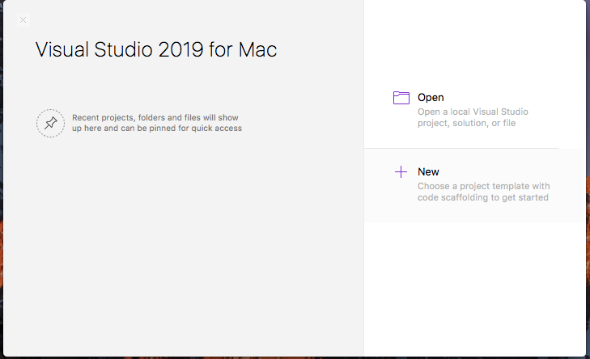
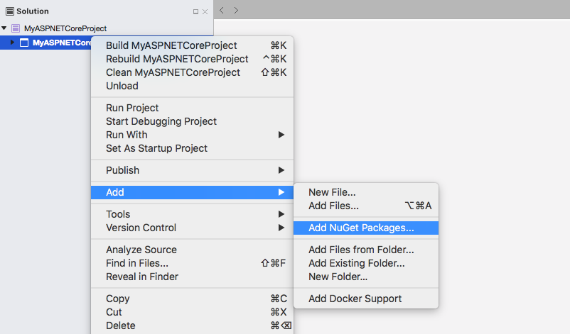
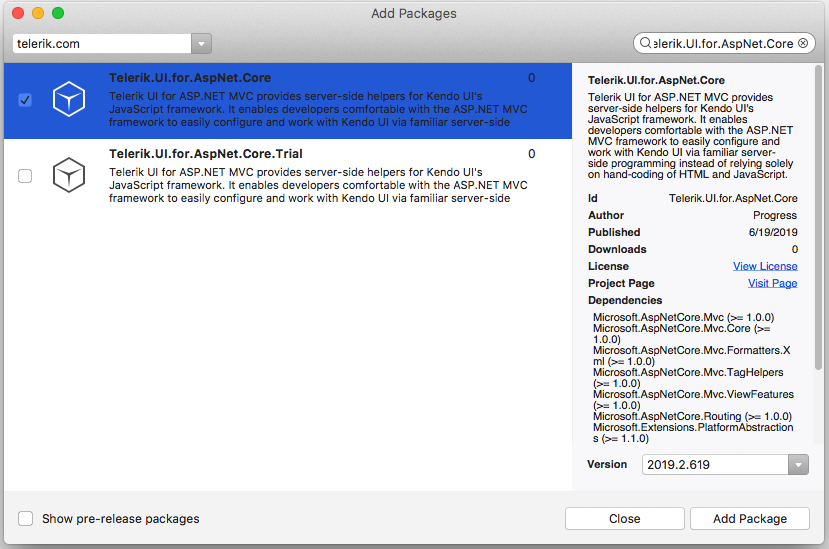
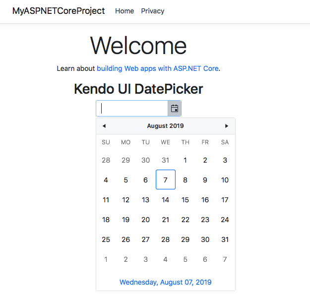

# First Steps on Mac

Welcome to the First Steps on Mac guide to get started with Progress<sup>®</sup> Telerik<sup>®</sup> UI for ASP.NET Core!

To configure an ASP.NET Core web application to use UI for ASP.NET Core you can use either of the following approaches:

* Create the application from scratch and add the necessary setup manually.
* [Use the Telerik UI for ASP.NET Core Visual Studio extensions]() and create an application that has all necessary scripts, styles, and editor templates.

This guide demonstrates how to create a UI for ASP.NET Core application from scratch and manually add the necessary setup. The guide creates a use-case scenario which demonstrates how to start working with the suite and implements the Kendo UI DatePicker for ASP.NET Core in your project by using the HTML Helper or the Tag Helper. For its purposes, the guide uses Visual Studio for Mac 2019.

This First Steps on Windows guide includes the following steps:

1. [Create the ASP.NET Core application](#creating-the-application)
1. [Add the UI for ASP.NET Core NuGet package](#adding-the-ui-for-aspnet-core-nuget-package)

## Prerequisites

Follow the instructions from the [official .NET Core documentation site](https://docs.microsoft.com/en-us/dotnet/core/macos-prerequisites?tabs=netcore2x).

## Creating the Application

1. Open Visual Studio for Mac 2019 and select **New**.

    

2. Select **Web Application(Model-View-Controller) .NET Core -> App** and click **Next**.

    

3. Select the target framework of the project and click **Next**.
4. Set a name and location for the project and click **Create**.    

## Adding the UI for ASP.NET Core NuGet Package

1. Open the NuGet Package Manager.

	

2. Add a new [package source](https://docs.microsoft.com/en-us/visualstudio/mac/nuget-walkthrough?toc=%2Fnuget%2Ftoc.json&view=vsmac-2019#adding-package-sources)

	

3.  In the **Add Package Source** popup add a **Telerik Source** with the following **Location** url and enter your credentials (telerik.com email and password) and click **OK**:

    ```
        https://nuget.telerik.com/nuget
    ```
	

4. Select the **Telerik Source** in the sources dropdown and search for `Telerik.UI.for.AspNet.Core`. Select it and click **Add Package** to install it. 
As a result, a line similar to 

    `<PackageReference Include="Telerik.UI.for.AspNet.Core" Version="{{ site.mvcCoreVersion }}" />` is added to your `.csproj` file.

	

    

5. Open the `Startup.cs` file and register the Kendo UI services in the `ConfigureServices` method.

		public void ConfigureServices(IServiceCollection services)
		{
			// Add Kendo UI services to the services container
			services.AddKendo();
		}

6. Import the `Kendo.Mvc.UI` namespace in `~/Views/_ViewImports.cshtml` through `@using Kendo.Mvc.UI`. If you intend to use the Telerik UI ASP.NET Core Tag Helpers, add them with `@addTagHelper *, Kendo.Mvc`.

        
        @using MyASPNETCoreProject
	    @using MyASPNETCoreProject.Models
        @addTagHelper *, Microsoft.AspNetCore.Mvc.TagHelpers
        @addTagHelper *, Kendo.Mvc
        @using Kendo.Mvc.UI
        

7. Include the client-side resources in `~\Views\Shared\_Layout.cshtml`.

	> * The CDN links and/or package versions have to point to the same UI for ASP.NET Core version which your project references.
	> * The Kendo UI scripts have to be placed after `jQuery`.

    7.1 Since the Microsoft template project uses Bootstrap, you can use the Kendo UI SASS Bootstrap v4 theme to match it.

  	7.2 The Microsoft template comes with a jQuery script reference in the body. Find it and move it to the head.

    7.3 After `jQuery`, copy and paste the scripts from this snippet. Make sure that the versions match the installed `Kendo.Mvc.dll`.

		<link rel="stylesheet" href="https://kendo.cdn.telerik.com/{{ site.mvcCoreVersion }}/styles/kendo.bootstrap-v4.min.css" />
		<script src="https://kendo.cdn.telerik.com/{{ site.mvcCoreVersion }}/js/kendo.all.min.js"></script>   
		<script src="https://kendo.cdn.telerik.com/{{ site.mvcCoreVersion }}/js/kendo.aspnetmvc.min.js"></script>   			


8. Use a Kendo UI widget by adding the snippet from the following example to `~/Views/Home/Index.cshtml`.

	```tab-HtmlHelper
		<div class="text-center">
    		<h2>Kendo UI DatePicker</h2>
    		@(Html.Kendo().DatePicker()
       			.Name("datepicker")
    		)
		</div>
	```
	```tab-TagHelper
		<div class="text-center">
    		<h2>Kendo UI DatePicker</h2>
			<kendo-datepicker name="my-picker"/>
		</div>
	```

	As a result, the following sample page is created.

    

## Next Steps

To use databound widgets and maintain the property names casing, modify the JsonSerializer. 

    ...
	using Newtonsoft.Json.Serialization;
	...

Open `Startup.cs` and update the `ConfigureServices` method in the following way:

###	ASP.NET Core 2

    public void ConfigureServices(IServiceCollection services)
	{
		...
		// Maintain the property names during serialization.
		// For more information, refer to https://github.com/aspnet/Announcements/issues/194.
		services
			.AddMvc().SetCompatibilityVersion(CompatibilityVersion.Version_2_1)
			.AddJsonOptions(options =>
				options.SerializerSettings.ContractResolver = new DefaultContractResolver());

		// Add the Kendo UI services to the services container.
		services.AddKendo();
	}

###	ASP.NET Core 3

    public void ConfigureServices(IServiceCollection services)
	{
		...
		services.AddMvc()
		        .AddNewtonsoftJson(options =>
			   options.SerializerSettings.ContractResolver =
			      new DefaultContractResolver());

		// Add the Kendo UI services to the services container.
		services.AddKendo();
	}

### See Also

* [UI for ASP.NET Core Tag Helpers]()
