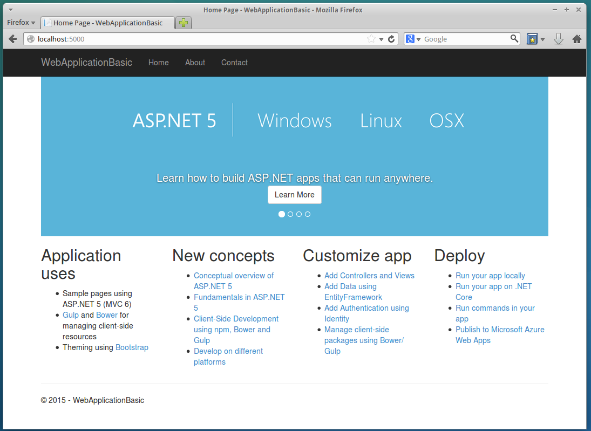
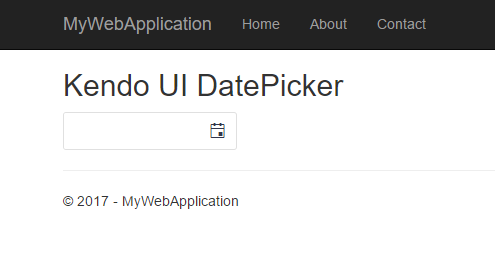

# Getting Started on Linux

This article demonstrates how to configure an ASP.NET Core project that enables you to use Telerik UI for ASP.NET MVC on Linux.

> **Important**
>
> The following steps are tested on Ubuntu 14.04 and 16.04. and on MacOS X El Capitan 10.11.6.

## Prerequisites

* Install [Microsoft ASP.NET](http://docs.asp.net/en/latest/getting-started/installing-on-linux.html)
* Install the [NuGet package manager](https://www.nuget.org/).

## Configuration

To configure an ASP.NET Core project that enables you to use Telerik UI for ASP.NET MVC on Linux:

1. Create an [ASP.NET MVC web site](#configuration-Create).
2. Add the Kendo UI [NuGet package](#configuration-Add).

### Create ASP.NET Core Web Sites

> **Important**
>
> If you are configuring an existing project, skip this step.

Below are listed the steps for you to follow when creating an ASP.NET Core web site. To scaffold an empty ASP.NET application, the examples use [Yeoman](http://yeoman.io/).

1. Install [Node.js](https://github.com/nodesource/distributions) v.4.x.

    ###### Example

            curl -sL https://deb.nodesource.com/setup_4.x | sudo -E bash -
            sudo apt-get install -y nodejs

2. Check if the Node.js version is the desired one.

    ###### Example

            kendo@kendo-docker:~$ nodejs -v
            v4.2.2

3. Install the Yeoman and an [aspnet](https://github.com/omnisharp/generator-aspnet#readme) generator.

    ###### Example

            sudo npm install -g yo generator-aspnet

4. By using the Terminal, navigate to the folder where you want to create the project folder.

    ###### Example

            kendo@kendo-docker:~$ mkdir Projects
            kendo@kendo-docker:~$ cd Projects/
            kendo@kendo-docker:~/Projects$

5. Run `yo aspnet`. The following example demonstrates a result that is similar to the response you are expected to receive.

    ###### Example

            kendo@kendo-docker:~/Projects$ yo aspnet

                 _-----_
                |       |    .--------------------------.
                |--(o)--|    |      Welcome to the      |
               `---------´   |   marvellous ASP.NET 5   |
                ( _´U`_ )    |        generator!        |
                /___A___\    '--------------------------'
                 |  ~  |
               __'.___.'__
             ´   `  |° ´ Y `

            ? What type of application do you want to create?
              Empty Application
              Console Application
              Web Application
            ❯ Web Application Basic [without Membership and Authorization]
              Web API Application
              Nancy ASP.NET Application
              Class Library
              Unit test project


6. Select the **Web Application Basic** option by using the keyboard `Arrow` keys and press `Enter`. Type the name of the new application. Note that you can skip this step and use the default name by pressing `Enter`. After you set the name, the generator creates the desired folder and the selected application. When finished, the scaffolded project should be ready.

    > **Important**
    >
    > Yeoman gets improved in time and the steps above might change. For more information, refer to the [Yeoman resources](http://yeoman.io/).

7. Navigate to the created folder and run `dotnet restore`.

    > **Important**
    >
    > For up-to-date commands, refer to the [guide on getting started with .NET Core](https://docs.asp.net/en/latest/getting-started.html).

    As a result, the NuGet packages are downloaded. The following example demonstrates a result that is similar to the end of the response you are expected to receive.

    ###### Example

            Restore complete, 10070ms elapsed

            kendo@kendo-docker:~/Projects/WebApplicationBasic$

8. Start the application by running `dotnet run`. The following example demonstrates the response you are expected to receive.

    ###### Example

            Hosting environment: Production
            Now listening on: http://localhost:5000
            Application started. Press Ctrl+C to shut down.

9. Use your favorite browser to navigate to the above location and make sure the application is working in the way shown below. After you check the application in the browser, stop the server.

    **Figure 1. The web application in the browser**

    

### Add the Telerik.UI.for.AspNet.Core NuGet Package

1. Open the `project.json` file by using a text editor, add the `Telerik.UI.for.AspNet.Core` dependency, and replace `productVersion` with an actual **Telerik UI for AspNet Core** version&mdash;for example, `2016.3.914`.

    ###### Example

            "dependencies": {
                ...
                "Telerik.UI.for.AspNet.Core": "productVersion"
            }

2. Add the private Telerik NuGet feed.

    ###### Example

    ```sh
    NuGet Sources Add -Name "telerik.com" -Source "https://nuget.telerik.com/nuget" -UserName "your telerik.com login email" -Password "your telerik.com password" -StorePasswordInClearText
    ```

    > **Important**
    >
    > Store the password in clear text because the .NET Core tooling does not support encryption.

3. Restore the packages by running `dotnet restore`.

    * **Troubleshooting**

        You might get an error similar to `error: Unable to resolve 'Telerik.UI.for.AspNet.Core (>= 2017.1.118)' for '.NETCoreApp,Version=v1.1'.` It is caused by problems in the tooling. For more information, refer to the GitHub issues in [Nuget/Home](https://github.com/NuGet/Home/issues/4413) and in [dotnet/core](https://github.com/dotnet/core/issues/453)).

    * **Workarounds**

        When you use NuGet to add a private feed, `NuGet Sources Add` writes in the `~/.config/NuGet/NuGet.Config` file. However, when you run `dotnet restore`, the `~/.nuget/NuGet/NuGet.Config` file is used to read `packageSources` and `packageSourceCredentials`.

        Until this issue in the tooling gets fixed, you can either:
           * Copy your `telerik.com` credentials manually from `~/.config/NuGet/NuGet.Config` to `~/.nuget/NuGet/NuGet.Config`, or
           * Create a `NuGet.Config` file in the project folder with the contents from `~/.config/NuGet/NuGet.Config`.

        ###### Example

        ```
        <?xml version="1.0" encoding="utf-8"?>
        <configuration>
          <packageSources>
            <add key="nuget.org" value="https://api.nuget.org/v3/index.json" protocolVersion="3" />
            <add key="telerik.com" value="https://nuget.telerik.com/nuget" />
          </packageSources>
          <packageSourceCredentials>
            <telerik.com>
              <add key="Username" value="your.telerik.com@email.login" />
              <add key="ClearTextPassword" value="your.telerik.com.password.in.clear.text" />
            </telerik.com>
          </packageSourceCredentials>
        </configuration>
        ```

4. Open `Startup.cs` by using a text editor (IDE) and update it in the way demonstrated in the following examples.

    Locate the `ConfigureServices` method and add a call to `services.AddKendo` at the end.

    ###### Example

            ...
            using Newtonsoft.Json.Serialization;
            ...
            public void ConfigureServices(IServiceCollection services)
            {
                ...
                // Maintain property names during serialization. See:
                // https://github.com/aspnet/Announcements/issues/194
                services
                    .AddMvc()
                    .AddJsonOptions(options => options.SerializerSettings.ContractResolver = new DefaultContractResolver());

                // Add Kendo UI services to the services container
                services.AddKendo();
            }

    Locate the `Configure` method and add a call to `app.UseKendo` at the end.

    ###### Example

            public void Configure(IApplicationBuilder app, IHostingEnvironment env, ILoggerFactory loggerFactory)
            {
                ...

                // Configure Kendo UI
                app.UseKendo(env);
            }

4. Import the `Kendo.Mvc.UI` namespace in `~/Views/_ViewImports.cshtml` through `@using Kendo.Mvc.UI`.

5. Copy the Kendo UI client-side resources.

    * Manual installation&mdash;To manually install the resources, copy the `js` and `styles` folders from the `telerik.ui.for.aspnetmvc` archive to `wwwroot\lib\kendo-ui`.

        **Figure 2. Kendo UI resources**

        

    * Bower package installation&mdash;For more information on how to achieve this, refer to the [Kendo UI Professional Bower package installation](../../kendo-ui/intro/installation/bower-install).

6. Register the Kendo UI styles and scripts in `~/Views/Shared/Layout.cshtml`.

    ###### Example

            <head>
            ...

            <link rel="stylesheet" href="~/lib/kendo-ui/styles/kendo.common-bootstrap.min.css" />
            <link rel="stylesheet" href="~/lib/kendo-ui/styles/kendo.bootstrap.min.css" />
            <link rel="stylesheet" href="~/lib/kendo-ui/styles/kendo.dataviz.bootstrap.min.css" />
            </head>
            <body>
            ...

            <script src="~/lib/kendo-ui/js/kendo.all.min.js"></script>
            <script src="~/lib/kendo-ui/js/kendo.aspnetmvc.min.js"></script>

            @RenderSection("scripts", required: false)
            </body>

7. Use a Kendo UI widget by adding the snippet from the following example to `~/Views/Home/Index.cshtml`.

    ###### Example

            <h2>Kendo UI DatePicker</h2>

            @(Html.Kendo().DatePicker()
                    .Name("datepicker")
                    .Deferred()
            )

            @section scripts {
                @Html.Kendo().DeferredScripts()
            }

8. Navigate to the project folder by using the Terminal and run it using the `dotnet run` command. Now that all is done, you can see the sample page.

    **Figure 3. The end result&mdash;a sample page**

    

## See Also

* [Overview of Telerik UI for ASP.NET Core]()
* [Get Started with Telerik UI for ASP.NET MVC in ASP.NET Core Projects]()
* [Known Issues with Telerik UI for ASP.NET Core]()
* [Tag Helpers for ASP.NET Core]()
