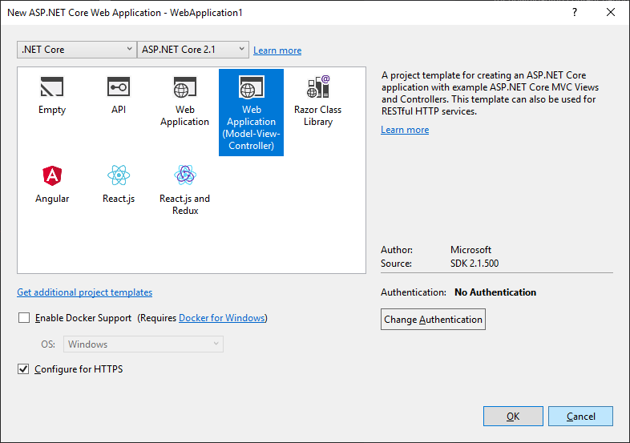

# Getting Started with Progress® Telerik® UI for ASP.NET Core

This article demonstrates how to configure an ASP.NET Core project to use Telerik UI for ASP.NET Core on Windows with Visual Studio (VS) 2017/2019. For using Telerik UI for ASP.NET Core on MacOS, refer to [Getting Started with CLI]().

## Prerequisites

The prerequisites for creating and running an ASP.NET Core on Windows with VS 2017 are described on the [.NET Core documentation site](https://docs.microsoft.com/en-us/dotnet/core/windows-prerequisites).

> **Important**
>
> You can use Visual Studio 2015 only for .NET Core 1.x development. However, this approach is not recommended because:
> * The .NET Core tooling is in a preview version which is not officially supported.
> * The projects are `project.json`-based which is deprecated.
>
> If you use Visual Studio 2015, to ensure the matching of the ASP.NET Core version which is distributed with the Telerik UI for ASP.NET Core, manually change the `Microsoft.AspNetCore.Routing` and `Microsoft.AspNetCore.Mvc` versions to `1.1.0` in `project.json`.

## Configuration

To configure an ASP.NET Core Web Application to use Telerik UI for ASP.NET Core:

1. Create an [ASP.NET Core Web Application](#configuration-Create).
2. Add the [UI for ASP.NET Core NuGet package]().

### Create ASP.NET Core Project

1. Select **File** > **New Project**.
2. Select **Installed** > **Visual C#** > **Web** > **ASP.NET Core Web Application**.
3. Set a name and location for the project and click **OK**.
4. Select **Web Application (Model-View-Controller)** from the **ASP.NET Core Templates** dialog.

    **Figure 1. Create an ASP.NET Core MVC application**

    

5. Click **OK** to create the project.

### Add the Telerik UI for ASP.NET Core NuGet Package

1. Before you continue, set up the [Telerik NuGet Private Feed]() with your Telerik account credentials. Store the password in clear text because the .NET Core tooling does not support encryption.

2. Open the NuGet Package Manager.

  **Figure 2. The NuGet package manager**

  

3. Click the **Browse** tab, select the **Telerik package source** and **search** for `Telerik.UI.for.AspNet.Core`.

4. Install the `Telerik.UI.for.AspNet.Core` package. It adds a line to your `.csproj` file similar to the following example.

    ###### Example

		<PackageReference Include="Telerik.UI.for.AspNet.Core" Version="{{ site.mvcCoreVersion }}" />

5. Open `Startup.cs` and update it in the following way:

	* Add the `using Newtonsoft.Json.Serialization` line at the top.

		###### Example

			...
			using Newtonsoft.Json.Serialization;
			...

	* Locate the `ConfigureServices` method and add the calls.

		###### Example

			public void ConfigureServices(IServiceCollection services)
			{
				...
				// Maintain property names during serialization. See:
				// https://github.com/aspnet/Announcements/issues/194
				services
					.AddMvc().SetCompatibilityVersion(CompatibilityVersion.Version_2_1)
					.AddJsonOptions(options =>
						options.SerializerSettings.ContractResolver = new DefaultContractResolver());

				// Add Kendo UI services to the services container
				services.AddKendo();
			}

	* If you are using a version prior to R2 2018, locate the `Configure` method and add a call to `app.UseKendo` at the end.

		###### Example

			public void Configure(IApplicationBuilder app, IHostingEnvironment env)
			{
				...

				//If using versions older than R2 2018, configure Kendo UI
				app.UseKendo(env);
			}

6. Import the `Kendo.Mvc.UI` namespace in `~/Views/_ViewImports.cshtml` through `@using Kendo.Mvc.UI`.

    ###### Example

            @using MyASPNETCoreProject
            @addTagHelper *, Microsoft.AspNetCore.Mvc.TagHelpers
            @addTagHelper *, Kendo.Mvc
            @using Kendo.Mvc.UI

7. Include the Kendo UI `client-side resources`. For more information about the different approaches for including client-side resources, refer to the article on [including client-side resources]().

8. Use a Kendo UI widget by adding the snippet from the following example to `~/Views/Home/Index.cshtml`.

    ###### Example

		<h2>Kendo UI DatePicker</h2>

		@(Html.Kendo().DatePicker()
				.Name("datepicker")
		)

	  Now that all is done, you can see the sample page.

    **Figure 3. The end result&mdash;a sample page**

    

## See Also

* [Overview of Telerik UI for ASP.NET Core]()
* [Including the Necessary Client-Side Resources]()
* [Get Started with Telerik UI for ASP.NET Core with the CLI]()
* [Known Issues with Telerik UI for ASP.NET Core]()
* [Tag Helpers for ASP.NET Core]()
