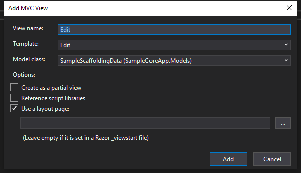

# Scaffolding

As of the R1 2019 release, Telerik UI for ASP.NET Core provides Scaffolding templates.

These templates allow you to apply standard scaffolding to generate MVC-helper declarations for editors which use the Telerik UI for ASP.NET Core components instead of applying standard inputs. You can use the Scaffolding extensions both in MVC views and in Razor Pages.

Depending on the type of field, the following editors will be generated:

* `String`&mdash;An `input` element with Kendo UI styles.
* `String` (multiline)&mdash;A `textarea` element with Kendo UI styles.
* `Number`&mdash;A `kendo-numerictextbox` tag helper.
* `DateTime`&mdash;A `kendo-datetimepicker` tag helper.
* `Boolean`&mdash;An `Html.Kendo().CheckBoxFor` helper.

The scaffolding logic and tools are the same as in the ordinary .NET Core web applications. The main repository and logic for the scaffolding that is provided by Microsoft is located in [https://github.com/aspnet/Scaffolding](https://github.com/aspnet/Scaffolding). The original template files are located in its [https://github.com/aspnet/Scaffolding/tree/master/src/VS.Web.CG.Mvc/Templates](https://github.com/aspnet/Scaffolding/tree/master/src/VS.Web.CG.Mvc/Templates) folder.

For more information on using the scaffolding by Microsoft, refer to the following resources:
- [Add a model to an ASP.NET Core MVC app](https://docs.microsoft.com/en-us/aspnet/core/tutorials/first-mvc-app/adding-model?view=aspnetcore-2.1)
- [Add a model to a Razor Pages app in ASP.NET Core](https://docs.microsoft.com/en-us/aspnet/core/tutorials/razor-pages/model?view=aspnetcore-2.1)

> **Important**
>
> The Scaffolding features allow you to generate templates based on classes. They are different from the editor templates that are used for editing by widgets such as the Grid, for example. The editor templates are located in your installation folder at `C:\Program Files (x86)\Progress\Telerik UI for ASP.NET Core <your version>\wrappers\aspnetcore\EditorTemplates`.

## Prerequisites

Install and set up Telerik UI for ASP.NET Core in your project by either of the following ways:
* [Use Visual Studio](https://docs.telerik.com/aspnet-core/getting-started/getting-started)
* [Use the CLI](https://docs.telerik.com/aspnet-core/getting-started/getting-started-cli)

## Installation

To install the UI for ASP.NET Core Scaffolding templates and extensions in your project:

1. Clone or download the [https://github.com/telerik/scaffold-templates-core](https://github.com/telerik/scaffold-templates-core) repository.
1. Copy the `Templates` folder from the `scaffold-templates-core` repository to the root of your project.
1. Exclude the `scaffold-templates-core` repository from the project to avoid its compilation when you build the application. To exclude the repository, use either of the following approaches:

    * Add the following lines directly to the project file.

        ```.csproj
          <ItemGroup>
            <Compile Remove="Templates\**" />
            <Content Remove="Templates\**" />
            <EmbeddedResource Remove="Templates\**" />
            <None Remove="Templates\**" />
          </ItemGroup>
        ```

    * Use the Visual Studio interface.

        **Figure 1. Exclude the Templates folder from compilation**

        

As of the 2019 R1 release, the **Create New Project Wizard**, which comes with the Telerik UI for ASP.NET Core [Visual Studio Extensions](https://docs.telerik.com/aspnet-core/vs-integration/introduction), automatically creates the `Templates` folder in the root of the application. For more information on the wizard, refer to the article on [creating projects](https://docs.telerik.com/aspnet-core/vs-integration/new-project-wizard). 

> As of .NET Core 2.2, when using Bootstrap 3, the views folder used is `ViewGenerator_Versioned\Bootstrap3\`. If you are upgrading your project make sure to update the folder's name.

## Using Scaffolding Templates with Visual Studio

The Kendo UI Scaffolding Templates pertain to `cshtml` generation. That is why, first you have to create the appropriate model and controller as per your application requirements. You can either use the standard Scaffolding or the code you already have. If you do not already have a model and controller, use the sample set below the list to follow the example.

To add a View that will use a Kendo UI Scaffolding template:

1. Select **Add** > **New Scaffolded Item...** from the context menu of the desired location.

    **Figure 2. Add Scaffolded Item**

    

1. Choose item type (for example, **MVC View**) and click **Add**.

     **Figure 3. Add Scaffolded View**

    

1. Set the View properties (name, template, and model to match the code you already have) and click **Add**. For example, an `Edit` view for the `SampleScaffoldingData` model.

     **Figure 3. Set View Properties**

    

As a result, in your project you have an output that is similar to the following code. You can also use the sample class and controller to test the behavior with dummy data instead of actual models.

```Model
using System;
using System.Collections.Generic;
using System.ComponentModel.DataAnnotations;
using System.Linq;
using System.Threading.Tasks;

namespace SampleCoreApp.Models
{
	public class SampleScaffoldingData
	{
		public string SingleLineString { get; set; }
		[DataType(DataType.MultilineText)]
		public string MultiLineString { get; set; }
		public int SomeNumber { get; set; }
		public DateTime SomeDate { get; set; }
		public bool SomeBoolean { get; set; }
	}
}
```
```View
@model SampleCoreApp.Models.SampleScaffoldingData

@{
    ViewData["Title"] = "Edit";
}

<h1>Edit</h1>

<h4>SampleScaffoldingData</h4>
<hr />
<div class="row">
    <div class="col-md-4">
        <form asp-action="Edit" id="SampleScaffoldingDataForm">
            <div asp-validation-summary="ModelOnly" class="text-danger"></div>
            <div class="form-group">
                <label asp-for="SingleLineString"></label>
                <input asp-for="SingleLineString" class="k-textbox" />
                <span asp-validation-for="SingleLineString" class="text-danger k-invalid-msg" data-for="SingleLineString"></span>
            </div>
            <div class="form-group">
                <label asp-for="MultiLineString"></label>
                <textarea asp-for="MultiLineString" class="k-textbox"></textarea>
                <span asp-validation-for="MultiLineString" class="text-danger k-invalid-msg" data-for="MultiLineString"></span>
            </div>
            <div class="form-group">
                <label asp-for="SomeNumber"></label>
                <kendo-numerictextbox for="SomeNumber" />
                <span asp-validation-for="SomeNumber" class="text-danger k-invalid-msg" data-for="SomeNumber"></span>
            </div>
            <div class="form-group">
                <label asp-for="SomeDate"></label>
                <kendo-datetimepicker for="SomeDate" />
                <span asp-validation-for="SomeDate" class="text-danger k-invalid-msg" data-for="SomeDate"></span>
             </div>
            <div class="form-group">
                @Html.Kendo().CheckBoxFor(m => m.SomeBoolean)
                <label asp-for="SomeBoolean"></label>
                <span asp-validation-for="SomeBoolean" class="text-danger k-invalid-msg" data-for="SomeBoolean"></span>
            </div>
            <div class="form-group">
                <input type="submit" value="Save" class="k-button k-primary" />
            </div>
        </form>
    </div>
</div>

<div>
    <a asp-action="Index" class="k-button">Back to List</a>
</div>
```
```Controller
using System;
using System.Collections.Generic;
using System.Linq;
using System.Threading.Tasks;
using Microsoft.AspNetCore.Http;
using Microsoft.AspNetCore.Mvc;
using SampleCoreApp.Models;

namespace SampleCoreApp.Controllers
{
    public class TestScaffoldingController : Controller
    {
		//the rest of the controller is omitted for brevity

        // GET: TestScaffolding/Edit/5
        public ActionResult Edit(int id)
        {
			SampleScaffoldingData sampleData = new SampleScaffoldingData() {
				MultiLineString = string.Format("{0}\n{1}", id, id + 1),
				SingleLineString = id.ToString(),
				SomeBoolean = id % 3 == 0,
				SomeDate = DateTime.Now,
				SomeNumber = id
			};

			return View(sampleData);
        }
    }
}
```

## See Also

* [Adding Kendo UI Components to Projects with VS 2017](https://docs.telerik.com/aspnet-core/getting-started/getting-started)
* [Adding Kendo UI Components to Projects with the CLI](https://docs.telerik.com/aspnet-core/getting-started/getting-started-cli)
* [ASP.NET Scaffolding](https://github.com/aspnet/Scaffolding)
* [Default ASP.NET Scaffolding Templates](https://github.com/aspnet/Scaffolding/tree/master/src/VS.Web.CG.Mvc/Templates)
* [UI for ASP.NET Core Scaffolding Templates](https://github.com/telerik/scaffold-templates-core)
* [Tutorial: How to add a model to an ASP.NET Core MVC app](https://docs.microsoft.com/en-us/aspnet/core/tutorials/first-mvc-app/adding-model?view=aspnetcore-2.1)
* [Tutorial: How to add a model to a Razor Pages app in ASP.NET Core](https://docs.microsoft.com/en-us/aspnet/core/tutorials/razor-pages/model?view=aspnetcore-2.1)
