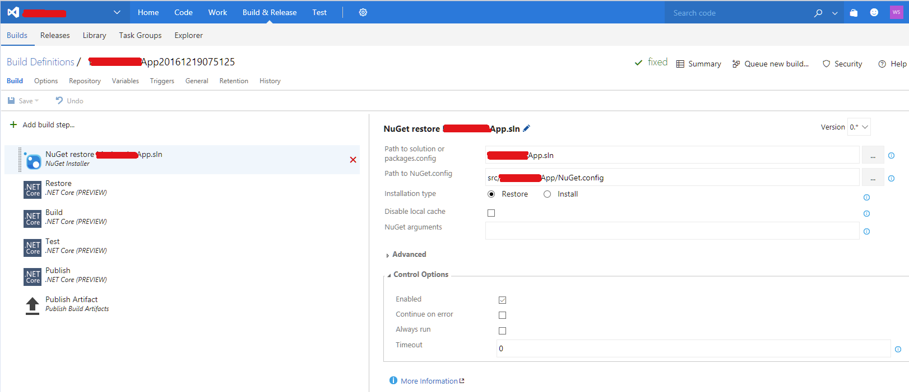

# Set Up Private NuGet Feed for Azure

Depending on your project, you might need to set up the private NuGet feed in Azure to publish an ASP.NET Core application that references the Telerik UI for ASP.NET Core assembly.

To achieve this behavior, follow the instructions which enable you to do add a private NuGet feed when running an MSBuild on a Build machine such as one hosted by Azure.

1. Add `NuGet.config` to the WebApp project in Visual Studio.

1. Add a new `NuGet.config` item to the same directory as the `project.json` file is located.

1. Set your own username and password (in clear text) that are needed to log in to the Telerik site. The following example demonstrates how to do this.

    ###### Example

        <?xml version="1.0" encoding="utf-8"?>
        <configuration>
            <packageSources>
                <add key="Telerik" value="https://nuget.telerik.com/nuget/" />
            </packageSources>
            <packageSourceCredentials>
            <Telerik>
                <add key="Username" value="user.name@telerik.com" />
                <add key="ClearTextPassword" value="********" />
            </Telerik>
            </packageSourceCredentials>
        </configuration>

1. Set the **Build Definitions** editor in Visual Studio to add a step for the NuGet installer. To achieve this:

   1. Select **Team Explorer** > **Builds**.
   1. Select **Build Definitions** and right-click **Edit Build Definitions**. This operation opens the **Build Definitions** in your browser, as shown in the following screenshot.

   

1. In the **Build Definitions** editor, add a **Nuget Installer** build step by clicking **Add build step...**.

1. Drag-and-drop the **Nuget Installer** build step to the top of the build steps list. Specify the solution and the `NugGet.config` files and then save them.

1. Save your changes to the source control for the WebApp in Visual Studio&mdash;that is, the **Build Definitions** and the **NuGet.config** file.

1. To build the application, click **Queue a new build**.

## See Also

* [Visual Studio Integration]()
* [Known Issues in Telerik UI for ASP.NET Core]()
