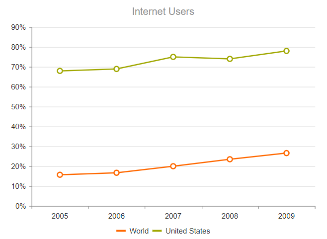

# Line Charts

The [Kendo UI Line Chart HtmlHelper for ASP.NET Core](https://demos.telerik.com/aspnet-core/line-charts/index) is suitable for displaying quantitative data by using continuous lines passing through points defined by the values of their items.

You can use the Line Chart HtmlHelper to render a trend over time and compare sets of similar data.

## Configuration

To create a Line series in the Chart helper, use `Line` and `VerticalLine` in the `Series` configuration.

### Axes

To configure the axes, use the `CategoryAxis` and `ValueAxis` settings. Multiple value axes are also supported.

###### Example

    @(Html.Kendo().Chart()
         .Name("chart")
         .Title("Internet Users")
         .Legend(legend => legend
             .Position(ChartLegendPosition.Bottom)
         )
         .Series(series =>
         {
             series.Line(new double[] { 15.7, 16.7, 20, 23.5, 26.6 }).Name("World");
             series.Line(new double[] { 67.96, 68.93, 75, 74, 78 }).Name("United States");
         })
         .CategoryAxis(axis => axis
             .Categories("2005", "2006", "2007", "2008", "2009")
             .MajorGridLines(lines => lines.Visible(false))
         )
         .ValueAxis(axis => axis
             .Numeric().Labels(labels => labels.Format("{0}%"))
         )
    )

The configuration from the previous example results in the following Line Chart.

**Figure 1: A sample Line Chart**



### Line Styles

The Line Charts support the rendering of lines between points by using different styles.

You can set the line style through the `Style` configuration in the `SeriesDefaults` common settings.

```
         .SeriesDefaults(seriesDefaults =>
             seriesDefaults.Line().Style(ChartLineStyle.Smooth)
         )
```

You can also set the line style for each Line series individually.

```
         .Series(series =>
         {
             series.Line(new double[] { 15.7, 26.7, 20, 23.5, 26.6 }).Name("World").Style(ChartLineStyle.Smooth);
             series.Line(new double[] { 67.96, 68.93, 75, 54, 78 }).Name("United States").Style(ChartLineStyle.Smooth);
         })
```

The supported styles are:

* Normal&mdash;This is the default style. It produces a straight line between data points.
* Step&mdash;This style renders the connection between data points through vertical and horizontal lines. It is suitable for indicating that the value is constant between the changes.
* Smooth&mdash;This style causes the Line Chart to display a fitted curve through data points. It is suitable when the data requires to be displayed with a curve, or when you wish to connect the points with smooth instead of straight lines.

**Figure 2: A step-line Line Chart**


**Figure 3: A smooth-line Line Chart**


### Types of Lines

By default, the Chart draws its Line series as solid lines. You can configure the line to be drawn through different dash styles by setting `DashType`.

```
         .Series(series =>
         {
             series.Line(new double[] { 15.7, 16.7, 20, 23.5, 26.6 }).Name("World").DashType(ChartDashType.Dot);
             series.Line(new double[] { 67.96, 68.93, 75, 74, 78 }).Name("United States");
         })
```

**Figure 4: A dotted Line Series**


### Markers

The series markers are the visuals that represent the point value in the Line series. You can customize or hide them through the `Markers` configuration.

```
             series.Line(new double[] { 15.7, 16.7, 20, 23.5, 26.6 }).Name("World")
                .Markers(m=>m
                    .Type(ChartMarkerShape.Square)
                    .Rotation(45)
                    .Background("yellow")
                );
```

**Figure 5: A Line Chart with custom markers**


You can also completely draw custom markers for the Line series through the `Visual` setting as shown in the [Custom Visuals](https://demos.telerik.com/aspnet-core/line-charts/visuals) demo.

## See Also

* [Overview of the Kendo UI Chart Html Helper for ASP.NET Core ]()
* [Area Charts]()
* [Bubble Charts]()
* [BoxPlot Charts]()
* [Bar Charts]()
* [Pie Charts]()
* [Stock Charts]()
* [TreeMap]()
* [Chart JavaScript API Reference](https://docs.telerik.com/kendo-ui/api/javascript/dataviz/ui/chart)
