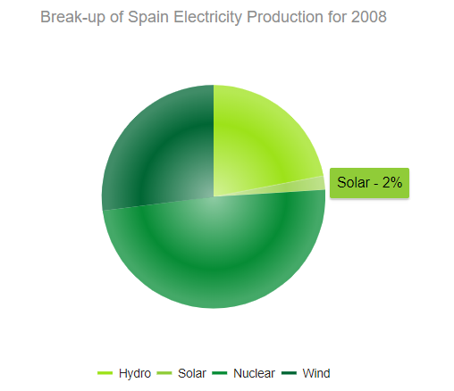

# Pie Charts

The [Kendo UI Pie Chart HTMLHelper for ASP.NET Core](https://demos.telerik.com/aspnet-core/pie-charts/index) displays data as single-series sectors from a two-dimensional circle. It is useful for rendering data as a part of the whole.

The [Kendo UI Donut Chart HTMLHelper for ASP.NET Core](https://demos.telerik.com/aspnet-core/donut-charts/index) is a Kendo UI Pie Chart variation with the same ability to display a single data series in a two-dimensional circle and is likewise useful for displaying data as a part of the whole.

## Getting Started

### Create the Pie Chart

To create a Kendo UI Pie Chart, define a single series of type `"pie"`. Additional series are not supported and each data point is an object that specifies the point value, category label, and other properties, as demonstrated in the following example.

###### Example

        @(Html.Kendo().Chart()
           .Name("chart")
           .Title("Break-up of Spain Electricity Production for 2008")
           .Legend(legend => legend
               .Position(ChartLegendPosition.Bottom)
           )
           .SeriesColors(new string[] { "#03a9f4", "#ff9800", "#fad84a", "#4caf50" })
           .Series(series =>
           {
               series.Pie(new dynamic[] {
               new {category="Hydro",value=22,color="#9de219"},
               new {category="Solar",value=2,color="#90cc38"},
               new {category="Nuclear",value=49,color="#068c35"},
               new {category="Wind",value=27,color="#006634"}})
               .Overlay(o => o.Gradient(ChartSeriesGradient.RoundedBevel));
           })
           .Tooltip(tooltip => tooltip.
               Template("${ category } - ${ value }%").Visible(true)
           )
        )

**Figure 1: A sample Pie Chart**

## Configuration

### Effects Overlay

Each segment has a transparent effect overlay that adds depth to the two-dimensional shape. The overlay transparent gradient is configurable, as demonstrated in the following example.

###### Example

    .Series(series =>
    {
       series.Pie(new dynamic[] {})
       .Overlay(o => o.Gradient(ChartSeriesGradient.None));
    })

The following `ChartSeriesGradient` options are available:

* (Default) `RoundedBevel`
* `SharpBevel`
* `None`

The following figure demonstrates the usage of each of these options.

**Figure 2: A Pie Chart with the `RoundedBevel` overlay applied**

**Figure 3: A Pie Chart with the `SharpBevel` overlay applied**

**Figure 4: A Pie Chart with no overlay**

## See Also

* [Overview of the Kendo UI Chart Html Helper for ASP.NET Core ]()
* [Area Charts]()
* [Bubble Charts]()
* [Bar Charts]()
* [Stock Charts]()
* [TreeMap]()
* [Chart JavaScript API Reference](https://docs.telerik.com/kendo-ui/api/javascript/dataviz/ui/chart)
