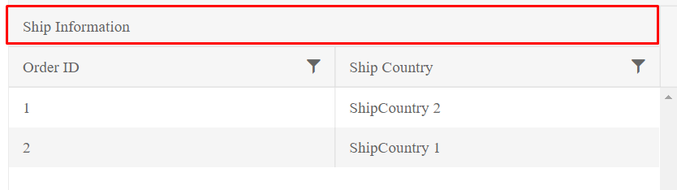

# Multi-Column Headers

The multicolumn headers of the Grid represent a tree-like structure where the user can group one or more columns together by a common header.

For a runnable example, refer to the [demo on implementing multi-column headers in the Grid](https://demos.telerik.com/aspnet-core/grid/multicolumnheaders).

That common header in turn can be a child of another upper `MultiColumn` header which can also span both columns and other headers. For more information, refer to the [demo on implementing multicolumn headers](https://demos.telerik.com/aspnet-core/grid/multicolumnheaders).

        .Columns(columns =>
        {
            columns.Group(colGroup =>
            {
                colGroup.Title("Ship Information");
                colGroup.Columns(cols =>
                {
                    cols.Bound(f => f.OrderID).Width(200);
                    cols.Bound(f => f.ShipCountry).Width(200);
                });
            });
        })

The previous example results in the following output.

## See Also

* [Implementing Multi-Column Headers in the Grid (Demo)](hhttps://demos.telerik.com/aspnet-core/grid/multicolumnheaders)
* [Server-Side API](/api/grid)
