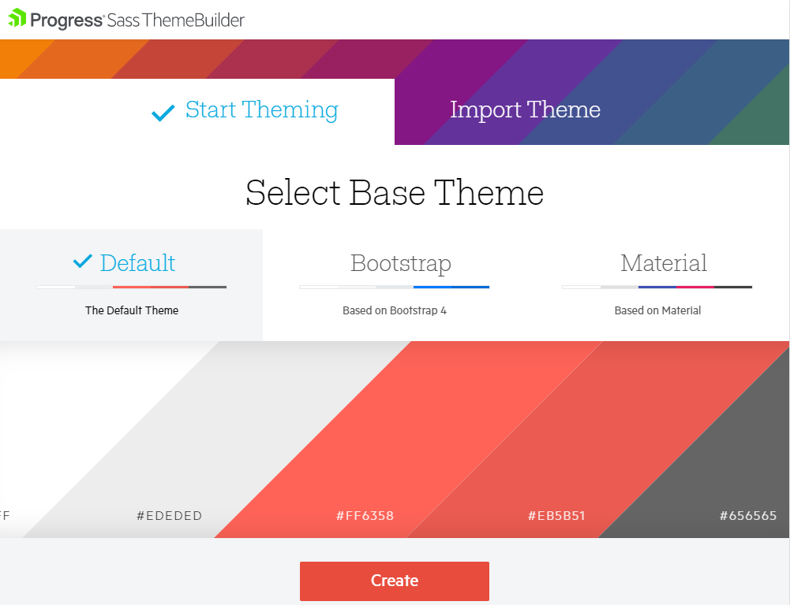
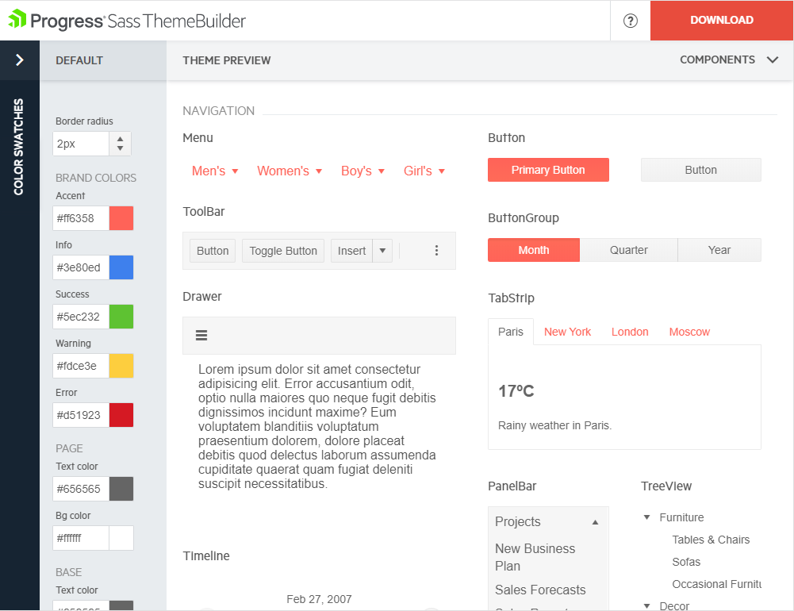
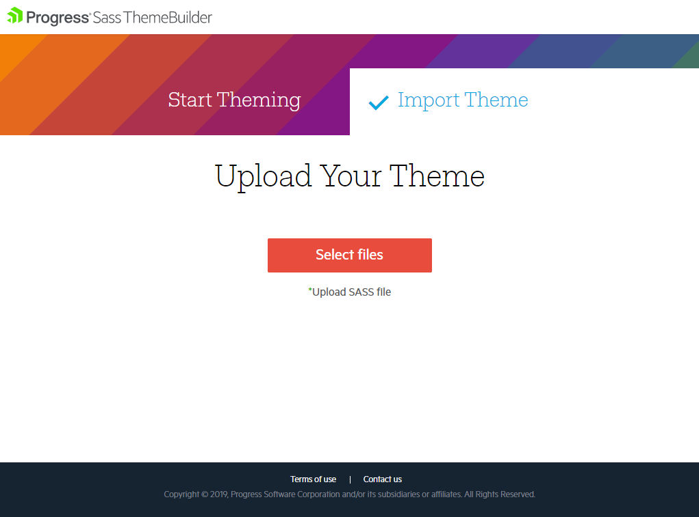

## Using the Sass Theme Builder

[**Progress Sass Theme Builder**](https://themebuilder.telerik.com/aspnet-core) is an Angular web application that enables you to create new or customize existing themes.

The tool renders the same look and feel as the look and feel of all other components in the suite. It also delivers full control over the skin elements of each component and automatically updates its composite units. After you create the skin and achieve the desired look of the theme, the Sass Theme Builder enables you to download and integrate it in your project.

**Figure 1: A preview of the Sass Theme Builder**

### Using Newly Created Themes

To create a new theme:

1. On the initial Sass Theme Builder pane, select the **Start Theming** option.
1. Choose one of the existing skins to use as a base. The currently available built-in skins are **Default** and **Bootsrap**.

    **Figure 2: Selecting a base theme**

    

### Modifying Themes

The Sass Theme Builder supports the following options for customization:

* Color pickers which customize the appearance of the components.
* The **Apply changes instantly** option which enables you to observe the changes on the fly.
* Manual updates of each component element.
* Utilization of predefined color swatches.

To customize an existing theme, use the following Sass Theme Builder features:

1. Color swatches&mdash;Contains predefined color palettes that you can apply to all components in your application.
1. Default&mdash;Provides the applicable color customization options.
1. Preview components&mdash;Keeps the main view of the components. It reflects the customization changes you make each time you add or remove theme elements.
1. Download&mdash;Downloads the archive that holds the generated style files after the customization completes. When you click the button, a dialog appears and prompts you to name your theme.

**Figure 3: Available options for customization**

To upload an existing theme you have previously created:

1. On the initial Sass Theme Builder pane, select **Import Theme**.
1. Upload the `variables.scss` file which contains your current modifications of the customized theme. As a result, the selected components and styling elements load.
1. Start [customizing your theme](#customizing-existing-themes).

**Figure 4: Importing themes for customization**

When you complete the modifications and the theme is ready to be used:

1. Download the theme as a compact archive by clicking the **Download** button.
1. Copy the downloaded `all.css` file and paste it in the **wwwroot** folder of your application.
1. Include the `all.css` file to the [client side resources](https://docs.telerik.com/aspnet-core/getting-started/installation/getting-started-copy-client-resources).

> Reference only the `all.css` file because the exported CSS file contains all styles you need.

## See Also

* [Cards]()
