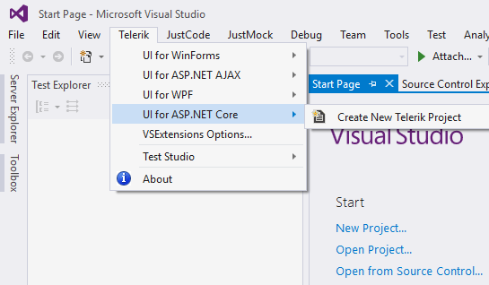
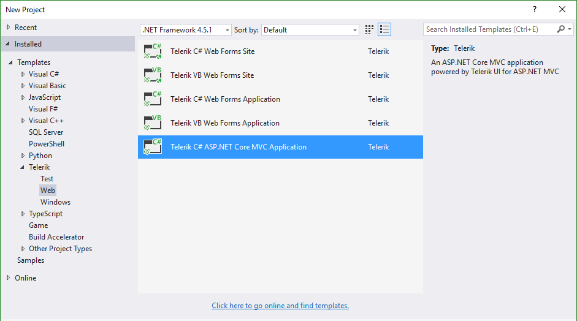

# Visual Studio Integration Overview

The Telerik UI for ASP.NET Core MVC Visual Studio Extensions enhance the experience of developing web applications with Telerik UI for ASP.NET MVC Core.

The extensions handle the following major points:

* Project [Creation](http://docs.telerik.com/aspnet-core/getting-started#configuration-Create)

The Telerik UI for ASP.NET Core Visual Studio Extensions are distributed with the Telerik UI for ASP.NET Core installer. They support Visual Studio 2015 and 2017(starting with __R1 2017__), which handle ASP.NET MVC 6 applications.

> **Important**
>
> Visual Studio Express editions are not supported.

The Visual Studio Extensions can be accessed through the **Telerik | UI for ASP.NET Core** menu.

**Figure 1. Visual Studio without Selected Projects**

**Figure 2. The added project template**

This is available in the language-specific nodes of the dialog as well. The **Add New Project** dialog contains the Telerik UI for ASP.NET Core MVC web application under the `CSharp\Web` node.

## See Also

Other articles on Telerik UI for ASP.NET MVC in ASP.NET Core applications:

* [Overview of Telerik UI for ASP.NET Core]()
* [Get Started with Telerik UI for ASP.NET MVC in ASP.NET Core Projects]()
* [Known Issues with Telerik UI for ASP.NET Core]()
* [Tag Helpers for ASP.NET Core]()
