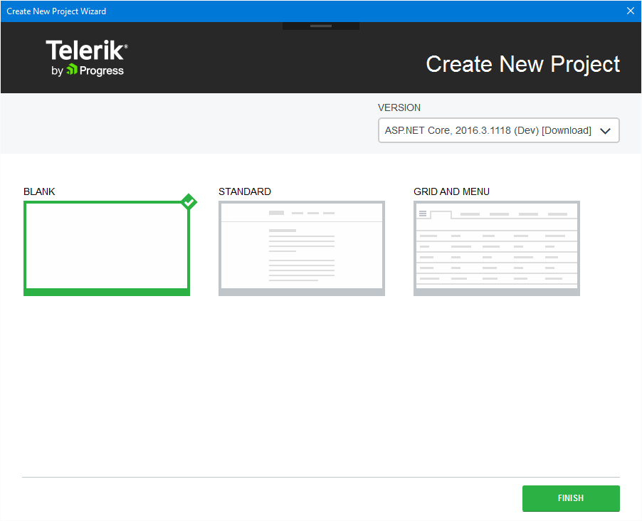

# Visual Studio Integration

The Visual Studio Extensions enhance the experience in developing web applications with Telerik UI for ASP.NET MVC Core.

## Overview 

As their major advantage, the extensions handle the [creation of projects](#configuration-Create).

The Visual Studio Extensions for Telerik UI for ASP.NET Core are distributed with the Telerik UI for ASP.NET Core installer. They support Visual Studio 2015 and, starting from R1 2017, Visual Studio 2017. Both Visual Studio versions handle ASP.NET MVC 6 applications.

> **Important**
>
> Visual Studio Express editions are not supported.

## Adding Project Templates

To access the Visual Studio Extensions, use the **Telerik | UI for ASP.NET Core** menu.

**Figure 1. Visual Studio without Selected Projects**

To add the project template, select it from the drop-down list of options.  

**Figure 2. The added project template**

The added project template is available in the language-specific nodes of the dialog as well. The **Add New Project** dialog contains the Telerik UI for ASP.NET Core MVC web application under the **CSharp\Web** node.

**Figure 3. New ASP.NET Core Project Wizard**

### Project Settings
The **Create New Project** page enables you to modify the project settings by configuring the following options:

* **Project type**&mdash;Choose the desired project type: **Empty**, **Standard**, **Grid and Menu**.
* **Version**&mdash;Choose the version of UI for ASP.NET Core you want to use.

### New ASP.NET Core Application Creation

After configuring the project settings, click **Finish** to start the creation of the new ASP.NET Core application.

As a result, the wizard:  
* Creates a new ASP.NET Core application.
* Copies all Kendo UI scripts.
* Copies all Kendo UI content files.
* Copies all Kendo UI editor templates.
* Adds a package reference to `Telerik.UI.for.AspNet.Core` NuGet package.

## See Also

Other articles on Telerik UI for ASP.NET MVC in ASP.NET Core applications:

* [Overview of Telerik UI for ASP.NET Core]()
* [Get Started with Telerik UI for ASP.NET MVC in ASP.NET Core Projects]()
* [Known Issues with Telerik UI for ASP.NET Core]()
* [Tag Helpers for ASP.NET Core]()
