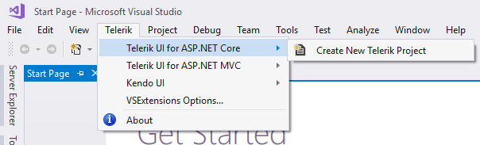
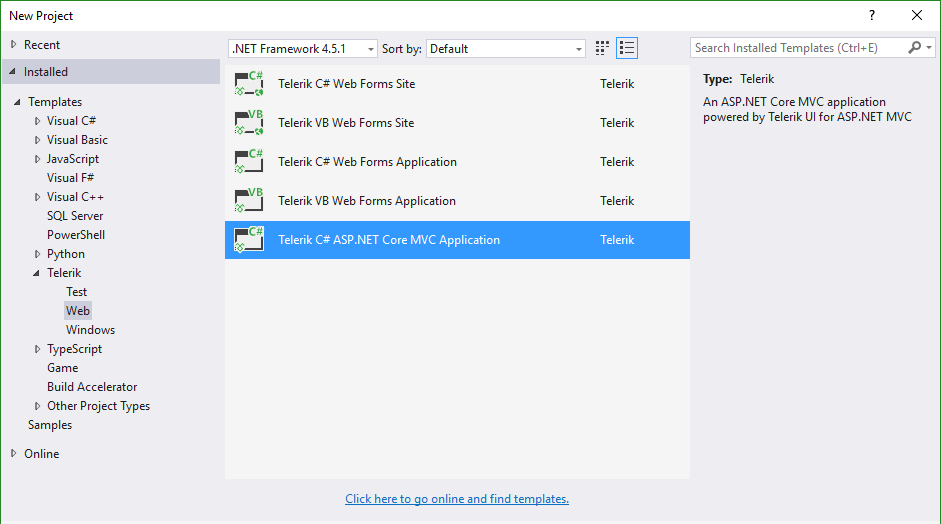

# Visual Studio Integration Overview

The Progress&reg; Telerik&reg; UI for ASP.NET Core Visual Studio (VS) Extensions enhance the experience in developing MVC web applications with Telerik UI for ASP.NET Core.

As their major advantage, the VS extensions handle the [creation of projects](#configuration-Create).

The Progress&reg; Telerik&reg; UI for ASP.NET Core VS Extensions support VS 2017 and are distributed with the Progress&reg; Telerik&reg; UI for ASP.NET Core installer.

> **Important**
>
> VS Express editions are not supported.

## Adding Project Templates

To access the VS Extensions, use the **Telerik | Telerik UI for ASP.NET Core** menu.

**Figure 1. VS without Selected Projects**

To add the project template, select it from the drop-down list of options.

**Figure 2. The added project template**

The added project template is available in the language-specific nodes of the dialog as well. The **Add New Project** dialog contains the Telerik UI for ASP.NET Core web application under the **CSharp\Web** node.

## See Also

* [Creating Projects with VS]()
* [Downloading New Versions]()
