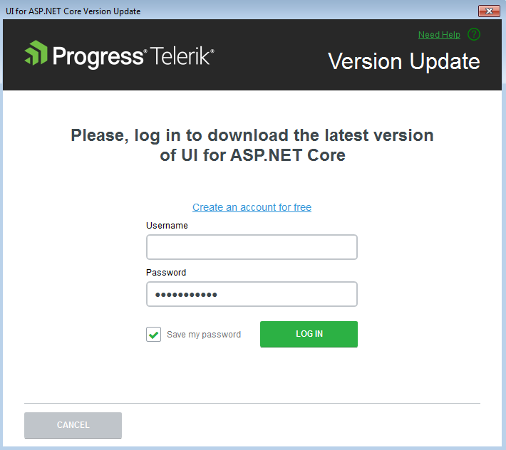
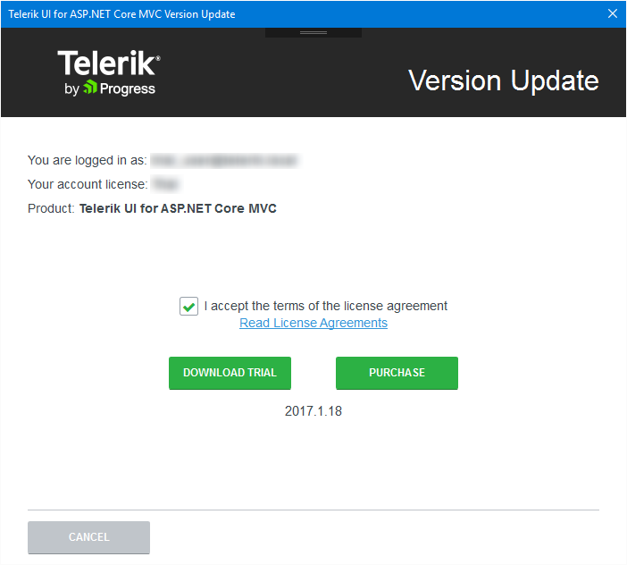
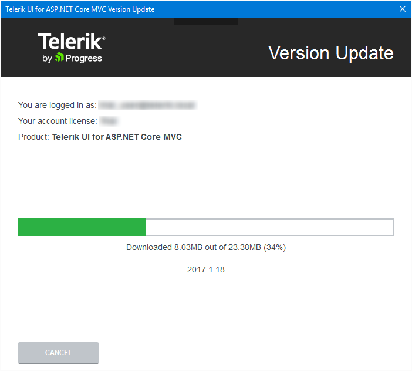
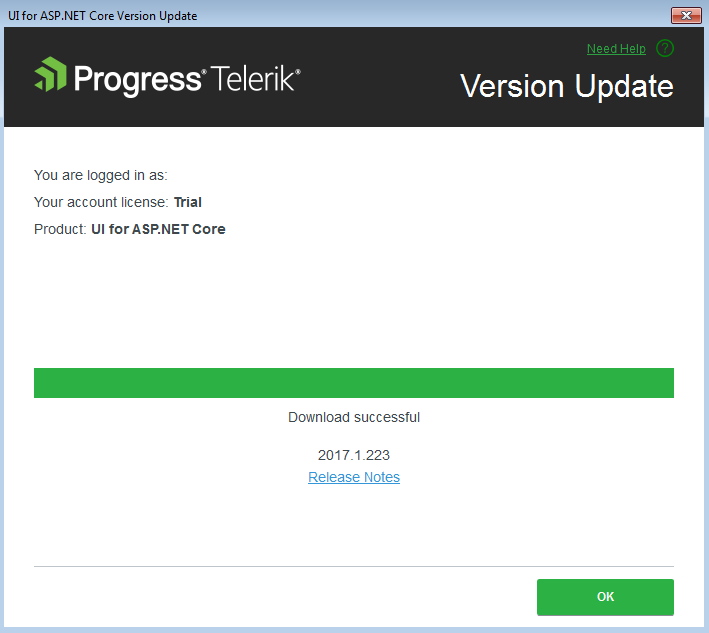

# Downloading New Versions

The Progress&reg; Telerik&reg; UI for ASP.NET Core Visual Studio (VS) extensions help you keep your projects updated. The Latest Version Acquirer tool automatically retrieves the latest Progress&reg; Telerik&reg; UI for ASP.NET Core distribution available on the Telerik web site.

Once a day, upon loading a project with Progress&reg; Telerik&reg; UI for ASP.NET Core controls, the extensions query the Telerik website for a new version of Progress&reg; Telerik&reg; UI for ASP.NET Core. When a new version is discovered a notification is displayed.

**Figure 1. A displayed notification upon locating a new Telerik UI for ASP.NET Core version**

Clicking **Update Now** starts the Latest Version Acquirer tool which, on its first page, prompts for your Telerik credentials. If you do not have a [www.telerik.com](https://www.telerik.com) account, you can create one through the **Create an account for free** link.

**Figure 2. The dialog for getting the latest version**

## The Process

1. Go to the [release notes of the Telerik UI for ASP.NET Core distribution](http://www.telerik.com/support/whats-new/aspnet-core-ui/release-history) to get information on the latest available versions.

2. Use the **Save my password** checkbox to avoid having to enter your Telerik credentials multiple times. The persistence is securely done and the credentials are saved in a per-user context. Other users on the machine do not have access to your stored credentials.

3. In the dialog that appears, confirm the download. The latest version then automatically starts to download. **Figures 2**, **3**, and **4** show the dialog that indicates the download progress.

  **Figure 3**

  

  **Figure 4**

  

  **Figure 5**

  

 4. To access the latest version of Telerik UI for ASP.NET Core, go to **New Project Wizard** after the download completes.

> **Important**
> * The **Download** buttons of the **New Project Wizard** launch the **Latest Version Acquirer** tool.
> * The **Latest Version Acquirer** tool downloads the `.zip` files, containing the latest Telerik UI for ASP.NET Core binaries and any resources that are vital for a Telerik UI for ASP.NET Core application. These get unpacked in the `%APPDATA%\Telerik\Updates` folder by default. If you find the list of the offered packages too long and you do not need the older versions, close the VS and use the Windows Explorer to delete these distributions.

## See Also

* [VS Integration Overview]()
* [Creating Projects]()
