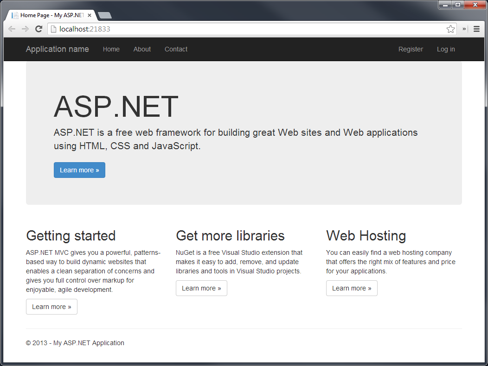

# Using in MVC 5

You can use Telerik UI for ASP.NET MVC and create ASP.NET MVC 5 applications.

This project uses Visual Studio 2013. However, the examples are applicable to all Visual Studio versions that support ASP.NET MVC 5. The demonstrated project creates a new ASP.NET MVC 5 application but you can use the same approach to use Telerik UI for ASP.NET MVC in existing ASP.NET MVC 5 applications.

> The Telerik UI for ASP.NET MVC Visual Studio extensions automate the suggested procedure. For more information, refer to the article on [VS extensions]().

To create, configure, build, and run the MVC 5 project with Telerik UI for ASP.NET MVC:

1. [Create the new MVC 5 application](#creating-the-new-application)
1. [Add Telerik UI for ASP.NET MVC](#adding-telerik-ui-for-aspnet-mvc-)
1. [Include the JavaScript and CSS files](#including-the-javascript-and-css-files)
1. [Add the Kendo.Mvc.dll reference](#adding-the-kendomvcdll-reference)
1. [Update the web.config file](#updating-the-webconfig-file)
1. [Set the Helper Widget Initialization](#setting-the-helper-widget-initialization)

## Creating the New Application

1. Open Visual Studio 2013.
1. Press `CTRL+SHIFT+N` to create a new project.
1. Select the **Visual C#** > **Web** to show all available web project templates for C#.
1. Select **ASP.NET Web Application** > **OK**. This starts the **New ASP.NET Project** wizard.
1. Select **MVC** from the available templates and click **OK**.
1. Press `CTRL+F5` to build and run the application.



## Adding Telerik UI for ASP.NET MVC

1. Include the required JavaScript and CSS files.
1. Reference the `Kendo.Mvc.dll` assembly.
1. Update the `web.config` file of the application.

## Including the JavaScript and CSS Files

To include the necessary Telerik UI for ASP.NET MVC files in the page, use either of the following approaches:
* Include a local copy of those files.
* Use the Content Delivery Network (CDN) services.

### Including Local File Copies

1. Navigate to the installation location of Telerik UI for ASP.NET MVC. By default, it is in `C:\Program Files (x86)\Progress\`. For versions prior to R3 2017, the default location is in `C:\Program Files (x86)\Telerik\`.
1. Drag the `js` directory from the location and drop it in Visual Studio over the `Scripts` folder of the application.
1. Drag the `styles` directory from the location and drop it in Visual Studio over the `Content` folder of the application.
1. Rename the `Scripts/js` directory to `Scripts/kendo`. Rename `Content/styles` to `Content/kendo`. After the needed JavaScript and CSS files are added to the application, you can include them.

    

1. Open `App_Start/BundleConfig.cs` to add bundles for Telerik UI for ASP.NET MVC.
1. Add a script bundle for Telerik UI for ASP.NET MVC.

        bundles.Add(new ScriptBundle("~/bundles/kendo").Include(
            "~/Scripts/kendo/kendo.all.min.js",
            // uncomment below if using the Scheduler
            // "~/Scripts/kendo/kendo.timezones.min.js",
            "~/Scripts/kendo/kendo.aspnetmvc.min.js"));

1. Add a style bundle for Telerik UI for ASP.NET MVC.

    > Make sure you are familiar with the [Telerik UI for ASP.NET MVC fundamentals and CSS bundling]().

        bundles.Add(new StyleBundle("~/Content/kendo/css").Include(
            "~/Content/kendo/kendo.common-bootstrap.min.css",
            "~/Content/kendo/kendo.bootstrap.min.css"));

1. Set the ASP.NET bundles to allow minified files in debug mode.

        bundles.IgnoreList.Clear();

1. Open the layout of the application. By default, if using ASPX, it is `Views/Shared/_Layout.cshtml`, or `Site.master`.
1. Render the Telerik UI for ASP.NET MVC style bundle.

    ```ASPX
        <%: Styles.Render("~/Content/kendo/css") %>
    ```
    ```Razor
        @Styles.Render("~/Content/kendo/css")
    ```

1. Move the jQuery bundle to the `head` tag of the page. By default, it is located at the end of the page.
1. Render the Telerik UI for ASP.NET MVC script bundle after jQuery. Make sure that the jQuery version you load is [supported](https://docs.telerik.com/kendo-ui/intro/installation/prerequisites#supported-jquery-versions).

    ```ASPX
        <%: Scripts.Render("~/bundles/jquery") %>
        <%: Scripts.Render("~/bundles/kendo") %>
    ```
    ```Razor
        @Scripts.Render("~/bundles/jquery")
        @Scripts.Render("~/bundles/kendo")
    ```

### Using the CDN Services

> Replace `kendo ui version` from the following code snippets with the current version of the product&mdash;for example, `2013.2.918`.

1. Open the layout of the application. By default, if using ASPX, it is `Views/Shared/_Layout.cshtml`, or `Site.master`.
1. Include `kendo.common-bootstrap.min.css` and `kendo.bootstrap.min.css`. Add a `link` tag within the `head` tag of the layout. For more information on the CSS files which are used by the predefined Less themes, refer to the documentation on the [Less-based themes](https://docs.telerik.com/kendo-ui/styles-and-layout/appearance-styling).

        <link rel="stylesheet" href="http://kendo.cdn.telerik.com/<kendo ui version>/styles/kendo.common-bootstrap.min.css" />
        <link rel="stylesheet" href="http://kendo.cdn.telerik.com/<kendo ui version>/styles/kendo.bootstrap.min.css" />

1. Include `kendo.all.min.js` and `kendo.aspnetmvc.min.js` after jQuery.

        <script src="http://kendo.cdn.telerik.com/<kendo ui version>/js/kendo.all.min.js"></script>
        <script src="http://kendo.cdn.telerik.com/<kendo ui version>/js/kendo.aspnetmvc.min.js"></script>

1. If using the Telerik MVC Scheduler helper, include `kendo.timezones.min.js` after `kendo.all.min.js`.

        <script src="http://kendo.cdn.telerik.com/<kendo ui version>/js/kendo.all.min.js"></script>
        <script src="http://kendo.cdn.telerik.com/<kendo ui version>/js/kendo.timezones.min.js"></script>
        <script src="http://kendo.cdn.telerik.com/<kendo ui version>/js/kendo.aspnetmvc.min.js"></script>

## Adding the Kendo.Mvc.dll Reference

The `Kendo.Mvc.dll` assembly contains the Telerik UI helpers. `Kendo.Mvc.dll` depends on the latest version of `System.Web.Mvc`. If the application uses a previous MVC version, [upgrade to the latest version](https://www.nuget.org/packages/Microsoft.AspNet.Mvc/).

1. Right-click the **References** node in Solution Explorer. Click **Add Reference**.
1. Select the **Browse** tab of the **Add Reference** dialog. Navigate to the install location of Telerik UI for ASP.NET MVC.
1. Navigate to `wrappers/aspnetmvc/Binaries/MVC5`. This directory contains the ASP.NET MVC 5 version of Telerik UI for ASP.NET MVC.
1. Select `Kendo.Mvc.dll`. Click **OK**.

Alternatively, use the following approach:

1. Copy the assembly from the Telerik UI for ASP.NET MVC install location.
1. Paste the assembly in the `bin` folder of the application.
1. Reference the assembly from there.

## Updating the web.config File

By updating the `web.config` file of the web application, you indicate the `Kendo.Mvc.UI` namespace where the helpers are located. For issues related to unmatching `System.Web.Mvc` versions, refer to the [article on troubleshooting]().

1. Open `Views/Web.config`, or root `Web.config` if using ASPX.
1. Locate the `namespaces` tag.
1. Append an `add` tag to the `namespaces` tag.

        <namespaces>
            <add namespace="System.Web.Mvc" />
            <add namespace="System.Web.Mvc.Ajax" />
            <add namespace="System.Web.Mvc.Html" />
            <add namespace="System.Web.Routing" />
            <add namespace="Kendo.Mvc.UI" />
        </namespaces>

1. Add a binding redirect to your current `System.Web.Mvc` version.

        <configuration>
            <runtime>
                <assemblyBinding xmlns="urn:schemas-microsoft-com:asm.v1">
                    <dependentAssembly>
                        <assemblyIdentity name="System.Web.Mvc" publicKeyToken="31bf3856ad364e35" />
                        <bindingRedirect oldVersion="1.0.0.0-5.2.7.0" newVersion="5.2.7.0" />
                    </dependentAssembly>
                </assemblyBinding>
            </runtime>
        </configuration>

## Setting the Helper Widget Initialization

Below are listed the steps for you to follow when using a Kendo UI widget through its MVC server-side wrapper initialization.

1. Open the `Views/Home/Index.cshtml` view, or `Index.aspx` if using ASPX.
1. Add a Kendo UI DatePicker widget.

    ```ASPX
        <%: Html.Kendo().DatePicker().Name("datepicker") %>
    ```
    ```Razor
        @(Html.Kendo().DatePicker().Name("datepicker"))
    ```

1. Press `CTRL+F5` to build and run the application.

    

## See Also

* [Telerik UI for ASP.NET MVC Fundamentals]()
* [Telerik UI for ASP.NET MVC Download and Installation]()
* [Telerik UI for ASP.NET MVC Troubleshooting]()
