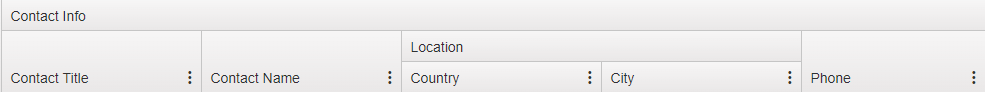

# Advanced Configuration

The Telerik UI for ASP.NET MVC Grid enables you to use the configuration options that are exposed by its fluent API.

The following example demonstrates the model which is assumed by all examples in this article.

    public class Product
    {
        public int ProductID { get; set; }
        public string ProductName { get; set; }
        public int UnitsInStock { get; set; }
        public int UnitsOnOrder { get; set; }
        public double UnitPrice { get; set; }
    }

The API of the Telerik UI Grid for ASP.NET MVC is exposed through the [`Kendo.Mvc.UI.Fluent.GridBuilder`](/api/Kendo.Mvc.UI.Fluent/GridBuilder) class. You do not have to instantiate that class but use the `@(Html.Kendo().Grid<Product>().Name("grid"))` Grid HtmlHelper extension method instead.

## Common DataSource Settings

The [`DataSource`](http://docs.telerik.com/aspnet-mvc/api/Kendo.Mvc.UI.Fluent/GridBuilder#methods-Columns(System.Action<Kendo.Mvc.UI.Fluent.GridColumnFactory<T>>)) method of Grid for ASP.NET MVC configures the [data source](http://docs.telerik.com/kendo-ui/api/javascript/ui/grid#configuration-dataSource).

* The `Aggregates` method sets the aggregates.

        @(Html.Kendo().Grid<Product>()
            .Name("grid")
            .DataSource(dataSource => dataSource
                .Ajax() //Or .Server()
                .Read(read => read.Action("Products_Read", "Home"))
                .Aggregates(aggregates =>
                {
                    aggregates.Add(product => product.UnitsInStock).Min().Max().Count();
                    aggregates.Add(product => product.UnitsOnOrder).Average();
                    aggregates.Add(product => product.ProductName).Count();
                    aggregates.Add(product => product.UnitPrice).Sum();
                })
            )
        )

* The `Create` method sets the action method which is responsible for saving new data items.

        @(Html.Kendo().Grid<Product>()
            .Name("grid")
            .ToolBar(toolbar => toolbar.Create())
            .DataSource(dataSource => dataSource
                .Ajax() //Or .Server()
                .Model(model => model.Id(product => product.ProductID))
                .Create(create => create.Action(/* action */"Products_Create", /* controller */ "Home"))
                .Read(read => read.Action("Products_Read", "Home"))
            )
        )

* The `Destroy` method sets the action method which is responsible for destroying data items.

        @(Html.Kendo().Grid<Product>()
            .Name("grid")
            .Columns(columns =>
            {
                columns.Bound(product => product.ProductName);
                columns.Command(command => command.Destroy());
            })
            .Editable(editable => editable.Mode(GridEditMode.InLine))
            .DataSource(dataSource => dataSource
                .Ajax() //Or .Server()
                .Model(model => model.Id(product => product.ProductID))
                .Destroy(destroy => destroy.Action(/* action */"Products_Destroy", /* controller */ "Home"))
                .Read(read => read.Action("Products_Read", "Home"))
            )
        )

* The `Events` method specifies the event handlers for the data source client-side [events](http://docs.telerik.com/kendo-ui/api/javascript/data/datasource#events).

        @(Html.Kendo().Grid<Product>()
            .Name("grid")
            .DataSource(dataSource => dataSource
                .Ajax()
                .Read(read => read.Action("Products_Read", "Home"))
                .Events(events => events
                    //Subscribe to the "change" event.
                    .Change("dataSource_change")
                    //Subscribe to the "error" event.
                    .Error("dataSource_error")
                    //Subscribe to the "requestStart" event.
                    .RequestStart("dataSource_requestStart")
                )
            )
        )
        <script>
            function dataSource_change(e) {
                // Handle the "change" event.
            }
            function dataSource_error(e) {
                // Handle the "error" event.
            }
            function dataSource_requestStart(e) {
                // Handle the "requestStart" event.
            }
        </script>

* The `Filter` method sets the initial filter of the data source.

        @(Html.Kendo().Grid<Product>()
            .Name("grid")
            .DataSource(dataSource => dataSource
                .Ajax()
                .Read(read => read.Action("Products_Read", "Home"))
                .Filter(filters =>
                {
                    //Show products whose ProductName property contains a "C".
                    filters.Add(product => product.ProductName).Contains("C");
                    //Show products whose UnitsInStock is greater than 10.
                    filters.Add(product => product.UnitsInStock).IsGreaterThan(10);
                })
            )
        )

* The `Group` method sets the initial grouping configuration of the data source.

        @(Html.Kendo().Grid<Product>()
            .Name("grid")
            .DataSource(dataSource => dataSource
                .Ajax()
                .Read(read => read.Action("Products_Read", "Home"))
                .Group(groups =>
                {
                    groups.Add(product => product.UnitPrice);
                    groups.Add(product => product.ProductName);
                })
            )
        )

* The `Model` method configures the model of the data source. The data field names must be valid JavaScript identifiers and contain neither spaces, nor special characters. The first character has to be a letter.

        @(Html.Kendo().Grid<Product>()
            .Name("grid")
            .DataSource(dataSource => dataSource
                .Ajax()
                .Read(read => read.Action("Products_Read", "Home"))
                .Model(model =>
                {
                    // The unique identifier (primary key) of the model is the ProductID property.
                    model.Id(product => product.ProductID);

                    //Declare a model field and optionally specify its default value (used when a new model instance is created).
                    model.Field(product => product.ProductName).DefaultValue("N/A");

                    //Declare a model field and make it readonly.
                    model.Field(product => product.UnitPrice).Editable(false);
                })
            )
        )

* The `PageSize` method sets the page size used during paging. The default page size is `10`.

        @(Html.Kendo().Grid<Product>()
            .Name("grid")
            .DataSource(dataSource => dataSource
                .Ajax() //Or .Server()
                .Read(read => read.Action("Products_Read", "Home"))
                .PageSize(20)
            )
        )

* The `Read` method sets the action method which is responsible for reading data items and for returning them as JSON.

        @(Html.Kendo().Grid<Product>()
            .Name("grid")
            .DataSource(dataSource => dataSource
                .Ajax() //Or .Server()
                .Read(read => read.Action(/* action */"Products_Read", /* controller */"Home"))
            )
        )

* The `Sort` method sets the initial sorting.

        @(Html.Kendo().Grid<Product>()
            .Name("grid")
            .DataSource(dataSource => dataSource
                .Ajax() //Or .Server()
                .Read(read => read.Action("Products_Read", "Home"))
                .Sort(sort =>
                {
                    //Sort by the UnitsInStock in descending order.
                    sort.Add(product => product.UnitsInStock).Descending();
                    // Then sort by the ProductName in ascending order.
                    sort.Add(product => product.ProductName);
                })
            )
        )

* The `Update` method sets the action method which is responsible for saving updated data items.

        @(Html.Kendo().Grid<Product>()
            .Name("grid")
            .Columns(columns =>
            {
                columns.Bound(product => product.ProductName);
                columns.Command(command => command.Edit());
            })
            .Editable(editable => editable.Mode(GridEditMode.InLine))
            .DataSource(dataSource => dataSource
                .Ajax() //Or .Server()
                .Model(model => model.Id(product => product.ProductID))
                .Update(update => update.Action(/* action */"Products_Update", /* controller */ "Home"))
                .Read(read => read.Action("Products_Read", "Home"))
            )
        )

## Ajax DataSource Settings

The `Batch` method configures the batch `create`, `update` and `destroy` operations. By default, the batch operations are disabled.

    @(Html.Kendo().Grid<Product>()
        .Name("grid")
        .Columns(columns =>
        {
            columns.Bound(product => product.ProductName);
            columns.Command(command => command.Edit());
        })
        .DataSource(dataSource => dataSource
            .Ajax() // or .Server()
            .Batch(true)
            .Model(model => model.Id(product => product.ProductID))
            .Update(update => update.Action(/* action */"Products_Update", /* controller */ "Home"))
            .Read(read => read.Action("Products_Read", "Home"))
        )
    )

## Bound Column Settings

A bound column is declared through the `Bound` method, which specifies a data field.

> The data field names must be valid JavaScript identifiers and contain neither spaces, nor special characters. The first character should be a letter.

Bound columns support the following settings:

* ClientTemplate
* Encoded
* Filterable
* Format
* Groupable
* Sortable
* Template
* Title
* Width

The [`Columns`](/api/Kendo.Mvc.UI.Fluent/GridBuilder#methods-Columns) method configures the Grid columns. If not used, the Grid creates a column for every public property of the model.

```ASPX
    <% Html.Kendo().Grid<Product>()
        .Name("grid")
        .Columns(columns =>
        {
            // Define a column which will display the value of the ProductID property.
            columns.Bound(product => product.ProductID);

            // Define a column and set a column setting.
            columns.Bound(product => product.ProductName).Title("Product Name");

            // Define a template column. It needs a server-side code block (<% %>).
            columns.Template(product =>
            {
                %>
                    <%: Html.ActionLink("Edit", "Home", new { id = p.ProductID }) %>
                <%
            });

            // Define a command column with a "Destroy" button.

            columns.Command(commands =>
            {
                commands.Destroy();
            });
        })
        // The Render method is used because of the server-side code blocks.
        .Render();
    %>
```
```Razor
    @( Html.Kendo().Grid<Product>()
        .Name("grid")
        .Columns(columns =>
        {
            // Define a column which will display the value of the ProductID property.
            columns.Bound(product => product.ProductID);

            // Define a column and set a column setting.
            columns.Bound(product => product.ProductName).Title("Product Name");

            // Define a template column. It needs a templated razor delegate.
            columns.Template(@<text>
                @Html.ActionLink("Edit", "Home", new { id = item.ProductID })
            </text>);

            // Define a command column with a "Destroy" button.
            columns.Command(commands =>
            {
                commands.Destroy();
            });
        })
    )
```

* A [Kendo UI for jQuery template](http://docs.telerik.com/kendo-ui/framework/templates/overview) which specifies the way the column is displayed.

    > The `ClientTemplate` is used when the Grid is configured for [Ajax binding]() or when [server binding]() is combined with client-side data operations^&mdash;when [`ServerOperation` is set to `false`](#enable-client-data-processing-during-ajax-binding).

    Client templates defined in server-side code are URL encoded before they are sent to the client. As a result, a `+` (plus) sign, which is used inside a binding expression, is lost&mdash;for example, `"#= 3 + 5 #"`.

    To work around this issue, use either f the following approaches:
    * Use an auxiliary JavaScript function in the global scope, which returns the desired value&mdash;for example, `"#= auxFunction(3, 5) #"`.
    * Encode the `+` (plus) sign&mdash;for example, `"#= 3 %2b 5 #"`.

        @(Html.Kendo().Grid<Product>()
            .Name("grid")
            .Columns(
            {
                columns.Bound(product => product.ProductName).ClientTemplate("<strong>#: ProductName #</strong>");
            })
            .DataSource(dataSource => dataSource
                .Ajax()
                .Read(read => read.Action("Products_Read", "Home"))
            )
        )

* The `Encoded` method configures the HTML encoding of the bound property value. By default, it is set to `true` which means that the column values are encoded.

        @(Html.Kendo().Grid<Product>()
            .Name("grid")
            .Columns(
            {
                // Stop encoding the value of the bound field.
                columns.Bound(product => product.ProductName).Encoded(false);
            })
            .DataSource(dataSource => dataSource
                .Ajax() // Or Server()
                .Read(read => read.Action("Products_Read", "Home"))
            )
        )

* The `Filterable` method enables or disables the filtering UI. By default, it is set to `true` which means that the bound Grid columns can be filtered using the filtering UI.

        @(Html.Kendo().Grid<Product>()
            .Name("grid")
            .Columns(
            {
                columns.Bound(product => product.ProductID).Filterable(false);
                columns.Bound(product => product.ProductName);
            })
            .Filterable()
            .DataSource(dataSource => dataSource
                .Ajax() //Or Server()
                .Read(read => read.Action("Products_Read", "Home"))
            )
        )

* The `Search` method enables or disables the Search Panel in the Grid toolbar. The Search Panel uses filtering under the hood to show only the relevant records in the Grid. In addition, it is possible to customize which fields to search when a value is entered in the search input.

    When filtering is enabled in the filter textboxes for all Grid columns will be populated with the value entered in the search textbox.

    > When server operations are enabled it is possible to search only using string fields. Using `Contains` filter operation is available only for string types.

        @(Html.Kendo().Grid<Product>()
            .Name("grid")
            .Columns(
            {
                columns.Bound(product => product.ProductID).Filterable(false);
                columns.Bound(product => product.ProductName);
            })
            .ToolBar(t => t.Search())
            .Search(s=> { s.Field(c => c.ProductName); })
            .DataSource(dataSource => dataSource
                .Ajax()
                .Read(read => read.Action("Products_Read", "Home"))
            )
        )


* The `Format` method specifies the format used when displaying the value of the bound property. By default, it is empty. For more information on the supported formats, refer to the [article about globalization](http://docs.telerik.com/kendo-ui/framework/globalization/overview).

        @(Html.Kendo().Grid<Product>()
            .Name("grid")
            .Columns(
            {
                //Format the value as currency.
                columns.Bound(product => product.UnitPrice).Format("{0:C}");
            })
            .Filterable()
            .DataSource(dataSource => dataSource
                .Ajax() //Or Server()
                .Read(read => read.Action("Products_Read", "Home"))
            )
        )

* The `Groupable` method enables or disables the dragging of the column header to group by its bound property. By default, it is set to `true` which means that the bound Grid columns can be dragged for grouping.

        @(Html.Kendo().Grid<Product>()
            .Name("grid")
            .Columns(
            {
                columns.Bound(product => product.ProductID).Groupable(false);
                columns.Bound(product => product.ProductName);
            })
            .Groupable()
            .DataSource(dataSource => dataSource
                .Ajax() //Or Server()
                .Read(read => read.Action("Products_Read", "Home"))
            )
        )

* The `Sortable` method enables or disables the sorting by that column.

        @(Html.Kendo().Grid<Product>()
            .Name("grid")
            .Columns(
            {
                columns.Bound(product => product.ProductID).Sortable(false);
                columns.Bound(product => product.ProductName);
            })
            .Groupable()
            .DataSource(dataSource => dataSource
                .Ajax() //Or Server()
                .Read(read => read.Action("Products_Read", "Home"))
            )
        )

* The `Template` method sets the server template which is used when the bound field is displayed.

    > The `Template` is used when the Grid is configured for [server binding](). If the client-side data operations are enabled&mdash;when [`ServerOperation` is set to `false`](#enable-client-data-processing-during-ajax-binding)), you will also need a [`ClientTemplate`](#clienttemplate).

    In WebForms, the template is a [server-side code block](https://msdn.microsoft.com/en-us/library/ms178135(vs.80).aspx). In Razor the template is a [templated Razor delegate](http://haacked.com/archive/2011/02/27/templated-razor-delegates.aspx/).

        ```ASPX
            <% Html.Kendo().Grid(Model)
                .Name("grid")
                .Columns(columns =>
                {
                    // The template is a server-side code block (<% %>).
                    columns.Bound(product => product.ProductID).Template(product =>
                    {
                        %>
                            <strong><%: p.ProductID %></strong>
                        <%
                    });
                })
                // The Render method is used because of the server-side code blocks.
                .Render();
            %>
        ```
        ```Razor
            @(Html.Kendo().Grid(Model)
                .Name("grid")
                .Columns(columns =>
                {
                        // The template is a templated razor delegate. The argument of the delegate is called "item".
                        columns.Bound(product => product.ProductID).Template(@<text>
                            <strong>@item.ProductID</strong>
                        </text>);
                })
                )
        ```

* The `Title` method sets the text displayed in the header of the column. By default, the property name is used. The `Title` must not include non-encoded HTML content. Use a `HeaderTemplate` instead.

        @(Html.Kendo().Grid<Product>()
            .Name("grid")
            .Columns(
            {
                columns.Bound(product => product.ProductName).Title("Product Name");
            })
            .DataSource(dataSource => dataSource
                .Ajax() //Оr Server()
                .Read(read => read.Action("Products_Read", "Home"))
            )
        )

* The `Width` method sets the width of the column in pixels or other units. By default, the width is not set and the column would try to accommodate its content.

        @(Html.Kendo().Grid<Product>()
            .Name("grid")
            .Columns(
            {
                // Set the column width in pixels.
                columns.Bound(product => product.ProductID).Width(200);
                // Set the column width in em.
                columns.Bound(product => product.ProductName).Width("10em");
            })
            .DataSource(dataSource => dataSource
                .Ajax() //Or Server()
                .Read(read => read.Action("Products_Read", "Home"))
            )
        )

* The multicolumn headers of the Grid represent a tree-like structure where one or more columns can be grouped together by a common header. That common header in turn can be a child of another upper `MultiColumn` header which can also span both columns and other headers. For more information, refer to the [demo on implementing multicolumn headers](https://demos.telerik.com/aspnet-mvc/grid/multicolumnheaders).

        columns.Group(group => group
            .Title("Contact Info")
            .Columns(info => {
                info.Bound(x => x.ContactTitle).Width(200);
                info.Bound(x => x.ContactName).Width(200);
                info.Group(g => g.Title("Location")
                    .Columns(location =>
                    {
                        location.Bound(c => c.Country).Width(200);
                        location.Bound(c => c.City).Width(200);
                    })
                );
                info.Bound(x => x.Phone);
            })
        );

  The above definition will be presented in the following output:

        

## Template Column Settings

Template columns have the following settings:

* ClientTemplate
* Title
* Width
* Paging
* ButtonCount
* Enabled
* Info
* Input
* Messages

A template column is declared through the `Template` method. This is a column that is not bound to a specific field from the data, so it is not sortable, nor filterable. Nevertheless, template columns can still display data item values.

* A [Kendo UI for jQuery template](http://docs.telerik.com/kendo-ui/framework/templates/overview) which specifies the way the column is displayed.

  > The `ClientTemplate` is used when the Grid is configured for [Ajax binding]().

        @(Html.Kendo().Grid<Product>()
            .Name("grid")
            .Columns(
            {
                columns.Template(@<text>
                            <strong>@item.ProductName</strong>
                        </text>)
                        .ClientTemplate("<strong>#: ProductName #</strong>");
            })
            .DataSource(dataSource => dataSource
                .Ajax()
                .Read(read => read.Action("Products_Read", "Home"))
            )
        )

* The `Title` method sets the text displayed in the header of the column. By default, it is empty.

        @(Html.Kendo().Grid<Product>()
            .Name("grid")
            .Columns(
            {
                columns.Template(@<text>
                            <strong>@item.ProductName</strong>
                        </text>)
                        .Title("Product Name")
                        .ClientTemplate("<strong>#: ProductName #</strong>");
            })
            .DataSource(dataSource => dataSource
                .Ajax()
                .Read(read => read.Action("Products_Read", "Home"))
            )
        )

* The `Width` method sets the width of the column in pixels or other units. By default, the width is not set and the column would try to accommodate its content.

        @(Html.Kendo().Grid<Product>()
            .Name("grid")
            .Columns(
            {
                columns.Template(@<text>
                            <strong>@item.ProductName</strong>
                        </text>)
                        .Width(200)
                        .ClientTemplate("<strong>#: ProductName #</strong>");
            })
            .DataSource(dataSource => dataSource
                .Ajax()
                .Read(read => read.Action("Products_Read", "Home"))
            )
        )

## Paging

The `Paging` method configures the paging functionality. To enable paging with the default settings, call the `Paegable` method without arguments.

```ASPX
    <%: Html.Kendo().Grid(Model)
        .Name("grid")
        .Pageable() //Enable paging.
        .DataSource(dataSource => dataSource
            .Ajax() //Or Server()
            .Read(read => read.Action("Products_Read", "Home"))
        )
    %>
```
```Razor
    @(Html.Kendo().Grid(Model)
        .Name("grid")
        .Pageable() //Enable paging.
        .DataSource(dataSource => dataSource
            .Ajax() //Or Server()
            .Read(read => read.Action("Products_Read", "Home"))
        )
    )
```

* The `ButtonCount` method specifies the number of numeric buttons that should be displayed in the pager. By default, the number of displayed buttons is 10.

        @(Html.Kendo().Grid(Model)
            .Name("grid")
            .Pageable(pager => pager.ButtonCount(15))
            .DataSource(dataSource => dataSource
                .Ajax() //Or Server()
                .Read(read => read.Action("Products_Read", "Home"))
            )
        )

* The `Enabled` method enables or disables paging. Use it when paging based on a condition should be enabled.

        @(Html.Kendo().Grid(Model)
            .Name("grid")
            .Pageable(pager => pager.Enabled((bool)ViewData["EnablePager"]))
            .DataSource(dataSource => dataSource
                .Ajax() //Or Server()
                .Read(read => read.Action("Products_Read", "Home"))
            )
        )

* The `Info` method specifies whether to show additional paging info. By default, the pager displays the total number of items in the Grid and the first and last item number&mdash;for example, `"1-50 of 50 items"`. If the Grid is empty, the pager would show `"No items to display"`. The paging info is displayed by default.

        @(Html.Kendo().Grid(Model)
            .Name("grid")
            .Pageable(pager => pager.Info(false))
            .DataSource(dataSource => dataSource
                .Ajax() //Or Server()
                .Read(read => read.Action("Products_Read", "Home"))
            )
        )

* The `Input` method specifies whether to show a textbox for typing in a page number. By default, such a textbox is not shown.

        @(Html.Kendo().Grid(Model)
            .Name("grid")
            .Pageable(pager => pager.Input(true))
            .DataSource(dataSource => dataSource
                .Ajax() //Or Server()
                .Read(read => read.Action("Products_Read", "Home"))
            )
        )

* The `Numeric` method sets the numeric pager. When enabled the pager will display numeric pager buttons. Numeric paging is enabled by default.

        @(Html.Kendo().Grid(Model)
            .Name("grid")
            .Pageable(pager => pager
                .Numeric(false)
            )
            .DataSource(dataSource => dataSource
                .Ajax() //Or Server()
                .Read(read => read.Action("Products_Read", "Home"))
            )
        )

* The `PageSizes` method enables or disables the page size dropdown. When enabled, the pager displays a dropdown which allows the user to change the page size to a predefined value. The page size dropdown is disabled by default.

        @(Html.Kendo().Grid(Model)
            .Name("grid")
            .Pageable(pager => pager
                .PageSizes(true) // The default page sizes are 5, 10 and 20.
            )
            .DataSource(dataSource => dataSource
                .Ajax() //Or Server()
                .Read(read => read.Action("Products_Read", "Home"))
            )
        )

  The following example demonstrates how to enable the page size drop-downs with custom page sizes.

        @(Html.Kendo().Grid(Model)
            .Name("grid")
            .Pageable(pager => pager
                .PageSizes(new [] { 10, 20, 30 }) // The default page sizes are 5, 10 and 20.
            )
            .DataSource(dataSource => dataSource
                .Ajax() //Or Server()
                .Read(read => read.Action("Products_Read", "Home"))
            )
        )

* The `PreviousNext` method enables or disables the `previous/next/first/last` pager buttons. These buttons navigate to the corresponding page when clicked. By default, the method is enabled.

        @(Html.Kendo().Grid(Model)
            .Name("grid")
            .Pageable(pager => pager
                .PreviousNext(false)
            )
            .DataSource(dataSource => dataSource
                .Ajax() // or Server()
                .Read(read => read.Action("Products_Read", "Home"))
            )
        )

* The `Refresh` method enables or disables the `refresh` pager button. Clicking that button reloads the current page. By default, the method is disabled.

        @(Html.Kendo().Grid(Model)
            .Name("grid")
            .Pageable(pager => pager
                .Refresh(true)
            )
            .DataSource(dataSource => dataSource
                .Ajax() // or Server()
                .Read(read => read.Action("Products_Read", "Home"))
            )
        )

## Pager Messages

The available messages are:

* Display
* Empty
* First
* ItemsPerPage
* Last
* Next
* Of
* Page
* Previous
* Refresh

The `Messages` method configures all messages displayed by the pager. Use this setting to override the default messages or to localize the pager.

* The `Display` method sets the pager info message. By default, it is set to `"{0} - {1} of {2} items"`. The placeholders represent the first item in the page, the last item in the page, and the total number of items in the Grid.

        @(Html.Kendo().Grid(Model)
            .Name("grid")
            .Pageable(pager => pager
                .Messages(messages => messages.Display("Showing items from {0} to {1}. Total items: {2}"))
            )
            .DataSource(dataSource => dataSource
                .Ajax() //Or Server()
                .Read(read => read.Action("Products_Read", "Home"))
            )
        )

* The `Empty` method configures the pager info message displayed when there are no items in the Grid. By default, it is set to `"No items to display"`.

        @(Html.Kendo().Grid(Model)
            .Name("grid")
            .Pageable(pager => pager
                .Messages(messages => messages.Empty("No data"))
            )
            .DataSource(dataSource => dataSource
                .Ajax() //Or Server()
                .Read(read => read.Action("Products_Read", "Home"))
            )
        )

* The `First` method sets the tooltip displayed when the user hovers over the `"first"` button of the pager. Clicking that button navigates to the first page. By default, it is set to `"Go to the first page"`.

        @(Html.Kendo().Grid(Model)
            .Name("grid")
            .Pageable(pager => pager
                .Messages(messages => messages.First("First page"))
            )
            .DataSource(dataSource => dataSource
                .Ajax() //Or Server()
                .Read(read => read.Action("Products_Read", "Home"))
            )
        )

* The `ItemsPerPage` method sets the label displayed when page sizes dropdown is displayed. By default, it is set to `"items per page`".

        @(Html.Kendo().Grid(Model)
            .Name("grid")
            .Pageable(pager => pager
                .PageSizes(true)
                .Messages(messages => messages.ItemsPerPage("items are currently displayed"))
            )
            .DataSource(dataSource => dataSource
                .Ajax() //Or Server()
                .Read(read => read.Action("Products_Read", "Home"))
            )
        )

* The `Last` method sets the tooltip displayed when the user hovers over the `"last"` button of the pager. Clicking that button, navigates to the last page. By default, it is set to `"Go to the last page"`.

        @(Html.Kendo().Grid(Model)
            .Name("grid")
            .Pageable(pager => pager
                .Messages(messages => messages.Last("Last page"))
            )
            .DataSource(dataSource => dataSource
                .Ajax() //Or Server()
                .Read(read => read.Action("Products_Read", "Home"))
            )
        )

* The `Next` method configures the tooltip displayed when the user hovers over the `"next"` button of the pager. Clicking that button navigates to the next page. By default, it is set to `"Go to the next page"`.

        @(Html.Kendo().Grid(Model)
            .Name("grid")
            .Pageable(pager => pager
                .Messages(messages => messages.Next("Next page"))
            )
            .DataSource(dataSource => dataSource
                .Ajax() //Or Server()
                .Read(read => read.Action("Products_Read", "Home"))
            )
        )

* The `Of` method configures the label displayed after the page textbox. By default, it is set to `"of {0}"`. The placeholder contains the total number of pages.

        @(Html.Kendo().Grid(Model)
            .Name("grid")
            .Pageable(pager => pager
                .Input(true)
                .Messages(messages => messages.Of("of {0} pages"))
            )
            .DataSource(dataSource => dataSource
                .Ajax() //Or Server()
                .Read(read => read.Action("Products_Read", "Home"))
            )
        )

* The `Page` method configures the label displayed before the page textbox. By default, it is set to `"Page"`.

        @(Html.Kendo().Grid(Model)
            .Name("grid")
            .Pageable(pager => pager
                .Input(true)
                .Messages(messages => messages.Page("Current page:"))
            )
            .DataSource(dataSource => dataSource
                .Ajax() //Or Server()
                .Read(read => read.Action("Products_Read", "Home"))
            )
        )

* The `Previous` method sets the tooltip displayed when the user hovers over the `"previous"` button of the pager. Clicking that button navigates to the previous page. By default, it is set to `"Go to the previous page"`.

        @(Html.Kendo().Grid(Model)
            .Name("grid")
            .Pageable(pager => pager
                .Messages(messages => messages.Previous("Previous page"))
            )
            .DataSource(dataSource => dataSource
                .Ajax() //Or Server()
                .Read(read => read.Action("Products_Read", "Home"))
            )
        )

* The `Refresh` method sets the tooltip displayed when the user hovers over the `"refresh"` button of the pager. Clicking that button refreshes the current page. By default, it is set to `"Refresh"`.

      @(Html.Kendo().Grid(Model)
          .Name("grid")
          .Pageable(pager => pager
              .Refresh(true)
              .Messages(messages => messages.Refresh("Click to refresh"))
          )
          .DataSource(dataSource => dataSource
              .Ajax() //Or Server()
              .Read(read => read.Action("Products_Read", "Home"))
          )
      )

## No Records Template

The Grid can show a built-in or custom message to the user when there are no records to display. There are several ways to configure it.

The following example demonstrates how to enable the default built-in `No Records` message.

    @(Html.Kendo().Grid<Order>()
        .Name("Grid")
        .NoRecords()
    )

The following example demonstrates how to define a custom `No Records` message. In this case, the custom message is be displayed centered inside the empty Grid's data area.

    @(Html.Kendo().Grid<Order>()
        .Name("Grid")
        .NoRecords("string HTML template, automatically centered")
    )

The following example demonstrates how to define a non-centered custom `No Records` message. In this case, the custom message is displayed with no centering styles applied, which allows an easier and more advanced appearance customization through custom CSS code.

    @(Html.Kendo().Grid<Order>()
        .Name("Grid")
        .NoRecords(n => n.Template("string HTML template, not centered"))
    )

The following example demonstrates how to define a custom `No Records` message with an external Kendo UI template. This case is the same as the above one, but the template is defined outside the Grid declaration.

    <script id="no-records-template-id" type="text/x-kendo-template">
        external HTML template, not centered
    </script>

    @(Html.Kendo().Grid<Order>()
        .Name("Grid")
        .NoRecords(n => n.TemplateId("no-records-template-id"))
    )

## Scrolling

By default, the Telerik UI Grid for ASP.NET MVC is not scrollable. When scrolling is enabled, the widget applies a default height of 200px to its data area. This can be changed or removed by setting an optional height style in the Grid's `Scrollable` settings.

    @(Html.Kendo().Grid(Model)
        .Name("grid")
        .Scrollable(s => s.Height(400)) // Set a 400px-height style.
    )

    // Alternatively:

    @(Html.Kendo().Grid(Model)
        .Name("grid")
        .Scrollable(s => s.Height("auto")) // Remove the default height.
    )

## See Also

* [Using the API of the Grid HtmlHelper for ASP.NET MVC (Demo)](https://demos.telerik.com/aspnet-mvc/grid/api)
* [Server-Side API](/api/grid)
