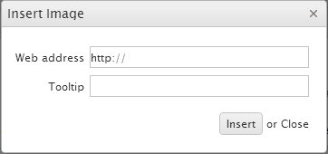
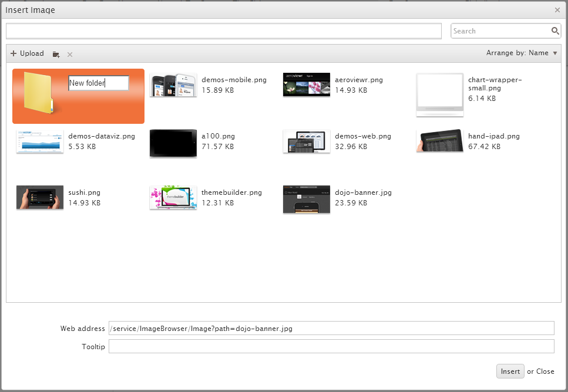

# Image Browser

By default, the **Insert Image** tool opens a simple dialog that allows you to type in or paste the URL of an image and, optionally, specify a tooltip.

**Figure 1: The Insert Image dialog**



## Overview

As of the Kendo UI Q3 2012 release, you can:

* Choose images by browsing through a list of predefined files and directories.
* Upload new images.

**Figure 2: The Image Browser dialog**



## Configuration

The **Image Browser** tool automatically appears as a file browser when the `ImageBrowser` method is defined in the code.

```Razor
@(Html.Kendo().Editor()
    .Name("Editor")
    .ImageBrowser(imageBrowser => imageBrowser
        // {0} is a placeholder, which will be replaced with the item's Name—the file.
        .Image("~/Content/UserFiles/Images/{0}")
        .Read("Read", "ImageBrowser")
        .Create("Create", "ImageBrowser")
        .Destroy("Destroy", "ImageBrowser")
        .Upload("Upload", "ImageBrowser")
        .Thumbnail("Thumbnail", "ImageBrowser"))
    .FileBrowser(fileBrowser => fileBrowser
         // {0} is a placeholder, which will be replaced with the item's Name—the file.
        .File("~/Content/UserFiles/Images/{0}")
        .Read("Read", "FileBrowser")
        .Create("Create", "FileBrowser")
        .Destroy("Destroy", "FileBrowser")
        .Upload("Upload", "FileBrowser")
    )
)
```
```ASPX
<%: Html.Kendo().Editor()
    .Name("Editor")
    .ImageBrowser(imageBrowser => imageBrowser
        .Image("~/Content/UserFiles/Images/{0}")
        .Read("Read", "ImageBrowser")
        .Create("Create", "ImageBrowser")
        .Destroy("Destroy", "ImageBrowser")
        .Upload("Upload", "ImageBrowser")
        .Thumbnail("Thumbnail", "ImageBrowser"))
    .FileBrowser(fileBrowser => fileBrowser
        .File("~/Content/UserFiles/Images/{0}")
        .Read("Read", "FileBrowser")
        .Create("Create", "FileBrowser")
        .Destroy("Destroy", "FileBrowser")
        .Upload("Upload", "FileBrowser")
    )
%>
```

### Built-In Options

The `Kendo.Mvc` assembly enables you to use the built-in `EditorImageBrowserController` class. It enables you to easily implement an MVC controller that consumes data from the **Image Browser** tool. In this way, you can populate it with images from the server, update them, and upload new ones.

###### Example

    public class ImageBrowserController : EditorImageBrowserController
    {
        private const string contentFolderRoot = "~/Content/";
        private const string prettyName = "Images/";
        private static readonly string[] foldersToCopy = new[] { "~/Content/shared/" };


        /// <summary>
        /// Gets the base paths from which the content is served.
        /// </summary>
        public override string ContentPath
        {
            get
            {
                return CreateUserFolder();
            }
        }

        private string CreateUserFolder()
        {
            var virtualPath = Path.Combine(contentFolderRoot, "UserFiles", prettyName);

            var path = Server.MapPath(virtualPath);
            if (!Directory.Exists(path))
            {
                Directory.CreateDirectory(path);
                foreach (var sourceFolder in foldersToCopy)
                {
                    CopyFolder(Server.MapPath(sourceFolder), path);
                }
            }
            return virtualPath;
        }

        private void CopyFolder(string source, string destination)
        {
            if (!Directory.Exists(destination))
            {
                Directory.CreateDirectory(destination);
            }

            foreach (var file in Directory.EnumerateFiles(source))
            {
                var dest = Path.Combine(destination, Path.GetFileName(file));
                System.IO.File.Copy(file, dest);
            }

            foreach (var folder in Directory.EnumerateDirectories(source))
            {
                var dest = Path.Combine(destination, Path.GetFileName(folder));
                CopyFolder(folder, dest);
            }
        }
    }

Similarly, you can use the `EditorFileBrowserController` class to create a controller for the **File Browser** tool as well.

> **Important**
>
> The consumed parameters for the `create`, `read`, `destroy`, and `upload` operations that are published in the article on the Image Browser of the Editor widget differ.

The following list provides information about the default requests and responses for the `create`, `read`, `destroy`, and `upload` operations used with the Editor HtmlHelper.

- `create`&mdash;Makes a `POST` request for the creation of a directory with the following parameters. Does not expect a response.

    ```
        {"Name":"New folder name","Size":0,"EntryType":1}
    ```

- `read`&mdash;Makes a `POST` request that contains the `Name` parameter to specify the path which is browsed. Expects a file listing in the following format:

    ```
        [
            { "Name": "Folder", "Size": 73289, "EntryType": 1 },
            { "Name": "file.jpg", "Size": 15289, "EntryType": 0 },
            ...
        ]
    ```

    Where `Name` is the file or directory name, `EntryType` is either a **0** (zero) for a file or a **1** (one) for a directory. `Size` is the file size  and is optional.

- `destroy`&mdash;Makes a `POST` request with the following parameters:

    - `Name`&mdash;The file or directory to be deleted.
    - `path`&mdash;The directory in which the file or directory resides.
    - `EntryType`&mdash;Whether a file or a directory is to be deleted (**0** (zero) or **1** (one)).
    - `Size`&mdash;(Optional) The file size as provided by the `read` response.

- `upload`&mdash;Makes a `POST` request to the `upload` action. The request contains `FormData` containing the upload path, file name, and type. Its payload consists of the uploaded file. The expected response is a `file` object in the following format:

        { "Name": "foo.png", "Size": 12345, "EntryType":0 }

- `thumbnailUrl`&mdash;Makes a `GET` request for each individual image to display its thumbnail in the explorer window. The single request parameter is the `path` to the image. The service is expected to respond with the image file for the thumbnail.

- `imageUrl`&mdash;Used by the Editor to generate the `src` attribute of the original image when it is inserted. It results in a `GET` request generated by the browser for each inserted image. The URL can point to a file system or to a service and is parameterized&mdash;the `{0}` placeholder denotes the `path` and `fileName` as received from the `Read` service. By default, the placeholder value is URL-encoded.

### Customization

Your project might require you to get files from sources other than the server such as databases, cloud storage utilities, and other. In such cases, you can use the `IImageBrowserController` and  `IFileBrowserController` interfaces. They help you create a controller that provides firm command over the actions that are intended to serve and consume files.

For an example of such a custom controller, refer to the article on how to [store images in the database with the Image Browser]().

## See Also

* [Telerik UI for ASP.NET MVC API Reference: EditorBuilder](http://docs.telerik.com/aspnet-mvc/api/Kendo.Mvc.UI.Fluent/EditorBuilder)
* [Overview of Telerik UI for ASP.NET MVC]()
* [Fundamentals of Telerik UI for ASP.NET MVC]()
* [Scaffolding in Telerik UI for ASP.NET MVC]()
* [Overview of the Kendo UI Editor Widget](http://docs.telerik.com/kendo-ui/controls/editors/editor/overview)
* [Telerik UI for ASP.NET MVC API Reference Folder](http://docs.telerik.com/aspnet-mvc/api/Kendo.Mvc/AggregateFunction)
* [Telerik UI for ASP.NET MVC HtmlHelpers Folder]()
* [Tutorials on Telerik UI for ASP.NET MVC]()
* [Telerik UI for ASP.NET MVC Troubleshooting]()

For runnable examples on the Kendo UI Editor in ASP.NET MVC applications, browse its [**How To** documentation folder](/helpers/editor/how-to/).
