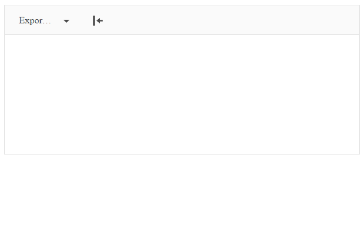

# Import and Export Various Documents

You can learn here the basics to get started with the Import and Export functionality of Editor for ASP.NET MVC.

## Overview

As of **R1 2017**, Editor for ASP.NET MVC provides importing and exporting capabilities through the dedicated **Kendo.Mvc.Export** assembly.

Along with the server-side integration of the [Telerik Document Processing](http://docs.telerik.com/devtools/document-processing/introduction) suite, there are also two new tools that utilize the import and export capabilities: **ExportAs** and **Import**.



## Dependencies

The import and export capabilities are bundled as a part of the [UI for ASP.NET MVC suite]().

In order to start using the import and export capabilities you should:

1. Add a reference in your project to the **Kendo.MVC.Export** assembly;
2. Add references in your project to the required [Telerik Document Processing libraries](http://docs.telerik.com/devtools/document-processing/introduction#libraries). 

> **Note**
>
> You can get the required assemblies from the `telerik.ui.for.aspnetmvc.<version>.zip` archive, which contains a `Kendo.MVC.Export` folder with the assemblies for both .NET 4.0 and .NET 4.5 versions.

## Getting started

### Exporting Editor Content

The following steps will enable the exporting capabilities of the Editor:

**Step 1** Add the **ExportAs** tool

###### Example 

```tab-Razor
@(Html.Kendo().Editor()
    .Name("Editor")
    .Tools(tools => tools
        .ExportAs()
    )
)
```
```tab-ASPX
<%: Html.Kendo().Editor()
        .Name("Editor")
        .Tools(tools => tools
            .ExportAs()
        )
%>
```

Optionally, you can refine the options by configuring the **ExportAs** tool.

###### Example 

```tab-Razor
@(Html.Kendo().Editor()
    .Name("Editor")
    .Tools(tools => tools
        .ExportAs(export => export
            .Add("DOCX", "docx")
            .Add("RTF", "rtf")
            .Add("PDF", "pdf")
            .Add("HTML", "html")
            .Add("TXT", "txt")
        )
    )
)
```
```tab-ASPX
<%: Html.Kendo().Editor()
        .Name("Editor")
        .Tools(tools => tools
            .ExportAs(export => export
                .Add("DOCX", "docx")
                .Add("RTF", "rtf")
                .Add("PDF", "pdf")
                .Add("HTML", "html")
                .Add("TXT", "txt")
            )
        )
%>
```

**Step 2** In order for the tool to contact the server and export a file configure the `Proxy` method and optionally set up the name of the exported file with `FileName` method

###### Example

```tab-Razor
@(Html.Kendo().Editor()
    .Name("Editor")
    .Tools(tools => tools
        .ExportAs()
    )
    .ExportAs(exportAs => exportAs
        .FileName("Export")
        .Proxy("Export", "Editor")
    )
)
```
```tab-ASPX
<%: Html.Kendo().Editor()
        .Name("Editor")
        .Tools(tools => tools
            .ExportAs()
        )
        .ExportAs(exportAs => exportAs
            .FileName("Export")
            .Proxy("Export", "Editor")
        )
%>
```

**Step 3** And implement the action method in the corresponding controller

###### Example

```
using Kendo.Mvc.Export;
...
    [HttpPost]
    public ActionResult Export(EditorExportData data)
    {
        return EditorExport.Export(data);
    }
...
```


### Importing Content from a File

Similar to exporting, the following steps will accomplish the **Import** tool to update the Editor content from a file: 

**Step 1** Add the **Import** tool

###### Example 

```tab-Razor
@(Html.Kendo().Editor()
    .Name("Editor")
    .Tools(tools => tools
        .Import()
    )
)
```
```tab-ASPX
<%: Html.Kendo().Editor()
        .Name("Editor")
        .Tools(tools => tools
            .Import()
        )
%>
```

**Step 2** Configure the **Import** by using the `Proxy` and `AllowedExtensions` methods

###### Example 

```tab-Razor
@(Html.Kendo().Editor()
    .Name("Editor")
    .Tools(tools => tools
        .Import()
    )
    .Import(import => import
        .AllowedExtensions(new[] { "docx", "rtf", "pdf", "html", "txt" })
        .Proxy("Import","Editor")
    )
)
```
```tab-ASPX
<%: Html.Kendo().Editor()
        .Name("Editor")
        .Tools(tools => tools
            .Import()
        )
        .Import(import => import
            .AllowedExtensions(new[] { "docx", "rtf", "pdf", "html", "txt" })
            .Proxy("Import","Editor")
        )
%>
```

> **Note**
>
> The **Import** tool integrates [Kendo Upload]() in order to send a file to the server. And you can configure it through these exposed helper methods:
> 
> * [AllowedExtensions()](/api/Kendo.Mvc.UI.Fluent/UploadValidationSettingsBuilder#methods-AllowedExtensions%28System.String%5B%5D%29)
> * [MaxFileSize()](/api/Kendo.Mvc.UI.Fluent/UploadValidationSettingsBuilder#methods-MaxFileSize%28System.Nullable<System.Double>%29)
> * [Complete()](/api/Kendo.Mvc.UI.Fluent/UploadEventBuilder#methods-Complete%28System.String%29)
> * [Progress()](/api/Kendo.Mvc.UI.Fluent/UploadEventBuilder#methods-Progress%28System.String%29)
> * [Select()](/api/Kendo.Mvc.UI.Fluent/UploadEventBuilder#methods-Select%28System.String%29)
> * [Success()](/api/Kendo.Mvc.UI.Fluent/UploadEventBuilder#methods-Success%28System.String%29)

**Step 3** Implement the action method in the corresponding controller

###### Example

```
using Kendo.Mvc.Export;
...
    public ActionResult Import(HttpPostedFileBase file)
    {
        var settings = new EditorImportSettings();
        string htmlResult;
        switch (Path.GetExtension(file.FileName))
        {
            case ".docx":
                htmlResult = EditorImport.ToDocxImportResult(file, settings);
                break;
            case ".rtf":
                htmlResult = EditorImport.ToRtfImportResult(file, settings);
                break;
            case ".pdf":
                htmlResult = EditorImport.ToPdfImportResult(file, settings);
                break;
            default:
                htmlResult = EditorImport.GetTextContent(file);
                break;
        }

        return Json(new { html = htmlResult });
    }
...
```

## Changing Import and Export Settings

The **Document Processing Library** provides settings for the import and export. This enables you to fine-tune how content is handled for the supported document types.

In the following example you can see how you can use [HtmlImportSettings](http://docs.telerik.com/devtools/document-processing/libraries/radwordsprocessing/formats-and-conversion/html/settings) in order to process HTML images before being exported to `RadFlowDocument`. 

###### Example

```
using Kendo.Mvc.Export;
using Telerik.Windows.Documents.Flow.FormatProviders.Html;
...
    [HttpPost]
    public ActionResult Export(EditorExportData data)
    {
        var settings = new EditorDocumentsSettings();
        settings.HtmlImportSettings.LoadFromUri += HtmlImportSettings_LoadFromUri;

        return EditorExport.Export(data);
    }

    private void HtmlImportSettings_LoadFromUri(object sender, LoadFromUriEventArgs e)
    {
        var uri = e.Uri;
        var absoluteUrl = uri.StartsWith("http://") || uri.StartsWith("www.");
        if (!absoluteUrl)
        {
            var filePath = Server.MapPath(uri);
            using (var fileStream = System.IO.File.OpenRead(filePath))
            {
                using (var memoryStream = new MemoryStream())
                {
                    fileStream.CopyTo(memoryStream);
                    e.SetData(memoryStream.ToArray());
                }
            }
        }
    }
...
```

And the next example configures the import capabilities so that images are generated with inline base64 data in the HTML `` tag:

###### Example

```
using Kendo.Mvc.Export;
using Telerik.Windows.Documents.Flow.FormatProviders.Html;
...
    public ActionResult Import(HttpPostedFileBase file)
    {
        var settings = new EditorImportSettings();
        settings.ImagesImportMode = ImagesExportMode.Embedded;
        string htmlResult = EditorImport.ToDocxImportResult(file, settings);
        
        return Json(new { html = htmlResult });
    }
...
```

You can read more about each setting available in `EditorImportSettings` in [HTML Export Settings documentation](http://docs.telerik.com/devtools/document-processing/libraries/radwordsprocessing/formats-and-conversion/html/settings#export-settings).

## See Also

Other articles on Telerik UI for ASP.NET MVC and on the Editor:

* [ASP.NET MVC API Reference: EditorBuilder](/api/Kendo.Mvc.UI.Fluent/EditorBuilder)
* [Overview of Telerik UI for ASP.NET MVC]()
* [Fundamentals of Telerik UI for ASP.NET MVC]()
* [Scaffolding in Telerik UI for ASP.NET MVC]()
* [Overview of the Kendo UI Editor Widget](http://docs.telerik.com/kendo-ui/controls/editors/editor/overview)
* [Telerik UI for ASP.NET MVC API Reference Folder](/api/Kendo.Mvc/AggregateFunction)
* [Telerik UI for ASP.NET MVC HtmlHelpers Folder]()
* [Tutorials on Telerik UI for ASP.NET MVC]()
* [Telerik UI for ASP.NET MVC Troubleshooting]()

For runnable examples on the Kendo UI Editor in ASP.NET MVC applications, browse its [**How To** documentation folder]().