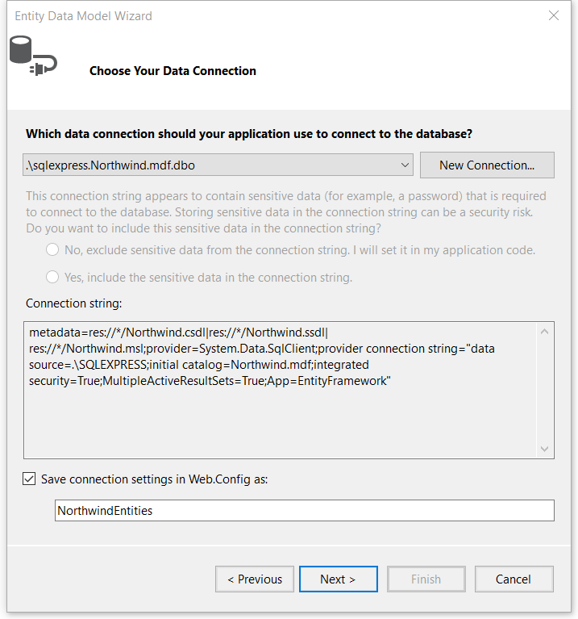
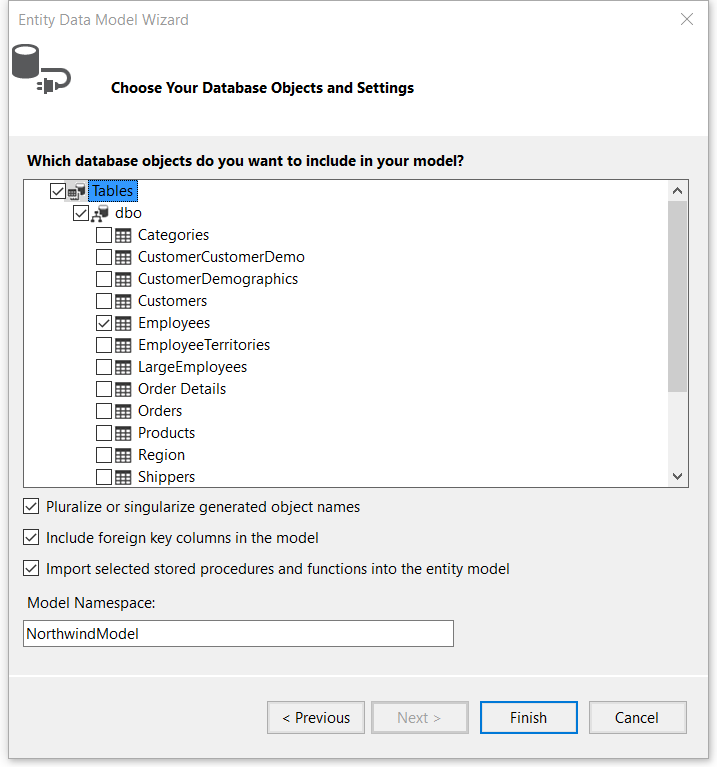
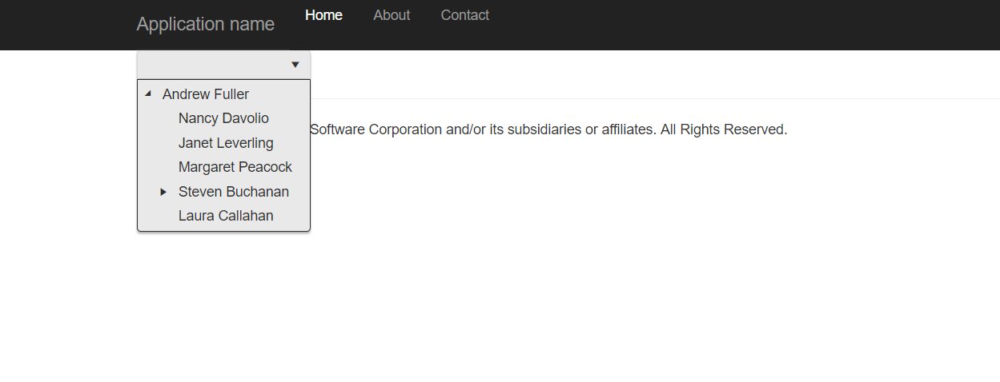

# Ajax Binding

During the Ajax binding the DropDownTree makes Ajax requests to get the data.

To configure the DropDownTree for Ajax binding to the Northwind database by using Entity Framework:

1. Create a new ASP.NET MVC application. If you have installed the [Telerik UI for ASP.NET MVC Visual Studio Extensions](#kendo-ui-for-asp.net-mvc-visual-studio-extensions), create a Telerik UI for ASP.NET MVC application.
1. Name the application `KendoDropDownTreeAjaxBinding`. If you decide not to use the Visual Studio extensions, follow the procedure for adding Telerik UI for ASP.NET MVC to existing applications:

    * [ASP.NET MVC 4]()
    * [ASP.NET MVC 5]()

1. Add a new `Entity Framework DataM Model`. Right-click the **Models** folder in Visual Studio solution explorer. Select **Add** > **New Item**. Choose **Data** > **ADO.NET Data Model** from the **Add New Item** dialog.
1. Name the model `Northwind.edmx`. Click **Next**. This starts the **Entity Data Model Wizard**.
1. Select **Generate from database**. Click **Next**. Configure a connection to the Northwind database and click **Next**.

    

1. Select the **Employees** table and click **Finish**.

    

1. Open `Controllers/HomeController.cs` and add a new action method which will return JSON. The DropDownTree makes an Ajax request to this action method any time the user expands a parent node. The action method returns only the child nodes of the expanded parent node. The DropDownTree provides the unique identifier of the parent node or `null` when it makes the initial request.

        public JsonResult Employees_Read(int? employeeId)
        {
            using (var norhtwind = new NorthwindEntities())
            {
                // Get employees who report to employeeId (null for root nodes).
                var employees = norhtwind.Employees
                                            // A workaround for the EF null comparison bug: http://stackoverflow.com/a/2541042/10141.
                                            .Where(employee => employeeId.HasValue ? employee.ReportsTo == employeeId : employee.ReportsTo == null);
                // Project the results to avoid JSON serialization errors.
                var result = employees.Select(employee => new
                                        {
                                            EmployeeID = employee.EmployeeID,
                                            Name = employee.FirstName + " " + employee.LastName,
                                            HasChildren = employee.Employees1.Any()
                                        })
                                        .ToList();
                return Json(result, JsonRequestBehavior.AllowGet);
            }
        }

1. Open `Views/Index.cshtml`, or `Views/Index.aspx`, and add a DropDownTree.

    ```Razor
    @(Html.Kendo().DropDownTree()
        .Name("dropdowntree")
        // The property that specifies the text of the node.
        .DataTextField("Name")
        .DataSource(dataSource => dataSource
            .Model(model => model
                // The property that uniquely identifies a node.
                // The value of this property is the argument of the action method.
                .Id("EmployeeID")
                // The Boolean property that tells whether a node has children.
                .HasChildren("HasChildren")
            )
            .Read(read => read
                // The action method which will return JSON.
                .Action("Employees_Read", "Home")
            )
        )
    )
    ```
    ```ASPX
    <%: Html.Kendo().DropDownTree()
        .Name("dropdowntree")
        // The property that specifies the text of the node.
        .DataTextField("Name")
        .DataSource(dataSource => dataSource
            .Model(model => model
                // The property that uniquely identifies a node.
                // The value of this property is the argument of the action method.
                .Id("EmployeeID")
                // The Boolean property that tells whether a node has children.
                .HasChildren("HasChildren")
            )
            .Read(read => read
                // The action method which will return JSON.
                .Action("Employees_Read", "Home")
            )
        )
    %>
    ```

1. Press `CTRL`+`F5` to build and run the application. Open the dropdown of the helper to observe and work with its embedded TreeView.

    

## See Also

* [Local Data Binding by the DropDownTree HtmlHelper for ASP.NET MVC (Demo)](https://demos.telerik.com/aspnet-mvc/dropdowntree/local-data-binding)
* [Remote Data Binding by the DropDownTree HtmlHelper for ASP.NET MVC (Demo)](https://demos.telerik.com/aspnet-mvc/dropdowntree/remote-data-binding)
* [DropDownTreeBuilder Server-Side API](http://docs.telerik.com/aspnet-mvc/api/Kendo.Mvc.UI.Fluent/DropDownTreeBuilder)
* [DropDownTree Server-Side API](/api/dropdowntree)
