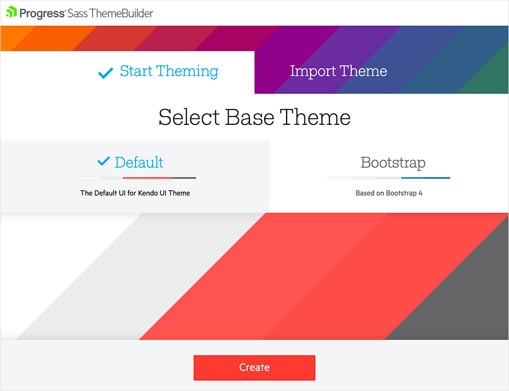
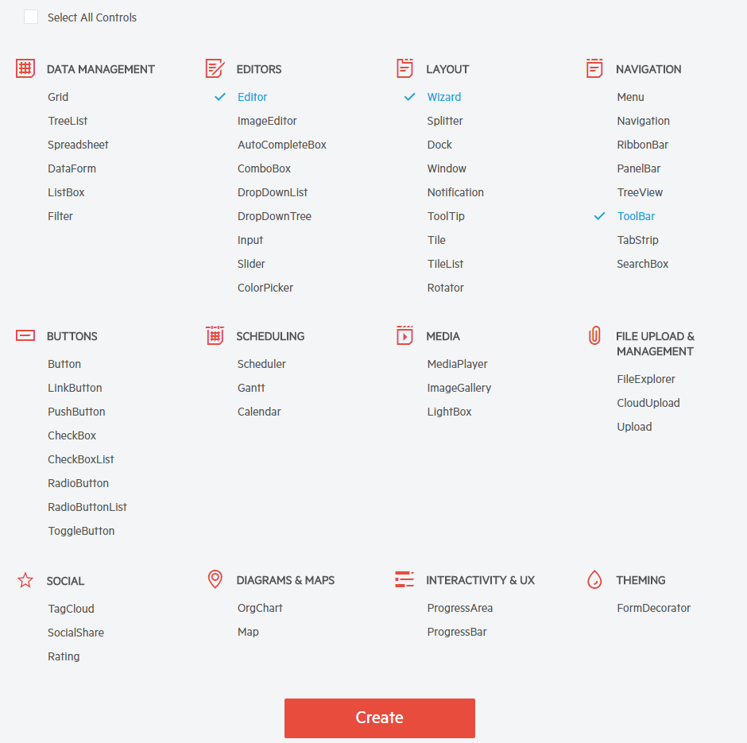
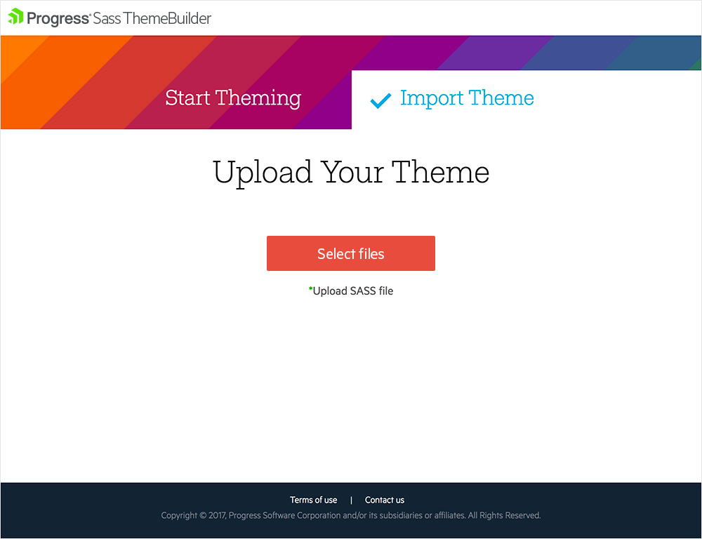

# Sass Theme Builder

[**Progress Sass Theme Builder**](https://themebuilder.telerik.com/aspnet-mvc) for Kendo UI is an Angular web application that enables you to create new or customize existing themes.

The tool renders the same look and feel as the look and feel of all other components in the suite. It also delivers full control over the skin elements of each component and automatically updates its composite units. After you create the skin and achieve the desired look of the theme, the Sass Theme Builder enables you to download and integrate it in your project.  

**Figure 1: A preview of the Sass Theme Builder**

## Creating New Themes

To create a new theme:

1. On the initial Sass Theme Builder pane, select the **Start Theming** option.
1. Choose one of the existing skins to use as a base. The currently available built-in skins are **Default** and **Bootsrap**.

    **Figure 2: Selecting a base theme**

    

1. Scroll down and select the controls you want to customize.

    **Figure 3: Selecting the widgets for customization**

    

1. (Optional) After the initial selection, add or remove elements for customization.

To deliver the full set of their functionalities, some Kendo UI controls, such as the Grid, have composite structures and include child components. In such cases, the Theme Builder automatically applies the theme modification to the child components and you do not need to customize each of them separately.

## Customizing Existing Themes

The Sass Theme Builder supports the following options for customization:

* Color pickers which customize the appearance of the components.
* The **Apply changes instantly** option which enables you to observe the changes on the fly.
* Manual updates of each component element.
* Utilization of predefined color swatches.

### Functionalities for Customization

To customize an existing theme, use the following Sass Theme Builder functionalities:

1. **Color Swatches**&mdash;Contains predefined color palettes that you can apply to all components in your application.
1. **Default**&mdash;Provides the applicable color customization options.
1. **Preview Components**&mdash;Keeps the main view of the components. It reflects the customization changes you make each time you add or remove theme elements.
1. **Download**&mdash;Downloads the archive that holds the generated style files after the customization completes. When you click the button, a dialog appears and prompts you to name your theme.

**Figure 4: Available options for customization**

### Importing the Themes

To upload an existing theme you have previously created:

1. On the initial Sass Theme Builder pane, select **Import Theme**.
1. Upload the `variables.scss` file which contains your current modifications of the customized theme. As a result, the selected components and styling elements load.
1. Start [customizing your theme](#customizing-existing-themes).

**Figure 5: Importing themes for customization**

## Adding the Themes to Your Project

When you complete the modifications and the theme is ready to be used:

1. Download the theme as a compact archive by clicking the **Download** button.
1. Copy the downloaded `all.css` file and paste it in the **Content** folder of your application.
1. Bundle the styles to render them or directly reference the styles in `Layout.cshtml`. For more information on CSS bundling in Telerik UI for ASP.NET MVC applications, refer to the article on [CSS bundling fundamentals](#css-bundling).

> **Important**  
>
> Reference or bundle only the `all.css` file because the exported CSS file contains all styles you need.

## See Also

* [Fundamentals of CSS Bundling](#css-bundling)
