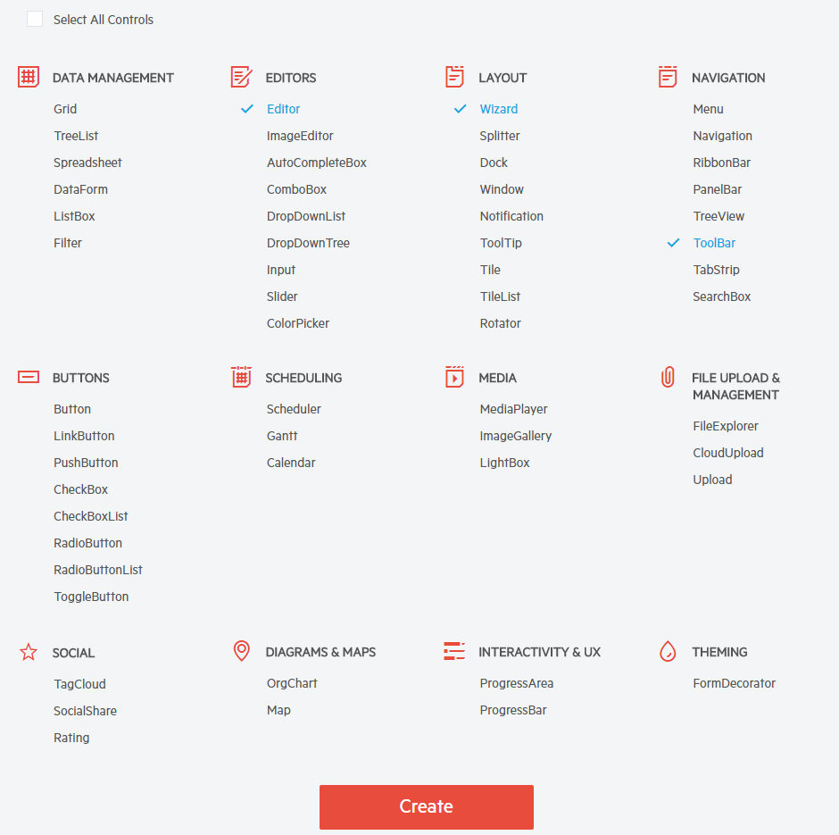

# Sass Theme Builder Overview

**Progress Sass Theme Builder** for Kendo UI is an Angular 2 Web application that provides you with the ability to create new or customize existing themes. It can be found at [http://themebuilder.telerik.com/](http://themebuilder.telerik.com/).

Just with a few clicks you can create your own custom theme with the same look and feel for all controls in the suite. The tool gives you complete control over the elements of the control’s skin along with automatic updates to its composite controls. Once the skin is created and the new Theme looks as you expected in the Preview pane you can download it with one click and integrate it in your project.  

### Create new Theme

First, you need to select the **Start Theming** option. Then select one of the existing Skins to use as a base. The currently available built-in skins based on which you can create your own theme for Telerik UI widgets are **Default** and **Bootsrap**. 

Then, you can scroll down and select the controls that you want to start customizing. The option to add or remove controls for customization is also available after the initial selection.

Some of the controls have composite structures and include other child controls to provide the rich functionality they offer, e.g. Grid, Scheduler. The **Sass Theme Builder** applies the selected changes automatically on such controls, so you don't bother customize them separately.

### Customization

Applying the desired colors is pretty straightforward. The **Theme Builder** provides Color pickers for customizing the appearance of the controls and the changes can be observed on the fly thanks to the *Apply changes instantly* option. While you have the possibility to manually alter each element of the controls, we provide you with the ability to use predefined swatches (see Figure1 p1).

**1. Swatches** column contains various predefined pallettes applied on all widgets on your page.

**2. Theme Colors** column provides the applicable color customization options.

**3. Preview of Controls** keeps the main view of the controls, providing you with the ability to add/remove controls (see Figure 2).

**4. Download** button is used after completion to download the archive holding the generated style files. Once the button is clicked, you will be prompted with a dialog where you can name your theme.

### Import
The **Sass Theme Builder** tool enables you to upload your own theme that you have created previously. You need to select the *Import existing theme* option.
Then, you should upload the **variables.scss**, which contains your current modifications of the customized theme. The selected widgets and style will automatically load and you can start to customize them, as described in the section above.

### Download and Apply in a Project

Once you've completed the modifications and the new Theme is ready to be used in a project, you can download it as a compact archive using the Download button (#4 from previous section).

Copy the downloaded CSS file (**all.css**) and paste it in the Content folder of your application. Then you can either bundle the styles and render them or you can directly reference them in the Layout.cshtml.

Make sure you are familiar with the article on the Telerik UI for ASP.NET MVC [fundamentals and CSS bundling](#css-bundling).

> **Important**  
>
> The exported css file contains all needed style, hence, you should only reference or bundle the **all.css** file.

## See Also

* [Fundamentals and CSS bundling](#css-bundling)

