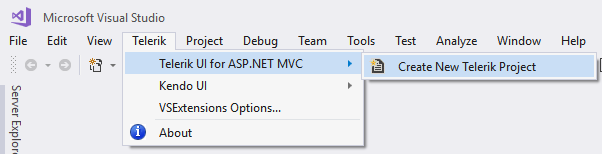
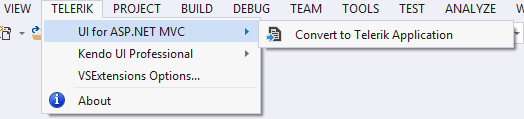
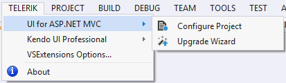
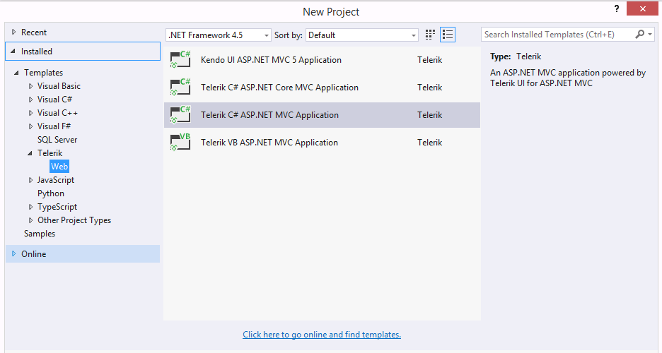

# Visual Studio Integration Overview

The Progress&reg; Telerik&reg; UI for ASP.NET MVC Visual Studio (VS) Extensions enhance the experience of developing web applications with Progress&reg; Telerik&reg; UI for ASP.NET MVC.

The extensions handle the following major points:

* Project [Creation]() and [Configuration]() Wizards&mdash;Web asset management, adding the required settings to `web.config`, changing the theme.
* Project [Upgrade]()&mdash;Upgrading Progress&reg; Telerik&reg; UI for ASP.NET MVC to a new version.

The Progress&reg; Telerik&reg; UI for ASP.NET MVC VS Extensions are distributed with the Progress&reg; Telerik&reg; UI for ASP.NET MVC installer. They support VS 2010, 2012, 2013, 2015, and 2017, which handle ASP.NET MVC 4 and 5 applications.

> **Important**
>
> VS Express editions are not supported.

The VS Extensions can be accessed through the **Telerik | Telerik UI for ASP.NET MVC** menu which has different menu items depending on the selected project in VS. Additionally, the extensions can be accessed through the Solution Explorer context menu of any supported ASP.NET MVC Web Application projects.

**Figure 1. VS without Selected Projects**

**Figure 2. The selected project in VS is a standard ASP.NET MVC 4 or 5 web application**

**Figure 3. The selected project in VS is a Progress&reg; Telerik&reg; UI for ASP.NET MVC web application**

When installed, the extensions add the project templates to the New Project dialog of VS and as shown in **Figure 4**.

* C# Progress&reg; Telerik&reg; UI for ASP.NET MVC web application
* VB Progress&reg; Telerik&reg; UI for ASP.NET MVC web application

**Figure 4. The added project templates**

These are available in the language-specific nodes of the dialog as well. The **Add New Project** dialog contains the Progress&reg; Telerik&reg; UI for ASP.NET MVC web application under both the `CSharp\Web` and `Visual Basic\Web` nodes.

There are also two additional project templates

* [C# Telerik ASP.NET Core MVC application](http://docs.telerik.com/aspnet-core/introduction)
* [Kendo UI ASP.NET MVC 5 application]()

The new ASP.NET MVC 4 project wizard also contains the Progress&reg; Telerik&reg; UI for ASP.NET MVC web application.

**Figure 5. The MVC wizard**

## See Also

* [Create Projects]()
* [Configure Projects]()
* [Upgrade Projects]()
* [Convert Projects]()
* [VS Extensions Options]()
* [Download New Versions]()
