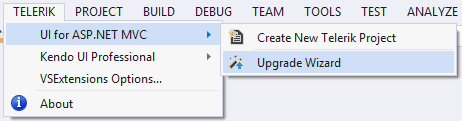
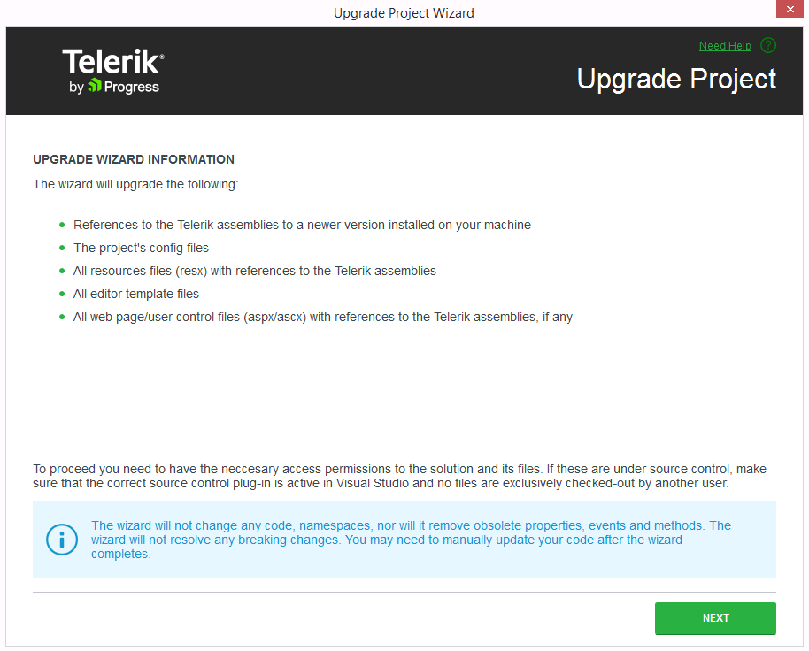
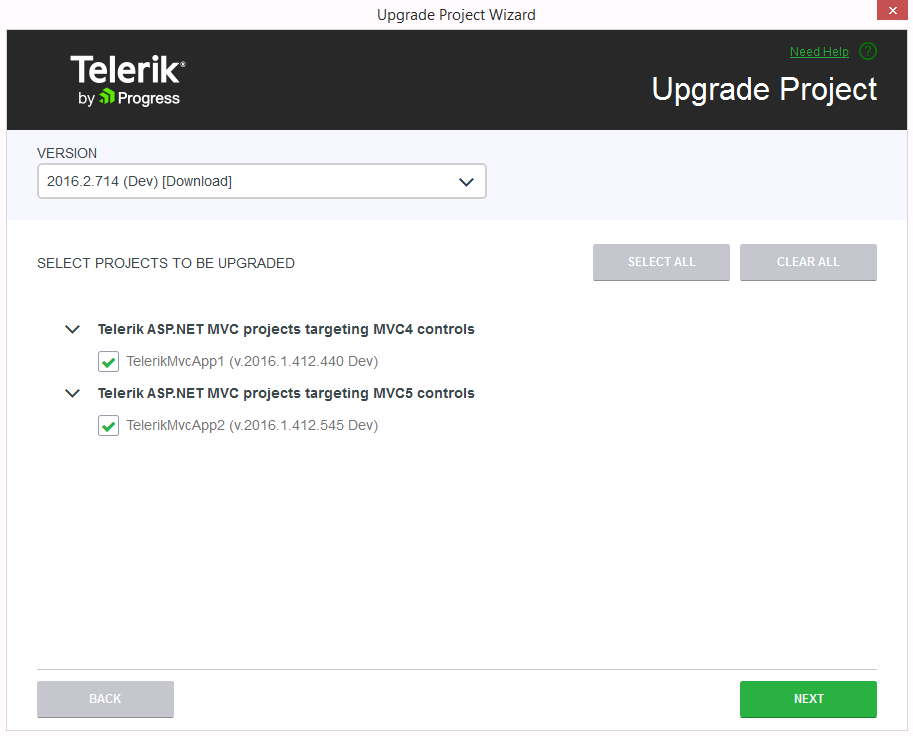
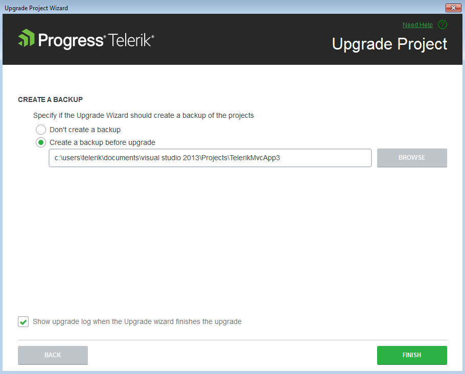

# Upgrading Projects

This article demonstrates how to upgrade a Progress&reg; Telerik&reg; UI for ASP.NET MVC application.

## Getting Started

### The Basics

The Upgrade Project Wizard upgrades existing Progress&reg; Telerik&reg; UI for ASP.NET MVC applications.

To open the wizard, click **Telerik** > **Telerik UI for ASP.NET MVC** > **Upgrade Wizard**.

**Figure 1. Launch the Upgrade Wizard**

### Files for Upgrade

The **Information Page** of the Upgrade Project Wizard describes the files and assemblies that are going to be upgraded.

**Figure 2. Information page**

### Projects for Upgrade

On the next page, the Wizard lists all projects from the solution that use Progress&reg; Telerik&reg; UI for ASP.NET MVC. This enables you to choose the projects that will be updated and the version to which they will be upgraded.

It is recommended to upgrade all projects to the selected version. The Compatibility button will invoke the [Upgrade API Analyzer tool](http://docs.telerik.com/aspnet-mvc/vs-integration/upgrade-api-analyzer):

> **Important**
>
> The listed projects target all MVC versions that are supported. When you complete the Wizard, all selected projects will be updated.

**Figure 3. Choose projects and distribution version**

### Project Resources for Upgrade

The **Upgrade Project Resources** page allows you to update the editor templates in `~/Views/Shared/EditorTemplates` by choosing **Update Editor Templates**.

**Figure 4. Update Project Resources page**

### Backup Creation

The **Create Backup** page provides the following options:

- **Create a backup before upgarde**&mdash;Backs up your project before upgrading it. If selected, specify the backup folder in the field below the option.
- **Don't create a backup**&mdash;Upgrades without creating a backup of your application.
- **Show upgrade log when the Upgrade wizard finishes the upgrade**&mdash;Displays the upgrade log after the **Upgrade Wizard** finishes the upgrade.

**Figure 5. Create Backup page**

## See Also

* [VS Integration Overview]()
* [Create Projects]()
* [Configure Projects]()
* [Convert Projects]()
* [VS Extensions Options]()
* [Download New Versions]()
