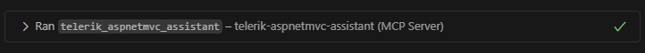
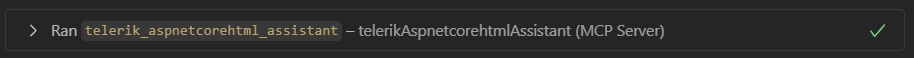


    

    


# Telerik {{ site.framework }} MCP Server

The Telerik {{ site.framework }} [MCP Server](https://modelcontextprotocol.io/introduction) lets you interact with AI and reach new levels of developer productivity. The MCP server provides proprietary context to AI-powered IDEs, apps and tools. You can use the Telerik {{ site.framework }} MCP server for {{ site.framework }} AI code generation and ask about [{{ site.product }} components](https://www.telerik.com/{{ telerik_product_url }}), features, or general usage. You can successfully prompt more complex questions and tasks, and generate tailored code that includes {{ site.product }} HtmlHelper and TagHelper components, along with their APIs.

## Prerequisites

To use the Telerik {{ site.framework }} MCP server, you need:

* [Node.js 18](https://nodejs.org/en) or a newer version.
* A [compatible MCP client (IDE, code editor or app)](https://modelcontextprotocol.io/clients) that supports *MCP tools*.
* A [Telerik user account](https://www.telerik.com/account/).
* An active [DevCraft or {{ site.product }} license](https://www.telerik.com/purchase/{{ telerik_product_url }}) or a [{{ site.product }} trial](https://www.telerik.com/{{ telerik_product_url}}).
* An [{{ site.framework }} application that includes {{ site.product }}](slug:overview_aspnetmvc6_aspnetmvc).

## Installation

Use the documentation of your AI-powered MCP client to add the Telerik {{ site.framework }} HtmlHelper or Telerik {{ site.framework }} TagHelper MCP server to a specific workspace or globally. You can see installation tips and examples for some popular MCP clients below.


The generic settings of the Telerik {{ site.framework }} MCP server are:

* npm package name: `@progress/telerik-aspnetmvc-mcp`
* Type: `stdio` (standard input/output transport)
* Command: `npx` (the MCP server works through an npm package)
* Arguments: `-y`
* Server name: `telerik-aspnetmvc-assistant`



The generic settings of the Telerik {{ site.framework }} MCP server are:

* npm package name: `@progress/telerik-aspnetcore-html-mcp` for HtmlHelper and `@progress/telerik-aspnetcore-tag-mcp` for TagHelper
* Type: `stdio` (standard input/output transport)
* Command: `npx` (the MCP server works through an npm package)
* Arguments: `-y`
* Server name: `telerik-aspnetcorehtml-assistant` for HtmlHelper and `telerik-aspnetcoretag-assistant` for TagHelper


You also need to add your [Telerik licence key](slug:installation_license_key_aspnetcore) as an `env` parameter in the `mcp.json` file. There are two options:

* (recommended) Use a `TELERIK_LICENSE_PATH` argument and point to the location of your Telerik license file.
* Use a `TELERIK_LICENSE` argument and paste your Telerik license key. Make sure to [update the license key](slug:installation_license_key_aspnetcore#license-key-updates) when necessary.

> * Some MCP clients expect the MCP servers to be listed under a `servers` JSON key, while others expect `mcpServers`.
> * Some MCP clients expect an `mcp.json` file, while others like Visual Studio 2022 expect an `.mcp.json` file.

### Visual Studio

For detailed instructions, refer to [Use MCP servers in Visual Studio](https://learn.microsoft.com/en-us/visualstudio/ide/mcp-servers).

> Early Visual Studio 17.14 versions require the Copilot Chat window to be open and active when you open a solution. Otherwise the Telerik MCP server is not used.
> Some Visual Studio 17.14 versions might encounter an error indicating a tool name exceeds the maximum length. To resolve such scenarios you can use a shorter server name. For example `telerik-core-html-assistant` instead of `telerik-aspnetcorehtml-assistant`, or a friendly name of your choice.

#### Workspace Configuration

To enable the Telerik MCP Servers in a specific {{ site.framework }} app, add a `.mcp.json` file to the solution folder:


  >caption .mcp.json

  ```JSON
  {
    "servers": {
      "telerik-aspnetmvc-assistant": {
        "type": "stdio",
        "command": "npx",
        "args": ["-y", "@progress/telerik-aspnetmvc-mcp@latest"],
        "env": {
          "TELERIK_LICENSE_PATH": "THE_PATH_TO_YOUR_LICENSE_FILE",
          // or
          "TELERIK_LICENSE": "YOUR_LICENSE_KEY"
        }
      }
    }
  }
  ```




* Telerik {{ site.framework }} HtmlHelpers MCP Server

  >caption .mcp.json

  ```JSON
  {
    "servers": {
      "telerik-aspnetcorehtml-assistant": {
        "type": "stdio",
        "command": "npx",
        "args": [ "-y", "@progress/telerik-aspnetcore-html-mcp@latest" ],
        "env": {
          "TELERIK_LICENSE_PATH": "C:\\Users\\___\\AppData\\Roaming\\Telerik\\telerik-license.txt"
        }
      }
    }
  }
  ```

* Telerik {{ site.framework }} TagHelpers MCP Server

  >caption .mcp.json

  ```JSON
  {
    "servers": {
      "telerik-aspnetcoretag-assistant": {
        "type": "stdio",
        "command": "npx",
        "args": [ "-y", "@progress/telerik-aspnetcore-tag-mcp@latest" ],
        "env": {
          "TELERIK_LICENSE_PATH": "C:\\Users\\___\\AppData\\Roaming\\Telerik\\telerik-license.txt"
        }
      }
    }
  }
  ```


#### Global Configuration

To enable global automatic discovery of the Telerik MCP Servers in Visual Studio, add the above `.mcp.json` file to your user directory (`%USERPROFILE%`), for example, `C:\Users\____\.mcp.json`.

> Once the Telerik MCP server is added, make sure that the `telerik-aspnetmvc-assistant``telerik-aspnetcorehtml-assistant` or `telerik-aspnetcoretag-assistant` tool is [enabled (checked) in the Copilot Chat window's tool selection dropdown](https://learn.microsoft.com/en-us/visualstudio/ide/mcp-servers?view=vs-2022#configuration-example-with-github-mcp-server). This dropdown opens when clicking on a wrench icon 🔧 at the bottom of the Copilot Window. The Telerik MCP server may get disabled when starting a new chat, changing threads, or relaunching Visual Studio. This is a known issue with MCP servers in general.

### VS Code

For detailed instructions, refer to [Use MCP servers in VS Code](https://code.visualstudio.com/docs/copilot/chat/mcp-servers).

> This section applies to VS Code 1.102.1 and newer versions.

> Make sure that [`chat.mcp.enabled`](vscode://settings/chat.mcp.enabled) is enabled in the VS Code settings.

#### Workspace Configuration

To enable the Telerik MCP Servers in a specific [workspace](https://code.visualstudio.com/docs/copilot/chat/mcp-servers#_add-an-mcp-server-to-your-workspace) or {{ site.framework }} app, add a `.vscode` folder with an `mcp.json` file at the root of the workspace with the following content:


  >caption .mcp.json

  ```JSON
  {
    "servers": {
      "telerik-aspnetmvc-assistant": {
        "type": "stdio",
        "command": "npx",
        "args": ["-y", "@progress/telerik-aspnetmvc-mcp@latest"],
        "env": {
          "TELERIK_LICENSE_PATH": "THE_PATH_TO_YOUR_LICENSE_FILE",
          // or
          "TELERIK_LICENSE": "YOUR_LICENSE_KEY"
        }
      }
    }
  }
  ```




* Telerik {{ site.framework }} HtmlHelpers MCP Server

  >caption .vscode/mcp.json

  ```JSON
  {
    "servers": {
      "telerik-aspnetcorehtml-assistant": {
        "type": "stdio",
        "command": "npx",
        "args": [ "-y", "@progress/telerik-aspnetcore-html-mcp@latest" ],
        "env": {
          "TELERIK_LICENSE_PATH": "C:\\Users\\___\\AppData\\Roaming\\Telerik\\telerik-license.txt"
        }
      }
    }
  }
  ```

* Telerik {{ site.framework }} TagHelpers MCP Server

  >caption .vscode/mcp.json

  ```JSON
  {
    "servers": {
      "telerik-aspnetcoretag-assistant": {
        "type": "stdio",
        "command": "npx",
        "args": [ "-y", "@progress/telerik-aspnetcore-tag-mcp@latest" ],
        "env": {
          "TELERIK_LICENSE_PATH": "C:\\Users\\___\\AppData\\Roaming\\Telerik\\telerik-license.txt"
        }
      }
    }
  }
  ```



This enables you to call the respective MCP Server with the `#telerik-aspnetmvc-assistant`.


This enables you to call the respective MCP Server with the `#telerik-aspnetcorehtml-assistant` or `#telerik-aspnetcoretag-assistant`.


#### Global Configuration

To add the Telerik MCP Servers [globally for VS Code](https://code.visualstudio.com/docs/copilot/chat/mcp-servers#_add-an-mcp-server-to-your-user-configuration), run the **MCP: Open User Configuration** command from the Command Palette and add the above content to the automatically created `mcp.json` file in your user folder.

Alternatively, manually create an `mcp.json` file with the above content in your user folder.

Also, ensure that [`chat.mcp.discovery.enabled`](vscode://settings/chat.mcp.discovery.enabled) is enabled in [`settings.json`](https://code.visualstudio.com/docs/configure/settings#_settings-json-file).

>caption VS Code settings.json

```JSON
{
  // ...
  "chat.mcp.discovery.enabled": true,
}
```

### Cursor

For detailed instructions, refer to [Model Context Protocol](https://docs.cursor.com/context/mcp).

#### Workspace Configuration

To enable the Telerik MCP servers in [a specific workspace](https://docs.cursor.com/context/mcp#using-mcp-json) or {{ site.framework }} app, add a `.cursor` folder with an `mcp.json` file at the root of the workspace with the following content:


  >caption .mcp.json

  ```JSON
  {
    "mcpServers": {
      "telerik-aspnetmvc-assistant": {
        "type": "stdio",
        "command": "npx",
        "args": ["-y", "@progress/telerik-aspnetmvc-mcp@latest"],
        "env": {
          "TELERIK_LICENSE_PATH": "THE_PATH_TO_YOUR_LICENSE_FILE",
          // or
          "TELERIK_LICENSE": "YOUR_LICENSE_KEY"
        }
      }
    }
  }
  ```




* Telerik {{ site.framework }} HtmlHelpers MCP Server

  >caption .cursor/mcp.json

  ```JSON
  {
    "mcpServers": {
      "telerik-aspnetcorehtml-assistant": {
        "type": "stdio",
        "command": "npx",
        "args": [ "-y", "@progress/telerik-aspnetcore-html-mcp@latest" ],
        "env": {
          "TELERIK_LICENSE_PATH": "C:\\Users\\___\\AppData\\Roaming\\Telerik\\telerik-license.txt"
        }
      }
    }
  }
  ```

* Telerik {{ site.framework }} TagHelpers MCP Server

  >caption .cursor/mcp.json

  ```JSON
  {
    "mcpServers": {
      "telerik-aspnetcoretag-assistant": {
        "type": "stdio",
        "command": "npx",
        "args": [ "-y", "@progress/telerik-aspnetcore-tag-mcp@latest" ],
        "env": {
          "TELERIK_LICENSE_PATH": "C:\\Users\\___\\AppData\\Roaming\\Telerik\\telerik-license.txt"
        }
      }
    }
  }
  ```



This enables you to call the respective MCP Server with the `#telerik-aspnetmvc-assistant`.

This enables you to call the respective MCP Server with the `#telerik-aspnetcorehtml-assistant` or `#telerik-aspnetcoretag-assistant`.


#### Global Configuration

To add the Telerik MCP Servers [globally for Cursor](https://docs.cursor.com/context/mcp#configuration-locations), add a `.cursor` folder with the above `mcp.json` file in your user folder.

## Usage

> When switching between tasks and files, start a new session in a new chat window to avoid polluting the context with irrelevant or outdated information.

To use the Telerik {{ site.framework }} MCP Server:


1. Start your prompt with `#telerik-aspnetmvc-assistant` (or with `#` followed by your custom server name, if set).
1. Confirm that the respective Telerik MCP server is used, because this doesn't happen deterministically. Look for a statement in the output, which is similar to:
    * `Running #telerik-aspnetmvc-assistant` (in VS Code)
    * `Calling MCP tool #telerik-aspnetmvc-assistant` (in Cursor)

    



1. Start your prompt with `#telerik-aspnetcorehtml-assistant` / `#telerik-aspnetcoretag-assistant` (or with `#` followed by your custom server name, if set).
1. Confirm that the respective Telerik MCP server is used, because this doesn't happen deterministically. Look for a statement in the output, which is similar to:
    * `Running telerik-aspnetcorehtml-assistant` or `Running telerik-aspnetcoretag-assistant` (in VS Code)
    * `Calling MCP tool telerik-aspnetcorehtml-assistant` or `Calling MCP tool telerik-aspnetcoretag-assistant` (in Cursor)

    


1. If the Telerik MCP server is not used even though it's installed and enabled, double-check the server name in your configuration and try rephrasing your prompt using another trigger syntax from the list in step 1.
1. If requested, grant the Telerik MCP server a permission to run for this session, workspace, or always.
1. If you want to prompt for information or code that are not related to your previous prompts, it is a good practice to start a new session in a new chat window, so that the context is not polluted by irrelevant old information.

To increase the probability of the Telerik {{ site.framework }} MCP Server being used, or to call it without the need to mention "telerik" explicitly, add custom instructions to your AI-powered tool. Here are examples for [GitHub Copilot](https://docs.github.com/en/copilot/customizing-copilot/adding-repository-custom-instructions-for-github-copilot#about-repository-custom-instructions-for-github-copilot-chat) and [Cursor](https://docs.cursor.com/context/rules).

## Sample Prompts


The following list describes how your prompts may look like:

* &quot;`#telerik-aspnetmvc-assistant` Generate a {{ site.product }} Grid with sorting and paging enabled. Bind the Grid to dummy data.&quot;
* &quot;`#telerik-aspnetmvc-assistant` Generate a ComboBox that shows a list of products. Create a Product class and generate sample data.&quot;
* &quot;`#telerik-aspnetmvc-assistant` Show me sample code for a {{ site.product }} Grid with virtual scrolling for the rows and columns.&quot;



The following list describes how your prompts may look like:

* When generating HtmlHelper components:

  * &quot;`#telerik-aspnetcorehtml-assistant` Generate a {{ site.product }} Grid with sorting and paging enabled. Bind the Grid to dummy data.&quot;
  * &quot;`#telerik-aspnetcorehtml-assistant`  Generate a ComboBox that shows a list of products. Create a Product class and generate sample data.&quot;
  * &quot;`#telerik-aspnetcorehtml-assistant` Show me sample code for a {{ site.product }} Grid with virtual scrolling for the rows and columns.&quot;

* When generating TagHelper components:

  * &quot;`#telerik-aspnetcoretag-assistant` Generate a {{ site.product }} Grid with sorting and paging enabled. Bind the Grid to dummy data.&quot;
  * &quot;`#telerik-aspnetcoretag-assistant`  Generate a ComboBox that shows a list of products. Create a Product class and generate sample data.&quot;
  * &quot;`#telerik-aspnetcoretag-assistant` Show me sample code for a {{ site.product }} Grid with virtual scrolling for the rows and columns.&quot;


## Usage Limits

@[template](/_contentTemplates/core/ai-coding-assistant.md#number-of-requests)

## Connect to Local AI Model

You can use the Telerik {{ site.framework }} MCP server with local large language models (LLM). For example, run your local model through [Ollama](https://ollama.com) and use a third-party package such as [MCP-LLM Bridge](https://github.com/patruff/ollama-mcp-bridge) to connect the model to the Telerik MCP server. This will allow you to use the Telerik AI Coding Assistant without a cloud-based AI model.

## See Also

* [Telerik {{ site.framework }} AI Coding Assistant Intended Use](slug:overview_ai#intended-use)
* [Telerik {{ site.framework }} AI Coding Assistant Recommendations](slug:overview_ai#recommendations)
* [Telerik {{ site.framework }} Prompt Library](slug:ai_prompt_library)
