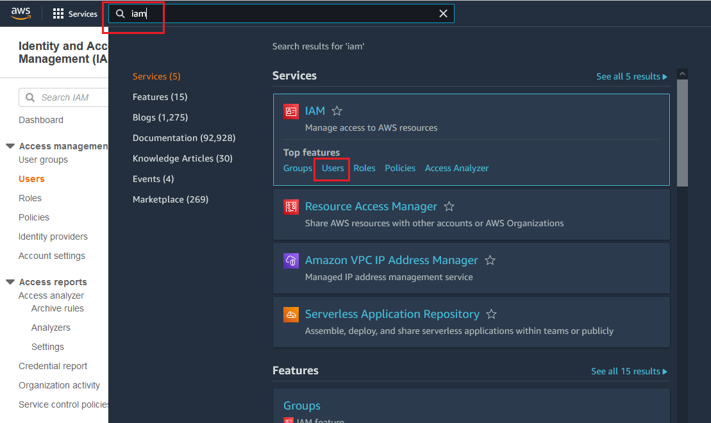
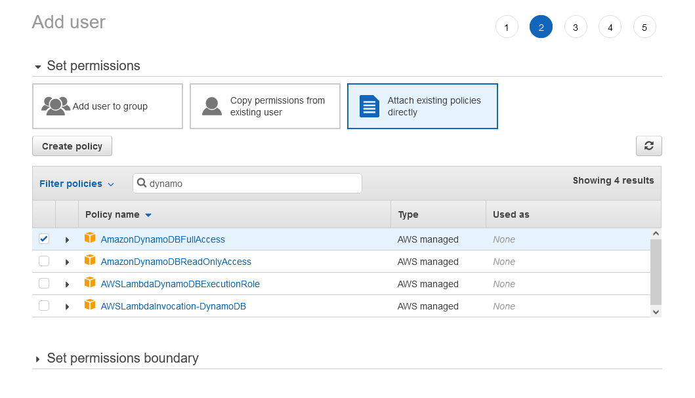

# Creating an AWS Account and a User

This article explains how to start using AWS. If you don't have an existing account and a user, follow the steps below to create them:

1. [Create an AWS account](#creating-an-aws-account).
2. [Create a user](#creating-a-user).

## Creating an AWS Account

To create an account, go to the [AWS website](https://aws.amazon.com/). The process is straightforward and takes several steps to complete. You will be prompted for a credit card number and a phone number, even if you choose the free option. 

## Creating a User

1. Sign in with your AWS account and search for `"iam"` (Identity and Access Management) in the [AWS Console](https://console.aws.amazon.com).
1. In the IAM console, select **Users** and then **Add User**.

	

1. Type a user name, for example, `telerik_user`, and then check the **Programmatic access** option.
1. Click **Next: Permissions**.
1. Select **Attach existing policies directly**. From the permissions step, you can control the user's access to specific services.

	* To access Amazon DynamoDB, type `dynamodb` in the search field and check the **AmazonDynamoDBFullAccess** option in the table. 

    

1. Click **Next: Review** > **Create user**.
1. From the summary view of the newly created user, copy the `Access key ID` and the `Secret access key`. You can also download the user details in a csv file. Keep both keys, because you will need them in the [next steps](#next-steps).

## Next Steps

* [Connecting to Amazon DynamoDB]()
* [Uploading to Amazon S3 storage]()
