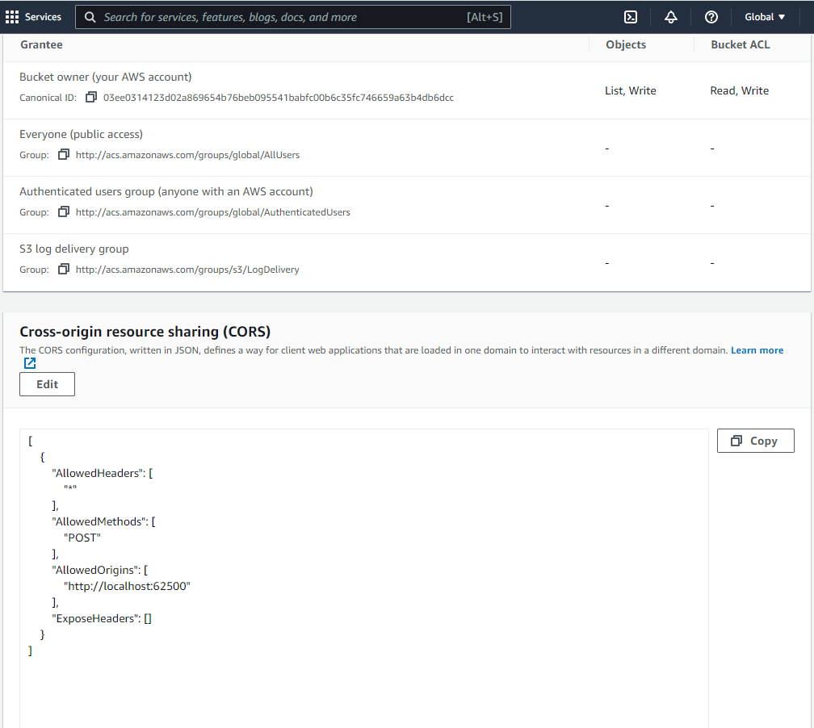
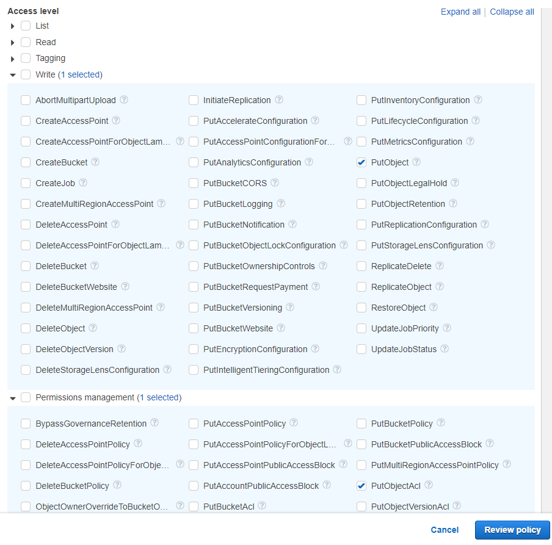

# Amazon S3

The **Amazon Simple Storage Service** (Amazon S3) is a storage service that allows you to upload any kind of data at any time, from anywhere. This article demonstrates how to upload files with the [Upload component]() for {{ site.framework }}.

## Prerequisites

To use {{ site.product }} with Amazon S3, you need:

* An AWS account
* A user created in AWS Identity and Access Management (IAM)
* A bucket in Amazon S3

Refer to [Creating an AWS Account and a User]() for more information on how to create an account and a user. To set permissions to the user see [User Permissions](#user-permissions).

## Creating and Configuring a New Bucket

Data in Amazon S3 is stored in buckets. Before you can upload a file to Amazon S3, you need to create a bucket by using the AWS Management Console. You can learn how to do that in the [Creating a Bucket](https://docs.aws.amazon.com/AmazonS3/latest/userguide/creating-bucket.html) article. 

>The example in this article uses the AWS Signature Version 2 (V2) signing process. This means that the bucket you will be uploading to must support Signature Version 2. In the bucket creation steps, you are prompted to specify the region the bucket resides in. The region determines whether V2 of the signing process is supported. See the list of regions that support V2 in the [Signature Version 2](https://docs.aws.amazon.com/general/latest/gr/signature-version-2.html) article.

### Bucket CORS Configuration

Once you have created a new bucket, you need to configure it to accept Cross-origin resource sharing [CORS](https://developer.mozilla.org/en/docs/HTTP/Access_control_CORS) requests from your application. Set the CORS configuration in the `Permissions` tab of the bucket.

The image below shows the minimum configuration needed for an application to upload files to the bucket.



The configuration is in JSON format:

```js
[
    {
        "AllowedHeaders": [
            "*"
        ],
        "AllowedMethods": [
            "POST"
        ],
        "AllowedOrigins": [
            "http://localhost:62500"
        ],
        "ExposeHeaders": []
    }
]
```

The `"http://localhost:62500"` address shown above is exemplary. Use the actual address of your application. Setting `"*"` as value of `AllowedOrigins` will allow any origin. 

## User Permissions

>If the purpose of the user is only to upload to the S3 storage, we recommend that you create a user with restricted permissions. In this case, the users policy only needs to allow two actions on the destination bucket: `PutObject` and `PutObjectAcl`. In the `Permissions` settings of the user, you can create a policy that includes only these two actions and apply the policy to the user.

	Allow the PutObject and PutObjectAcl actions in the Visual Editor:

	

    The permissions configuration of the restricted user can be reviewed as JSON and should look like this: 

    ```js
    {
        "Version": "2012-10-17",
        "Statement": [
            {
                "Sid": "VisualEditor0",
                "Effect": "Allow",
                "Action": [
                    "s3:PutObject",
                    "s3:PutObjectAcl"
                ],
                "Resource": "arn:aws:s3:::mybucketname/*"
            }
        ]
    }
    ```

## Configuring the Application 

### Upload Authorization

In your application, create a model and set up the S3 authorization as demonstrated below. 

The following server-side logic authorizes uploads by creating and signing temporary policies for each client:

```
public ActionResult Index()
{
    var config = new S3Config
    {
        // Unique Policy ID and duration
        Uuid = Guid.NewGuid(),
        ExpirationTime = TimeSpan.FromHours(1),

        // Authentication
        AccessKey = "put the user's access key here",
        SecretAccessKey = "put the user's secret access key here",

        // Bucket name and key prefix (folder)
        Bucket = "mybucketname",
        // The Bucket must reside in a region that supports Signature Version 2. In this example: eu-west-1
        BucketUrl = "https://mybucketname.s3.eu-west-1.amazonaws.com/",
        KeyPrefix = "UploadRoot/",

        // See http://docs.aws.amazon.com/AmazonS3/latest/dev/ACLOverview.html#CannedACL
        Acl = "private",

        // Mime type prefix
        ContentTypePrefix = "image/",

        // Fully qualified URL of an "empty document" in the same origin
        // Required for IE < 10
        SuccessUrl = "http://localhost:62500/home/success"
    };

    ViewBag.Policy = Policy(config);
    ViewBag.PolicySignature = Sign(ViewBag.Policy, config.SecretAccessKey);
    ViewBag.S3Config = config;

    return View();
}

public ActionResult Success()
{
    // Return empty response to signify success to IE < 10
    return Content("", "text/plain");
}

private string Policy(S3Config config)
{
    var policyJson = JsonConvert.SerializeObject(new
    {
        expiration = DateTime.UtcNow.Add(config.ExpirationTime).ToString("yyyy-MM-ddTHH:mm:ssZ"),
        conditions = new object[] {
            new { bucket = config.Bucket },
            new [] { "starts-with", "$key", config.KeyPrefix },
            new { acl = config.Acl },
            new [] { "starts-with", "$success_action_redirect", "" },
            new [] { "starts-with", "$Content-Type", config.ContentTypePrefix },
            new Dictionary<string, string>  {{ "x-amz-meta-uuid", config.Uuid.ToString() }} 
        }
    });

    return Convert.ToBase64String(Encoding.UTF8.GetBytes(policyJson));
}

private static string Sign(string text, string key)
{
    var signer = new HMACSHA1(Encoding.UTF8.GetBytes(key));
    return Convert.ToBase64String(signer.ComputeHash(Encoding.UTF8.GetBytes(text)));
}
```
```Model
public class S3Config
{
    public TimeSpan ExpirationTime { get; set; }
    public string AccessKey { get; set; }
    public string SecretAccessKey { get; set; }
    public string Bucket { get; set; }
    public string BucketUrl { get; set; }
    public string KeyPrefix { get; set; }
    public string Acl { get; set; }
    public string ContentTypePrefix { get; set; }
    public Guid Uuid { get; set; }
    public string SignatureVersion { get; set; }
    public string SuccessUrl { get; set; }
    public string SuccessStatus { get; set; }
}
```

The policy sets restrictions on the destination, content type, and others. Any requests that do not match these rules will be rejected. The policy is signed with the secret key, which is not transmitted to the client.

### Adding the Upload on the Client

Add the Upload component to the view and handle its `upload` and `select` events.

```
@(Html.Kendo().Upload()
    .Name("file")
    .Async(async => async
        .SaveUrl(ViewBag.S3Config.BucketUrl)
        .WithCredentials(false)
    )
    .Events(events => events
        .Upload("onUpload")
        .Select("onSelect")
    )
)

<script>
    function mimeType(extension) {
        var types = {
            ".jpg": "image/jpeg",
            ".jpeg": "image/jpeg",
            ".png": "image/png",
            ".gif": "image/gif"
            // ...
        };
        return types[extension.toLowerCase()];
    }

    function onSelect(e) {
            // Filter selected files by extension
            for (var i = 0; i < e.files.length; i++) {
                var file = e.files[i];
                var type = mimeType(file.extension);
                if (!type || type.indexOf("@ViewBag.S3Config.ContentTypePrefix") !== 0) {
                alert("Only image files are supported");
                e.preventDefault();
                return;
            }
        }
    }

    function onUpload(e) {
        var redirect = "";
        if (typeof FormData === "undefined") {
            // Redirect to an empty page is required for IE < 10
            redirect = "@ViewBag.S3Config.SuccessUrl";
        }
        var file = e.files[0];
        var type = mimeType(file.extension);
        e.data = {
            "key": "@ViewBag.S3Config.KeyPrefix" + file.name,
            "acl": "@ViewBag.S3Config.Acl",
            "Content-Type": type,
            "x-amz-meta-uuid": "@ViewBag.S3Config.Uuid",
            "AWSAccessKeyId": "@ViewBag.S3Config.AccessKey",
            "Policy": "@ViewBag.Policy",
            "Signature": "@ViewBag.PolicySignature",
            "success_action_redirect": redirect
        };
    }
</script>
```

The client-side logic appends all required fields before submitting the request to S3. This is done in the upload event handler. All fields except "Content-Type" are taken directly from the configuration. The content type is inferred from the extension.

>Existing files with the same names will be overwritten. It is highly recommended to make file names unique.

## See Also

* [Connecting to Amazon DynamoDB]()
