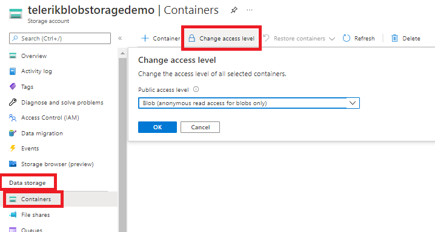

# Using {{ site.product }} with Azure Blob Storage

The **Azure Blob Storage** is Microsoft's object storage solution for the cloud. The Blob storage is optimized for storing massive amounts of unstructured data (data that doesn't adhere to a particular data model or definition, such as text or binary data).

This article demonstrates how to upload images with the [Upload component]() for {{ site.framework }} to Azure Blob Storage and view the uploaded images in a [{{ site.framework }} ListView]().

## Prerequisites

To use {{ site.product }} with Azure Blob Storage, you need:

* [An Azure account]()
* [An Azure Storage Account](https://docs.microsoft.com/en-us/azure/storage/common/storage-account-create?toc=%2Fazure%2Fstorage%2Fblobs%2Ftoc.json&tabs=azure-portal)
* [An Azure Storage Container](https://docs.microsoft.com/en-us/azure/storage/blobs/storage-quickstart-blobs-portal#create-a-container)
* [A web application configured to use {{site.product}} components](https://docs.telerik.com/{{site.platform}}/getting-started/first-steps)

## Setting up Container Permissions

After you create the Storage Container, set the permission level. This allows you to access the uploaded images:

1. Navigate to your storage account and select the container under **Data Storage** > **Containers**.
1. Click on **Change access level** and select the desired access level:



## Configuring the Web Application

Add the Azure account and the Azure Storage Container details to the `appsettings.json` of the application as they will be used to access the Container.

```
{
  "ApplicationInsights": {
    "InstrumentationKey": ""
  },
  "Logging": {
    "IncludeScopes": false,
    "LogLevel": {
      "Default": "Debug",
      "System": "Information",
      "Microsoft": "Information"
    }
  },
  "AzureStorageConfig": {
    "AccountName": "<Your Account Name>",
    "AccountKey": "<Your Account Key>",
    "ImageContainer": "<Name of the created container>",
    "ConnectionString": "<Connention string>"
  }
}
```

>For clarity, this tutorial demonstrates how to store the endpoint URI and account Key in the `appsettings.json`. For production application hosted on Azure, it is strongly recommended to store sensitive data in [Azure Key Vault](https://docs.microsoft.com/en-us/aspnet/core/security/key-vault-configuration?view=aspnetcore-6.0#secret-storage-in-the-production-environment-with-azure-key-vault).

You can find the account key and connection string by navigating to your storage account&mdash;under **Security + networking** > **Access Keys**


## Adding the Upload and ListView on the Client

The following configuration demonstrates how to add an [Upload component]() with enabled validation for `jpg` and `png` files. The Success event handler of the Upload is used to refresh the ListView.

```Razor
    <script type="text/x-kendo-tmpl" id="template">
        <div class="img">
            
            <h4>#:Name#</h4>
        </div>
    </script>

    @(Html.Kendo().ListView<ImageViewModel>()
        .Name("listView")
        .TagName("div")
        .ClientTemplateId("template")
        .DataSource(dataSource => dataSource
                .Ajax()
                .Read(read => read.Action("GetImageDetails", "Images"))
                .PageSize(5)
            )
        .Pageable(pageable => pageable
            .Refresh(true)
            .ButtonCount(5)
            .PageSizes(new[] { 5, 15, 21 })
        )
    )

    @(Html.Kendo().Upload()
        .Name("files")
        .Async(a=>a
            .Save("Save","Images")
            .Remove("Remove","Images")
            .AutoUpload(false)
            )
        .Validation(validation => validation.AllowedExtensions(new string[]{".jpg", ".png"}))
        .Events(ev=>ev.Success("onSuccess"))
    )

    <script>
        function onSuccess(e){
            var listView = $("#listView").getKendoListView();
            listView.dataSource.read();
        }
    </script>

    <style>
        .k-listview-content{
            display:flex;
            flex-direction:row;
            gap:20px;
        }
        .img h4 {
            line-height: 1.1em;
            font-size: .9em;
            font-weight: normal;
            text-transform: uppercase;
            color: #999;
        }
    </style>
```

## Configuring the Server-Side

The following server-side logic demonstrates the server-side configuration of the Upload and the Listview components:

* The `Save` and `Remove` endpoints of the Upload component demonstrate the configuration required to save uploaded images in the Azure Storage Container or remove them, respectively.
* The `GetImageDetails` action method demonstrates the configuration for the ListView endpoint.

```ImagesController
    public class ImagesController : Controller
    {
        private readonly AzureStorageConfig storageConfig = null;

        public ImagesController(IOptions<AzureStorageConfig> config)
        {
            storageConfig = config.Value;
        }

        [HttpPost]
        public async Task<IActionResult> Save(ICollection<IFormFile> files)
        {
            bool isUploaded = false;

            try
            {
                if (files.Count == 0)
                    return BadRequest("No files received from the upload");

                if (storageConfig.AccountKey == string.Empty || storageConfig.AccountName == string.Empty)
                    return BadRequest("sorry, can't retrieve your azure storage details from appsettings.js, make sure that you add azure storage details there");

                if (storageConfig.ImageContainer == string.Empty)
                    return BadRequest("Please provide a name for your image container in the azure blob storage");

                foreach (var formFile in files)
                {

                    if (formFile.Length > 0)
                    {
                        using (Stream stream = formFile.OpenReadStream())
                        {
                            isUploaded = await UploadFileToStorage(stream, formFile.FileName, storageConfig);
                        }
                    }
                }

                if (isUploaded)
                {
                    return new AcceptedResult();
                }
                else
                    return BadRequest("Look like the image couldnt upload to the storage");
            }
            catch (Exception ex)
            {
                return BadRequest(ex.Message);
            }
        }

        public static async Task<bool> UploadFileToStorage(Stream fileStream, string fileName,
                                                            AzureStorageConfig _storageConfig)
        {
            // Create a URI to the blob
            Uri blobUri = new Uri("https://" +
                                _storageConfig.AccountName +
                                ".blob.core.windows.net/" +
                                _storageConfig.ImageContainer +
                                "/" + fileName);

            // Create StorageSharedKeyCredentials object by reading
            // the values from the configuration (appsettings.json)
            StorageSharedKeyCredential storageCredentials =
                new StorageSharedKeyCredential(_storageConfig.AccountName, _storageConfig.AccountKey);

            // Create the blob client.
            BlobClient blobClient = new BlobClient(blobUri, storageCredentials);


            var fileBytes = ReadFully(fileStream);
            var data = new BinaryData(fileBytes);

            // Upload the file
            await blobClient.UploadAsync(data);

            return await Task.FromResult(true);
        }

        private static byte[] ReadFully(Stream input)
        {
            using (MemoryStream ms = new MemoryStream())
            {
                input.CopyTo(ms);
                return ms.ToArray();
            }
        }

        [HttpPost]
        public async Task<ActionResult> Remove(string[] fileNames)
        {
            // The parameter of the Remove action must be called "fileNames"

            if (fileNames != null)
            {
                foreach (var fullName in fileNames)
                {
                    await RemoveFileFileFromStorage(fullName, storageConfig);
                }
            }

            // Return an empty string to signify success
            return Content("");
        }

        public static async Task<bool> RemoveFileFileFromStorage(string fileName,
                                                            AzureStorageConfig _storageConfig)
        {
            // Create BlobServiceClient from the account URI
            BlobServiceClient blobServiceClient = new BlobServiceClient(_storageConfig.ConnectionString);

            // Get reference to the container
            BlobContainerClient container = blobServiceClient.GetBlobContainerClient(_storageConfig.ImageContainer);

            //Remove blob matching the fileName
            await container.DeleteBlobAsync(fileName, DeleteSnapshotsOption.None);

            return await Task.FromResult(true);
        }

        public async Task<ActionResult> GetImageDetails([DataSourceRequest] DataSourceRequest request)
        {
            var data = await GetUploadedImages(storageConfig);
            return Json(data.ToDataSourceResult(request));
        }

        public static async Task<List<ImageViewModel>> GetUploadedImages(AzureStorageConfig _storageConfig)
        {
            List<ImageViewModel> images = new List<ImageViewModel>();

            // Create BlobServiceClient from the account URI
            BlobServiceClient blobServiceClient = new BlobServiceClient(_storageConfig.ConnectionString);

            // Get reference to the container
            BlobContainerClient container = blobServiceClient.GetBlobContainerClient(_storageConfig.ImageContainer);

            if (container.Exists())
            {
                var data = container.GetBlobs();
                foreach (BlobItem blobItem in container.GetBlobs())
                {
                    images.Add(new ImageViewModel() { Name = blobItem.Name, Url = container.Uri + "/" + blobItem.Name });
                }
            }

            return await Task.FromResult(images);
        }
    }
```
```AzureStorageConfig
    public class AzureStorageConfig
    {
        public string AccountName { get; set; }
        public string AccountKey { get; set; }
        public string ImageContainer { get; set; }
        public string ConnectionString { get; set; }
    }
```

## See Also

* [Connecting to Azure CosmosDB]()
