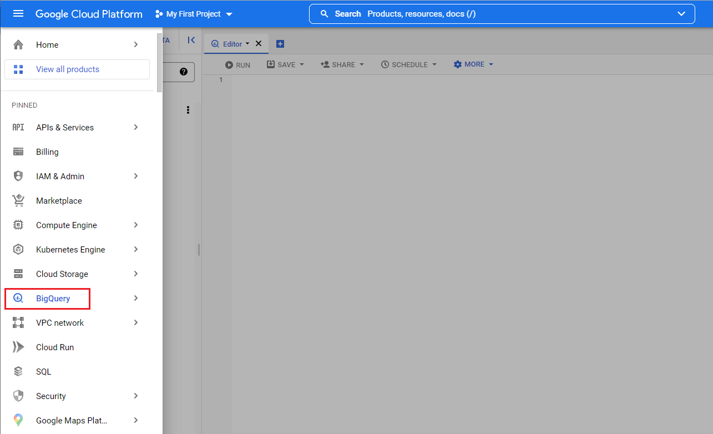
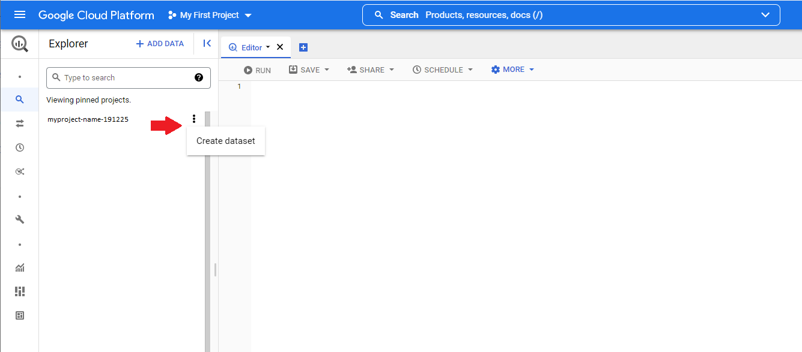
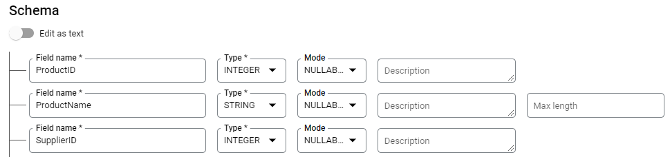
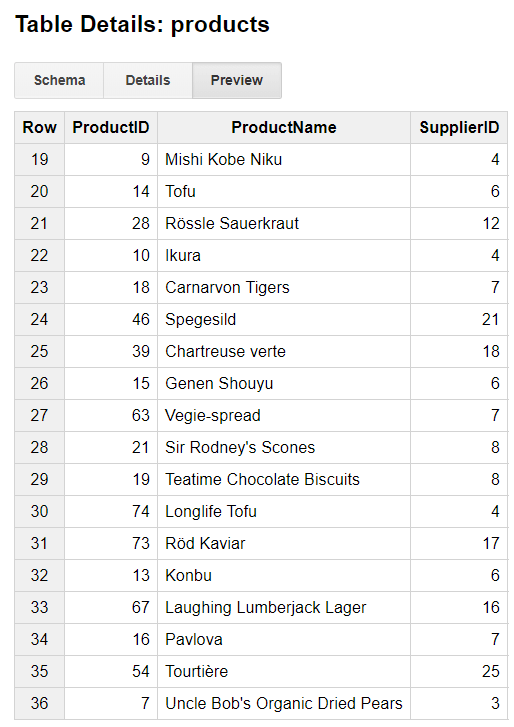

# Google Cloud Big Query

This tutorial shows how to create a Dataset in [Google Cloud Big Query](https://cloud.google.com/bigquery) and configure the Telerik UI for {{ site.framework }} Grid to perform remote CRUD (Create, Read, Update, Destroy) data operations in the Dataset.

## Prerequisites

Before you start using the Grid with Google Cloud Big Query, you will need:

* A Google Cloud account
* A project created in Google Cloud
* Basic knowledge on using the [Cloud Console](https://cloud.google.com/cloud-console/)
* An application set up to use {{ site.product }}

Refer to [Creating a Google Cloud Account and Project]() for more information on how to create an account and a project.

## Creating New DataSet and Table in BigQuery

For more information on how to create new datasets and tables, refer to the articles about [creating and using datasets](https://cloud.google.com/bigquery/docs/tables) and [creating and using tables](https://cloud.google.com/bigquery/docs/tables) from the official BigQuery documentation. 

1. Navigate to **BigQuery** from the Google Cloud Platform navigation menu.

    

1. Select your project and choose **Create dataset** from the dropdown, which opens on clicking the project's menu button.

    

Once the dataset is created, copy the datasetid. You will need it later, in the logic responsible for running the queries against this dataset. In this example the datasetid is `TestDataset`.

1. Create a `products` table with the following Schema and Data.

    Schema in the TestDataset:
    

    Data of the Products Table in the TestDataset:

    

## Authorization and Access

The Google APIs Client library for .NET handles the authorization and access to the Google API. For more details on the available libraries, refer to [Cloud Client Libraries](https://cloud.google.com/apis/docs/cloud-client-libraries).

To start using the Google APIs Client library for .NET:

1. Install the **Google.Apis.Bigquery.v2** NuGet package in your {{ site.framework }} application.

1. Follow the steps from the [Setting up Authentication](https://cloud.google.com/bigquery/docs/reference/libraries#setting_up_authentication) guide.

One of the steps for setting up authentication consists of downloading a JSON key file that holds the credentials information to your computer. Provide the credentials to your application code by setting the environment variable GOOGLE_APPLICATION_CREDENTIALS. To set the variable, use the approach described in the [Setting up Authentication](https://cloud.google.com/bigquery/docs/reference/libraries#setting_up_authentication) guide. 

If you experience issues with accessing the environment variable, make sure the JSON file is present in an accessible location, for example, `C:\Program Files (x86)\IIS Express\myproject-name-191225-5f6ddc8dc2f6.json`. Try setting the GOOGLE_APPLICATION_CREDENTIALS environment variable in the application:

```
public ActionResult Index()
{
    Environment.SetEnvironmentVariable("GOOGLE_APPLICATION_CREDENTIALS", "myproject-name-191225-5f6ddc8dc2f6.json");

    return View();
}
```

## Configuring the Grid to Consume and Manipulate Available BigQuery Data

Configure the Grid for remote binding and implement the actions the Grid will call to perform CRUD operations. 

1. Configure the Grid.

    The declaration of the Grid and the view model it uses are shown in the example below.

	```
    @(Html.Kendo().Grid<TelerikApp1.Models.ProductViewModel>()
        .Name("grid")
        .Columns(columns =>
        {
            columns.Bound(p => p.ProductID);
            columns.Bound(p => p.ProductName);
            columns.Bound(p => p.SupplierID);
            columns.Command(command => { command.Edit(); command.Destroy(); }).Width(250);
        })
        .ToolBar(toolbar => toolbar.Create())
        .Editable(editable => editable.Mode(GridEditMode.InLine))
        .Pageable()
        .Sortable()
        .Scrollable()
        .HtmlAttributes(new { style = "height:550px;" })
        .DataSource(dataSource => dataSource
            .Ajax()
            .PageSize(20)
            .Events(events => events.Error("error_handler"))
            .Model(model =>
            {
                model.Id(p => p.ProductID);
                model.Field(f => f.ProductID).Editable(false);
            })
            .Read(read => read.Action("Products_Read", "Home"))
            .Create(create => create.Action("Product_Create", "Home"))
            .Update(update => update.Action("Product_Update", "Home"))
            .Destroy(destroy => destroy.Action("Product_Destroy", "Home"))
        )
    )

    <script type="text/javascript">
        function error_handler(e) {
            if (e.errors) {
                var message = "Errors:\n";
                $.each(e.errors, function (key, value) {
                    if ('errors' in value) {
                        $.each(value.errors, function() {
                            message += this + "\n";
                        });
                    }
                });
                alert(message);
            }
        }
    </script>
	```
    ```Model
    public class ProductViewModel
    {
        public int ProductID { get; set; }

        public string ProductName { get; set; }

        public int SupplierID { get; set; }
    }
    ```

1. Implement the `Products_Read` action.

    The Google BigQuery API (using Google.Cloud.BigQuery.V2;) allows you to run queries against the dataset. To use the API, add the following namespace to the controller:

    ```csharp
    using Google.Cloud.BigQuery.V2;
    ```
    
    This exemplary implementation shows how you can use a SELECT statement, to get the data and then return it back to the client, for the Grid to visualize it. 

    ```Controller
        public ActionResult Products_Read([DataSourceRequest]DataSourceRequest request)
        {
            BigQueryClient client = BigQueryClient.Create("myproject-name-191225");
            //The GetTable method expects the Google Cloud projectid, the datasetid and the tableid:
            BigQueryTable table = client.GetTable("myproject-name-191225", "TestDataset", "products");

            string sql = $"SELECT * FROM TestDataset.products";
            BigQueryParameter[] parameters = null;
            BigQueryResults results = client.ExecuteQuery(sql, parameters);

            List<ProductViewModel> data = new List<ProductViewModel>();
            foreach (BigQueryRow row in results)
            {
                data.Add(new ProductViewModel() { ProductID = Int32.Parse(row["ProductID"].ToString()), ProductName = row["ProductName"].ToString(), SupplierID = Int32.Parse(row["SupplierID"].ToString()) });
            }

            return Json(data.ToDataSourceResult(request));
        }
    ```

1. Implement the Update, Create and Destroy actions.

    This snippet shows an exemplary implementation of the action responsible for the Update operations. 

    ```Controller
        [AcceptVerbs(HttpVerbs.Post)]
        public ActionResult Product_Update([DataSourceRequest] DataSourceRequest request, ProductViewModel product)
        {
            if (product != null && ModelState.IsValid)
            {
                //Update product
                BigQueryClient client = BigQueryClient.Create("rich-sunlight-353114");
                BigQueryTable table = client.GetTable("rich-sunlight-353114", "TestDataset", "products");

                string sql = $"UPDATE TestDataset.products SET ProductName = '" + product.ProductName + "', SupplierID = " + product.SupplierID + " WHERE ProductID = " + product.ProductID + "; ";
                BigQueryParameter[] parameters = null;
                BigQueryResults results = client.ExecuteQuery(sql, parameters);
            }

            return Json(new[] { product }.ToDataSourceResult(request, ModelState));
        }
    ```

    Use the same approach, to implement the Create and Destroy actions. With the help of BigQuery API, you can run INSERT and DELETE statements to modify the data in the dataset.

    ```Controller
        [AcceptVerbs(HttpVerbs.Post)]
        public ActionResult Product_Create([DataSourceRequest] DataSourceRequest request, ProductViewModel product)
        {
            if (product != null && ModelState.IsValid)
            {
                //Create product...
            }

            return Json(new[] { product }.ToDataSourceResult(request, ModelState));
        }

        [AcceptVerbs(HttpVerbs.Post)]
        public ActionResult Product_Destroy([DataSourceRequest] DataSourceRequest request, ProductViewModel product)
        {
            if (product != null)
            {
                //Destroy product...
            }

            return Json(new[] { product }.ToDataSourceResult(request, ModelState));
        }
    ```

## See Also

* [Binding to Azure Cosmos DB]()
* [Consuming Data from Amazon DynamoDB]()
