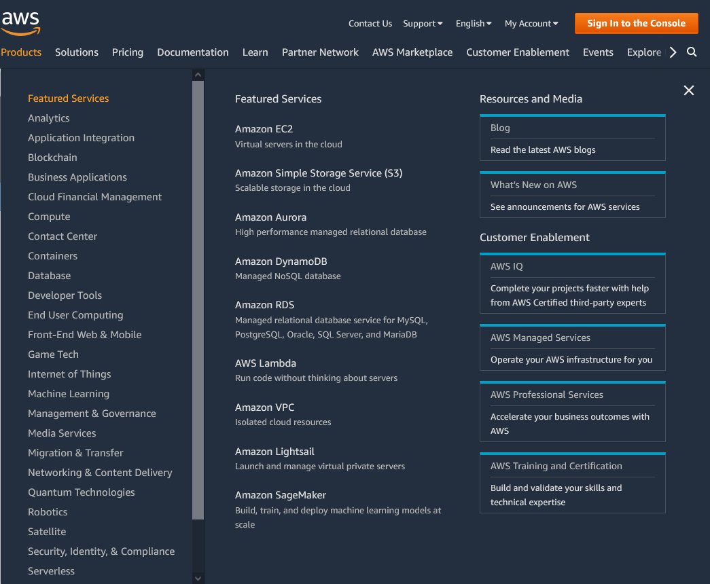
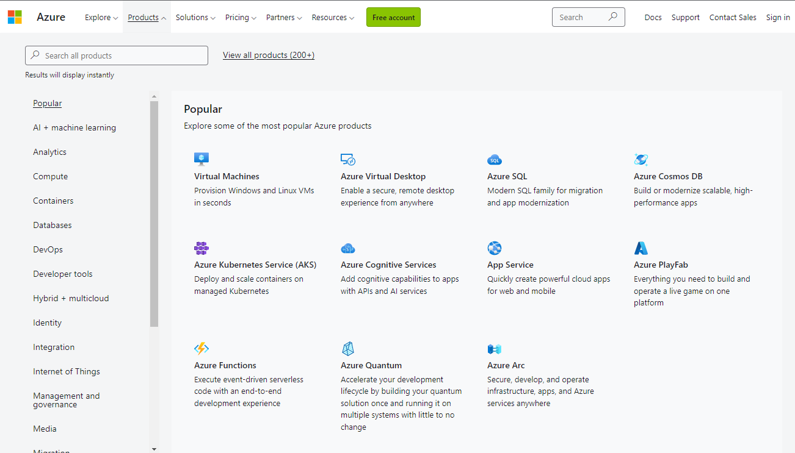

# {{ site.product }} Cloud Integration Overview

You can use Telerik UI for {{ site.framework }} with various cloud services like **Amazon Web Services** and **Azure**. Key features of the cloud service providers are their storage capability, infrastructure-as-a-service (IaaS ) solutions, and tools. Both AWS and Azure provide an extensive list of scalable, secure, and cost-effective computing services. 

# AWS (Amazon Web Services)

Amazon Web Services is a cloud platform that provides a wide range of cloud services. You can create a [free account](https://aws.amazon.com/free/?sc_icampaign=acq_aws_takeover-abandoner&sc_ichannel=ha&sc_icontent=awssm-1524&sc_iplace=ed&trk=ha_awssm-1524&all-free-tier.sort-by=item.additionalFields.SortRank&all-free-tier.sort-order=asc&awsf.Free%20Tier%20Types=*all&awsf.Free%20Tier%20Categories=*all) that is available for a year and allows you to explore the provided services. 

For examples of using Telerik UI for {{ site.framework }} components with AWS cloud services, refer to the following articles:

* [Creating an AWS Account and a User]()&mdash;describes the steps for creating an AWS account and adding a user.

* [Storage (S3)]()&mdash;explains how to create a bucket in Amazon S3 and how to upload a file to the bucket with the Telerik UI for {{ site.framework }} Upload.

* [DynamoDB]()&mdash;describes how to connect the Telerik UI for {{ site.framework }} Grid to Amazon DynamoDB.

# Microsoft Azure

Microsoft Azure (often referred to as Azure) is a cloud computing service operated by Microsoft. The platform provides software as a service (SaaS), platform as a service (PaaS), and infrastructure as a service (IaaS). It supports different languages, tools, and frameworks, including both Microsoft-specific and third-party software and systems.

For examples of using Telerik UI for {{ site.framework }} components with Azure cloud services, refer to the following articles:

* [Creating an Azure Account]()&mdash;learn how to create an Azure account.

* [Azure Blob Storage]()&mdash;demonstrates how to upload images into a Blob Storage Container with the Telerik UI for {{ site.framework }} Upload and review them using a Telerik UI for {{ site.framework }} ListView.

* [Azure CosmosDB]()&mdash;describes how to connect the Telerik UI for {{ site.framework }} Grid to Azure CosmosDB.
