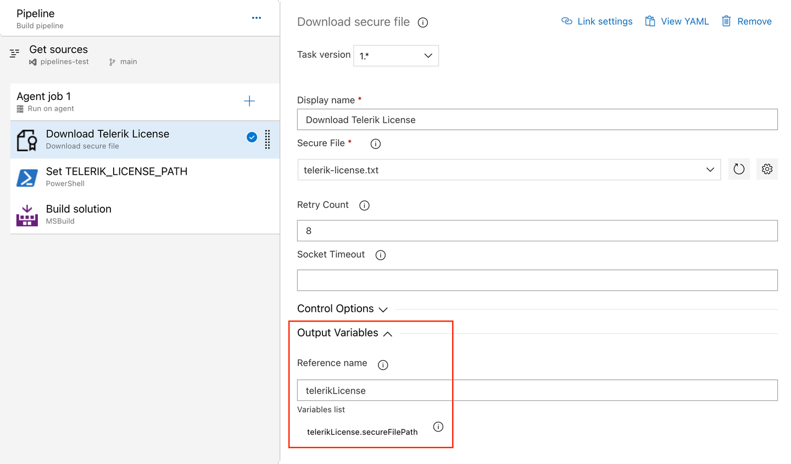
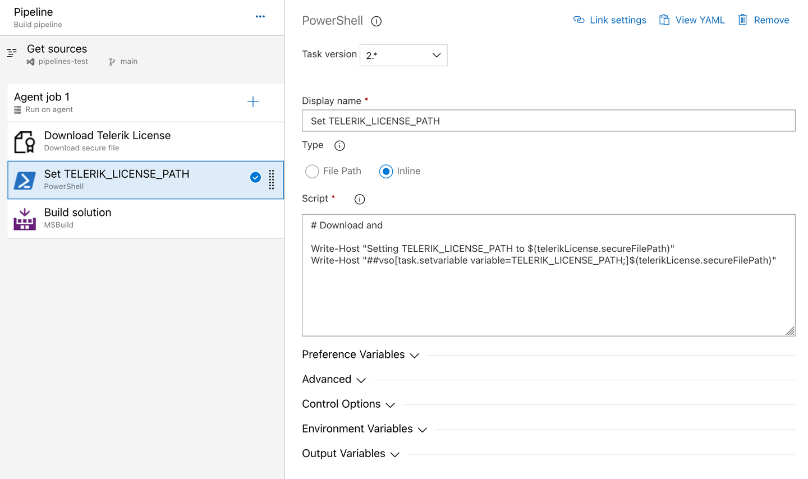

# Setting Up Your License Key in CI/CD Environment

This article describes how to set up and activate your [{{ site.product }} license key]() across a few popular CI/CD services by using environment variables.

@[template](/_contentTemplates/licensing-templates.md#ci-cd-support)

## Basics

When working with CI/CD platforms, always add the [`Telerik.Licensing` NuGet package]() as a project dependency. This package activates the {{ site.product_short }} components at build time by using the provided license key.

The license activation process in a CI/CD environment involves the following steps:

1. Add the `Telerik.Licensing` NuGet package as a dependency to all projects that reference {{ site.product }} or Telerik Document Processing:
    ```
    <PackageReference Include="Telerik.Licensing" Version="1.*" />
    ```
1. Go to the <a href="https://www.telerik.com/account/your-licenses/license-keys" target="_blank">License Keys page</a> in your Telerik account and get your license key.
1. [Create an environment variable](#creating-environment-variables) named `TELERIK_LICENSE` and add your {{ site.product_short }} license key as a value.

## Creating Environment Variables

The recommended way to provide your license key to the `Telerik.Licensing` NuGet package in CI/CD environment is to use environment variables. Each CI/CD platform has a different process for setting environment variables. This article lists only some of the most popular examples.

### Azure Pipelines (YAML)

1. Create a new <a href="https://docs.microsoft.com/en-us/azure/devops/pipelines/process/variables?view=azure-devops&tabs=yaml%2Cbatch" target="_blank">user-defined variable</a> named `TELERIK_LICENSE`.
1. Paste the contents of the license key file as a value.

>Always consider the variable size limit—if you are using a Variable Group, the license key will typically exceed the character limit for the variable values. The only way to have a long value in the Variable Group is to link it from Azure Key Vault. If you cannot use a Key Vault, then use a normal pipeline variable instead (see above) or use the [Secure files approach instead](#azure-secure-files).

### Azure Pipelines (Classic)

1. Create a new <a href="https://docs.microsoft.com/en-us/azure/devops/pipelines/process/variables?view=azure-devops&tabs=classic%2Cbatch" target="_blank">user-defined variable</a> named `TELERIK_LICENSE`.
1. Paste the contents of the license key file as a value.

### Azure Secure Files

<a href="https://learn.microsoft.com/en-us/azure/devops/pipelines/library/secure-files?view=azure-devops" target="_blank">Secure files</a> are an alternative approach for sharing the license key file in Azure Pipelines that does not have the size limitations of environment variables.

You have two options for the file-based approach. Set the `TELERIK_LICENSE_PATH` variable or add a file named `telerik-license.txt` to the project directory or a parent directory.

>Make sure you’re referencing v1.4.10 or later of the `Telerik.Licensing` NuGet package.

#### YAML Pipeline

With a YAML pipeline, you can use the <a href="https://learn.microsoft.com/en-us/azure/devops/pipelines/tasks/reference/download-secure-file-v1?view=azure-pipelines" target="_blank"> DownloadSecureFile@1</a> task, then use `$(name.secureFilePath)` to reference it. For example:

```
  - task: DownloadSecureFile@1
    name: DownloadTelerikLicenseFile # defining the 'name' is important
    displayName: 'Download Telerik License Key File'
    inputs:
      secureFile: 'telerik-license.txt'

  - task: MSBuild@1
    displayName: 'Build Project'
    inputs:
      solution: 'myapp.csproj'
      platform: Any CPU
      configuration: Release
      msbuildArguments: '/p:RestorePackages=false'
    env:
      # use the name.secureFilePath value to set TELERIK_LICENSE_PATH
      TELERIK_LICENSE_PATH: $(DownloadTelerikLicenseFile.secureFilePath) 
```

#### Classic Pipeline

With a classic pipeline, use the "Download secure file" task and a PowerShell script to set `TELERIK_LICENSE_PATH` to the secure file path.

1. Add a "Download secure file" task and set the output variable's name to `telerikLicense`.



2. Add a PowerShell task and set the `TELERIK_LICENSE_PATH` variable to the secureFilePath property of the output variable:



The script to set the environment variable is quoted below:

```
Write-Host "Setting TELERIK_LICENSE_PATH to $(telerikLicense.secureFilePath)"
Write-Host "##vso[task.setvariable variable=TELERIK_LICENSE_PATH;]$(telerikLicense.secureFilePath)"
```

Alternatively, copy the file into the repository directory:

```
echo "Copying $(telerikLicense.secureFilePath) to $(Build.Repository.LocalPath)/telerik-license.txt"
Copy-Item -Path $(telerikLicense.secureFilePath) -Destination "$(Build.Repository.LocalPath)/telerik-license.txt" -Force
```

### GitHub Actions

1. Create a new <a href="https://docs.github.com/en/actions/reference/encrypted-secrets#creating-encrypted-secrets-for-a-repository" target="_blank">Repository Secret</a> or an <a href="https://docs.github.com/en/actions/reference/encrypted-secrets#creating-encrypted-secrets-for-an-organization" target="_blank">Organization Secret</a>.
1. Set the name of the secret to `TELERIK_LICENSE` and paste the contents of the license file as a value.
1. After running `npm install` or `yarn`, add a build step to activate the license:
    ```YAML
    env:
        TELERIK_LICENSE: ${{ secrets.Telerik_License_Key }}
    ```

## Next Steps

* [Restore Telerik NuGet Packages in CI/CD Workflows]()

## See Also

* [Licensing FAQ]()
* [CI, CD, Build Server]()

* [Getting Started with {{ site.product }}]()

* [Getting Started with {{ site.product }}]()

