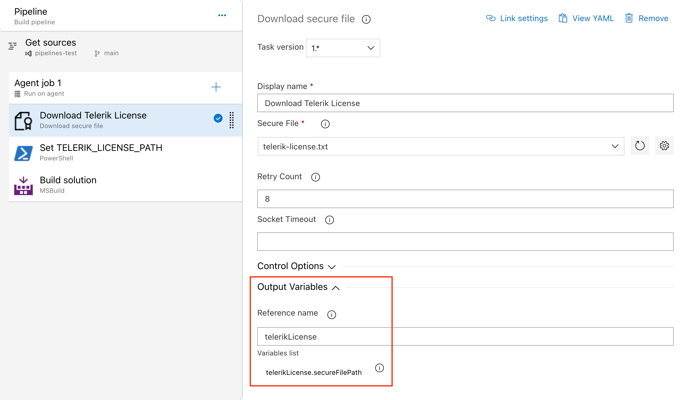
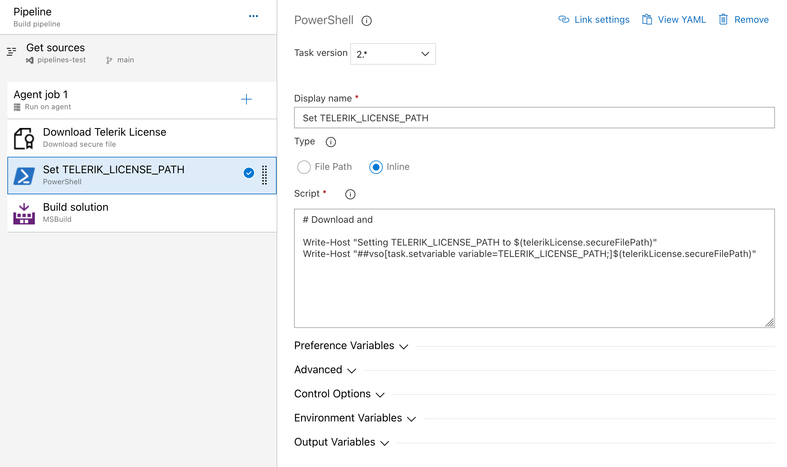

# Adding the License Key to CI/CD Services

This article describes how to set up and activate your {{ site.product }} license across a few popular CI/CD services by using deployment keys.

Deployment keys are a dedicated type of license key for build pipelines. They are tied to a specific application and the set of products that the application uses. Deployment keys cannot be used for application development.

> Developer license keys remain valid for CI/CD deployments, so existing pipelines do not need to be updated. For new pipelines, we recommend using deployment keys. For more information, see [the differences between developer license keys and deployment keys](slug:licensing-faq#what-is-the-difference-between-developer-license-keys-and-deployment-keys).

To activate your license in a CI/CD environment:

1. Navigate to the [Deployment Keys](https://www.telerik.com/account/your-licenses/deployment-keys) page.
1. Click **Add Application**. In the form that opens:
    * Add the application name.
    * Select the type of application&mdash;public or private.
    * Select the set of products used in the application.
1. Copy the key value and store it securely.
1. [Create an environment variable](#creating-an-environment-variable) named `TELERIK_LICENSE` and set it to the obtained key value. Alternatively, store the key in a `telerik-license.txt` file, for example, when using the [Azure secure files approach](#using-secure-files-on-azure-devops).

Treat the deployment key and the license file as secrets. Always store and retrieve them securely according to the build platform's best practices.

## Creating an Environment Variable

The recommended approach for providing your license key to the `Telerik.Licensing` NuGet package is to use environment variables. Each CI/CD service has a different process for setting environment variables. This article lists examples for some of the most popular services.

If your CI/CD service is not listed in this article, contact [Telerik technical support](https://www.telerik.com/support).

### GitHub Actions

1. Create a new [Repository Secret](https://docs.github.com/en/actions/security-for-github-actions/security-guides/using-secrets-in-github-actions#creating-secrets-for-a-repository) or [Organization Secret](https://docs.github.com/en/actions/security-for-github-actions/security-guides/using-secrets-in-github-actions#creating-secrets-for-an-organization).
1. Set the name of the secret to `TELERIK_LICENSE` and paste the deployment key value into the secret.
1. After running `npm install` or `yarn`, add a build step to activate the license:

```yaml
  env:
    TELERIK_LICENSE: ${{ "{{ secrets.TELERIK_LICENSE }}" }}
```

In a complete CI/CD workflow, you also need to set up NuGet package restoration authentication using `TELERIK_NUGET_KEY`. See [Restoring NuGet Packages in Your CI Workflow]() for details.

### Azure Pipelines

1. Create a new [secret variable](https://learn.microsoft.com/en-us/azure/devops/pipelines/process/variables?view=azure-devops&tabs=yaml%2Cbatch#secret-variables) named `TELERIK_LICENSE`.
1. Paste the deployment key as its value.


## Using Secure Files on Azure DevOps

[Secure files](https://learn.microsoft.com/en-us/azure/devops/pipelines/library/secure-files?view=azure-devops) are an alternative for sharing the deployment key file in Azure Pipelines without the size limitations of environment variables.

You have two options for the file-based approach:

* Set the `TELERIK_LICENSE_PATH` variable to the full path of the license file.
* Add a file named `telerik-license.txt` to the project directory or a parent directory.

Make sure that you reference `Telerik.Licensing` version 1.4.10 or later.

### YAML Pipeline

With a YAML pipeline, use the [`DownloadSecureFile@1`](https://learn.microsoft.com/en-us/azure/devops/pipelines/tasks/reference/download-secure-file-v1?view=azure-pipelines) task, then use $(name.secureFilePath) to reference it. For example:

```YAML
steps:
- task: DownloadSecureFile@1
  name: DownloadTelerikLicenseFile
  displayName: 'Download Telerik License Key File'
  inputs:
    secureFile: 'telerik-license.txt'


- task: DotNetCoreCLI@2
  displayName: 'Build Project'
  inputs:
    command: 'build'
  env:
    TELERIK_LICENSE_PATH: $(DownloadTelerikLicenseFile.secureFilePath)

- task: MSBuild@1
  displayName: 'Build Project'
  inputs:
    solution: 'myapp.csproj'
    platform: 'Any CPU'
    configuration: 'Release'
    msbuildArguments: '/p:RestorePackages=false'
  env:
    TELERIK_LICENSE_PATH: $(DownloadTelerikLicenseFile.secureFilePath)

```

### Classic Pipeline

With a classic pipeline, add a **Download secure file** task and a PowerShell script to set `TELERIK_LICENSE_PATH` to the secure file path.

1. Add a “Download secure file” task and set the output variable's name to telerikLicense.



1. Add a PowerShell task and set the `TELERIK_LICENSE_PATH` variable to the `secureFilePath` property of the output variable:



The script to set the environment variable is quoted below:

```powershell
Write-Host "Setting TELERIK_LICENSE_PATH to $(telerikLicense.secureFilePath)"
Write-Host "##vso[task.setvariable variable=TELERIK_LICENSE_PATH;]$(telerikLicense.secureFilePath)"
```

Alternatively, copy the file into the repository directory:

```powershell
Write-Host "Copying $(telerikLicense.secureFilePath) to $(Build.Repository.LocalPath)/telerik-license.txt"
Copy-Item -Path $(telerikLicense.secureFilePath) -Destination "$(Build.Repository.LocalPath)/telerik-license.txt"
```

## Next Steps

* [Restore Telerik NuGet Packages in CI/CD Workflows]()

## See Also

* [Licensing FAQ]()
* [CI, CD, Build Server]()

* [Getting Started with {{ site.product }}]()

* [Getting Started with {{ site.product }}]()
