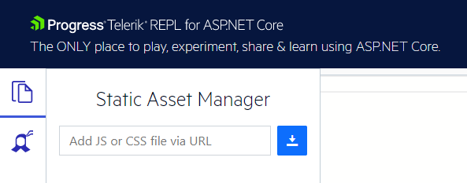
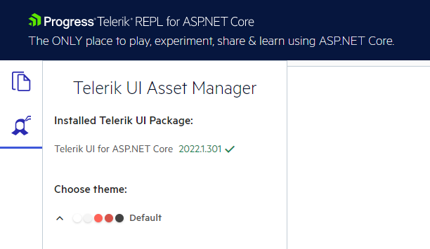

# Telerik REPL for ASP.NET Core Features

By using the Telerik REPL for ASP.NET Core, you can write razor code that contains HTML, C#, JS, and CSS in a default `.cshtml` file. The Telerik REPL for ASP.NET Core supports Razor engine features including:

* [Adding static assets](#adding-static-assets)
* [Customizing the visual theme](#customizing-the-theme)
* [Rendering HTML](#rendering-html)
* [Using Razor code blocks](#using-razor-code-blocks)
* [Using Razor local methods](#using-razor-local-methods)
* [Using Razor `@functions` directive](#using-razor-funcitons-directive)

To get a grasp of runnable examples that tackle different use-cases, see the [Starting Fast with Pre-Built Examples](https://www.telerik.com/aspnet-core-ui/repl/getting-started) article.

## Adding Static Assets

In the Telerik REPL for ASP.NET Core, you can define your own script and style tags that reference static assets and add them to the `.cshtml` file that you are editing. 

To add js or CSS files as static assets, click the Static Asset Manager icon and provide the url to files that you want to add.

   

## Customizing the Theme

To change the theme for the {{site.product}} components, select a new theme from the theme selection dropdown.

   

## Rendering HTML

By using the Telerik REPL for ASP.NET Core, you can render plain HTML:

```
    <table>
    <tr>
        <th>Position</th>
        <th>Contact</th>
        <th>Country</th>
    </tr>
    <tr>
        <td>Sales Representative</td>
        <td>Nancy Davolio</td>
        <td>USA</td>
    </tr>
    <tr>
        <td>Vice President, Sales</td>
        <td>Andrew Fuller</td>
        <td>USA</td>
    </tr>
    </table>
```

## Using Razor Code Blocks

Razor code blocks start with `@` and are enclosed by `{}`:

```
    @using System;
    @using System.Globalization;

    @{
        var cultureInfo = CultureInfo.GetCultureInfo("en-US");
        var formattedDate = DateTime.Now.ToString("dddd, dd MMMM yyyy",cultureInfo);
    }

    Today is @formattedDate
```

## Using Razor Local Methods

In code blocks, you can declare local functions with markup to serve as templating methods:

```
    @{
        void RenderName(string name)
        {
            <p>Name: <strong>@name</strong></p>
        }

        RenderName("Mahatma Gandhi");
        RenderName("Martin Luther King, Jr.");
    }
```

## Using Razor the @functions Directive

The `@functions` directive enables you to add C# members (fields, properties, and methods) to the generated class. The following example demonstrates how to generate an HTML table from a collection by using the Telerik REPL for ASP.NET Core:

```
    @using System.Linq.Expressions
    @using System.Text
    @using System.Reflection

    @functions {

        public class Contact {
            public string Name { get; set; }  
            public string Position { get; set; }      
            public string Country { get; set; }      
        }
        
        public string GenerateHtmlTable<T, Tproperty>(IEnumerable<T> list, params Expression<Func<T, Tproperty>>[] columns)
        {
            var sb = new StringBuilder();

            sb.AppendLine("<table>");
            sb.AppendLine("<tr>");
            foreach (var column in columns)
            {
                sb.Append("<th>");
                sb.Append(GetPropertyName(Activator.CreateInstance<T>(), column));
                sb.Append("</th>");
            }
            sb.AppendLine("</tr>");
            sb.AppendLine("<tbody>");

            foreach (var item in list)
            {
                sb.AppendLine("<tr>");

                foreach (var column in columns)
                {
                    var func = column.Compile();
                    sb.Append("<td>");
                    sb.Append(func(item));
                    sb.Append("</td>");

                }
                sb.AppendLine("</tr>");
            }
            sb.AppendLine("</tbody>");
            sb.AppendLine("</table>");

            return sb.ToString();
        }

        public string GetPropertyName<TSource, TProperty>(TSource source, Expression<Func<TSource, TProperty>> propertyLambda)
        {
            Type type = typeof(TSource);

            var expressionBody = propertyLambda.Body;
            if (expressionBody is UnaryExpression expression && expression.NodeType == ExpressionType.Convert)
            {
                expressionBody = expression.Operand;
            }

            MemberExpression member = (MemberExpression)expressionBody;
            if (member == null)
                return "";

            PropertyInfo propertyInfo = member.Member as PropertyInfo;
            if (propertyInfo == null)
                return "";

            if (type != propertyInfo.ReflectedType &&
                !type.IsSubclassOf(propertyInfo.ReflectedType)) return "";

            return propertyInfo.Name;
        }
    }


    @{
        var contacts = new List<Contact>
        {
            new Contact { Name = "Andrew Fuller", Position = "Vice President, Sales", Country="USA" },
            new Contact { Name = "Nancy Davolio", Position = "Sales Representative", Country="USA" }
        };

    }


    @Html.Raw(@GenerateHtmlTable(contacts, x => x.Name, x => x.Position, x => x.Country))
```

## See Also

* [Getting Started with UI for ASP.NET Core]()
* [Using Telerik REPL with UI for ASP.NET Core]()
* [Using Predefined Models]()
