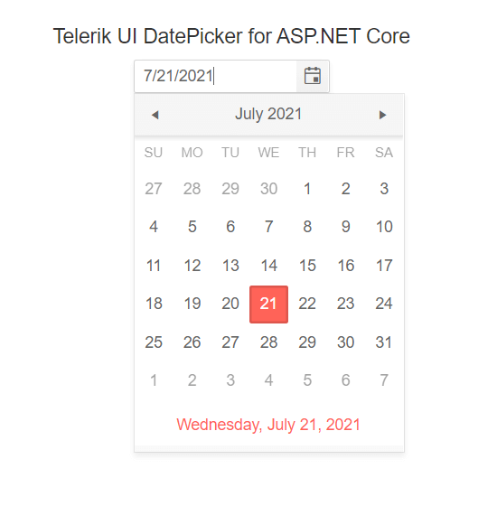

# First Steps with CLI

Welcome to the First Steps with CLI guide on getting started with Progress<sup>®</sup> Telerik<sup>®</sup> UI for ASP.NET Core by using the [command-line interface (CLI)](https://docs.microsoft.com/en-us/dotnet/core/tools/?tabs=netcore2x)!

The guide creates a use-case scenario which demonstrates how to start working with the suite and implements the Kendo UI DatePicker for ASP.NET Core in your project by using the DatePicker HtmlHelper or TagHelper.

The suggested approach is platform-agnostic&mdash;you can apply it for macOS, Linux, and Windows. The steps are applicable for .NET Core projects in [Visual Studio Code](https://code.visualstudio.com/).

To get up and running with the project:

1. [Download the controls](https://www.telerik.com/download-trial-file/v2/aspnet-core-ui)
1. [Meet the requirements](#meeting-the-requirements)
1. [Create the ASP.NET Core application](#creating-the-application)
1. [Integrate UI for ASP.NET Core in the project](#integrating-ui-for-aspnet-core)

## Meeting the Requirements

Install the appropriate [.Net Core SDK 2.0 or later](https://www.microsoft.com/net/download/all) for your platform.

## Creating the Application

> * If you are configuring an existing project, skip this step.
> * For the full list of current commands, refer to the [Microsoft guide on getting started with .NET Core](https://docs.asp.net/en/latest/getting-started.html).

1. Navigate to the folder of your choice by using the Terminal (cmd). Create a new folder and navigate in it.

      ```
      mkdir MyASPNETCoreProject
      cd MyASPNETCoreProject
      ```

2. Create a .NET Core application with the default web MVC template by running [`dotnet new mvc`](https://docs.microsoft.com/en-us/dotnet/core/tools/dotnet-new). The following example demonstrates a sample response that you are expected to receive.

      ```
      dotnet new mvc

      Getting ready...
      The template "ASP.NET Core Web App (Model-View-Controller)" was created successfully.
      --
      Restore succeeded.
      ```

3. Start the application by running [`dotnet run`](https://docs.microsoft.com/en-us/dotnet/core/tools/dotnet-run). The following example demonstrates a sample response that you are expected to receive.

      ```
      dotnet run

      Now listening on: http://localhost:5000
      Application started. Press Ctrl+C to shut down.
      ```

4. By using the browser, navigate to the above location and make sure that the application is properly running. After you check the application in the browser, stop the server with `Ctrl`+`C`.

## Integrating UI for ASP.NET Core

1. Configure the private Telerik NuGet feed and use either of the following approaches:

    * Globally include the `telerik.com` credentials to the NuGet configuration of the user. To do that, modify (or create) the `NuGet.Config` file for the user. On Windows machines, that file is located in the `%appdata%\NuGet\` folder. On Mac and Linux machines and depending on the exact OS distribution, the file is located in the `~/.config/NuGet/` or the `~/.nuget/NuGet/` folder.
    * Create a local `NuGet.Config` file in the project folder.

    In all cases, the `NuGet.Config` file has to include your `telerik.com` credentials.

      ```
      <?xml version="1.0" encoding="utf-8"?>
      <configuration>
          <packageSources>
          ...
          <add key="telerik.com" value="https://nuget.telerik.com/nuget" />
          </packageSources>
          <packageSourceCredentials>
          <telerik.com>
              <add key="Username" value="[ your.telerik.com@email.login ]" />
              <add key="ClearTextPassword" value="[ your.telerik.com.password.in.clear.text ]" />
          </telerik.com>
          </packageSourceCredentials>
      </configuration>
      ```

2. Install Telerik UI for ASP.NET Core through the CLI by running `dotnet add package Telerik.UI.for.AspNet.Core`.
3. Open the `Startup.cs` file and register the Kendo UI services in the `ConfigureServices` method.

	    public void ConfigureServices(IServiceCollection services)
	    {
	    	// Add the Kendo UI services to the services container.
	    	services.AddKendo();
	    }

4. Import the `Kendo.Mvc.UI` namespace in `~/Views/_ViewImports.cshtml` through `@using Kendo.Mvc.UI`. If you intend to use the Telerik UI ASP.NET Core Tag Helpers, add them with `@addTagHelper *, Kendo.Mvc`.

      ```
      @using MyASPNETCoreProject
	    @using MyASPNETCoreProject.Models
      @addTagHelper *, Microsoft.AspNetCore.Mvc.TagHelpers
      @addTagHelper *, Kendo.Mvc
      @using Kendo.Mvc.UI
      ```

5. Include the client-side resources.

	> * The CDN links and/or package versions have to point to the same UI for ASP.NET Core version which your project references.
	> * The Kendo UI scripts have to be placed after `jQuery`.

	5.1 Go to `~\Views\Shared\_Layout.cshtml` and add the theme of your choice to the `<head>` of the document. Since the Microsoft project uses Bootstrap, you can use the Kendo UI SASS Bootstrap v4 theme to match it.

  5.2 The Microsoft template comes with a jQuery script reference in the body. Find it and move it to the head.

  5.3 After `jQuery`, copy and paste the scripts from this snippet. Make sure that the versions match `Kendo.Mvc.dll`.

      <link rel="stylesheet" href="https://kendo.cdn.telerik.com/{{ site.mvcCoreVersion }}/styles/kendo.bootstrap-v4.min.css" />
      <script src="https://kendo.cdn.telerik.com/{{ site.mvcCoreVersion }}/js/kendo.all.min.js"></script>   
      <script src="https://kendo.cdn.telerik.com/{{ site.mvcCoreVersion }}/js/kendo.aspnetmvc.min.js"></script>

6. Use a Kendo UI widget by adding the snippet from the following example to `~/Views/Home/Index.cshtml`.

	```tab-HtmlHelper
		<div class="text-center">
    		<h2>Kendo UI DatePicker</h2>
    		@(Html.Kendo().DatePicker()
       			.Name("my-picker")
    		)
		</div>
	```
	```tab-TagHelper
		<div class="text-center">
    		<h2>Kendo UI DatePicker</h2>
			<kendo-datepicker name="my-picker"/>
		</div>
	```

7. Navigate to the project folder by using the Terminal (cmd) and run it by using the `dotnet run` command. The **Index** page will display a [Kendo UI DatePicker](). As a result, the following sample page is created.

    

## Next Steps

* [Use data-bound widgets]()
* [Ways to download and install UI for ASP.NET Core (overview)]()
* [Create your own custom bundles]()
* [Explore the helper script dependencies]()

## See Also

* [Installing UI for ASP.NET Core with Bower]()
* [Installing UI for ASP.NET Core by Using the CDN Services]()
* [Installing UI for ASP.NET Core with NPM]()
* [Installing UI for ASP.NET Core with NuGet]()
