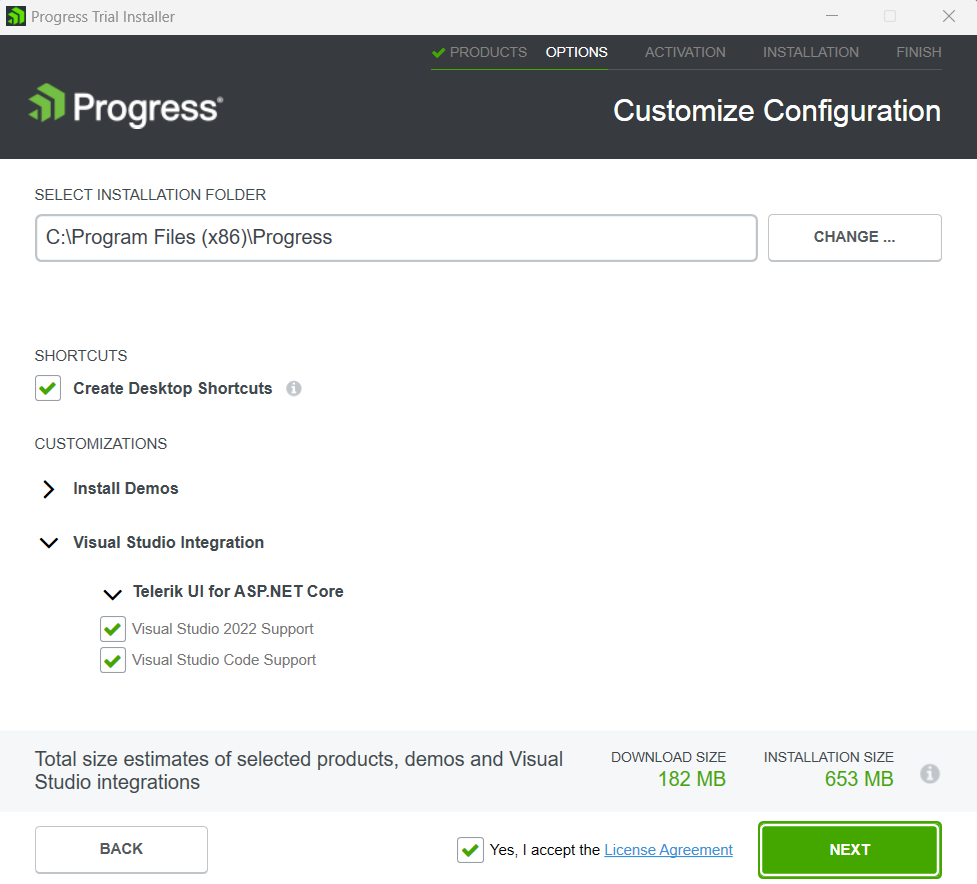

# Creating and Manually Configuring a Project

This article presents a use case scenario that demonstrates how to start working with the Telerik UI for ASP.NET Core. You will implement the Telerik UI DatePicker for ASP.NET Core in your project by using its dedicated HtmlHelper or TagHelper. In this guide, we use Visual Studio 2019 for Windows.

To configure an ASP.NET Core web application to use Telerik UI for ASP.NET Core, you can apply either of the following approaches:
* Create the application manually from scratch and add the necessary setup (demonstrated in this article).
* [Use the Telerik UI for ASP.NET Core Visual Studio extensions]() and create an application that has all necessary scripts, styles, and editor templates.

To get up and running with the project:

1. [Check the prerequisites](#prerequisites)
1. [Create the ASP.NET Core application](#create-the-application)
1. [Add the Telerik NuGet Feed to Visual Studio](#add-the-telerik-nuget-feed-to-visual-studio)
1. [Add the UI for ASP.NET Core NuGet package](#add-the-nuget-package)
1. [Add a reference to Kendo.Mvc.UI](#add-a-reference-to-kendomvcui)
1. [Include the Telerik UI for ASP.NET Core client-side resources](#include-the-telerik-ui-for-aspnet-core-client-side-resources)
1. [Add a Telerik UI component](#add-a-telerik-ui-component)

## Prerequisites

* [.NET Core SDK](https://dotnet.microsoft.com/download/dotnet)
* [Visual Studio 2017 or later](https://visualstudio.microsoft.com/downloads)
* **Windows 10** or higher
* [Telerik account](https://www.telerik.com/account/)

>tip If you don't have a [Telerik account](https://www.telerik.com/account) yet, you can create one for free.

> For .NET Core 3.1 version or later, Visual Studio 2019 is required. 

## Create the Application

1. Open Visual Studio 2019 for Windows and select **Create a new project**.

1. In the search box, enter **Model-View-Controller**, select the **ASP.NET Core Web App (Model-View-Controller)** C# template, and then select **Next**.

    

1. Enter **MyTelerikProject** as a project name, and then select **Next**.

1. Select the **.NET** target framework of your choice from the dropdown box, and then select **Create**.

## Add the Telerik NuGet Feed to Visual Studio

Telerik maintains a NuGet Feed with official UI for ASP.NET Core releases and service packs. These packages are available for registered users.

The next step is to add the Telerik NuGet Feed to Visual Studio:

* If you use a free trial license, go to [Add the Telerik NuGet Feed for Trial License Users](#add-the-telerik-nuget-feed-for-trial-license-users).
* If you purchased a commercial license, go to [Add the Telerik NuGet Feed for Users with Commercial License](#add-the-telerik-nuget-feed-for-users-with-commercial-license).

>tipIf you have already configured the Telerik NuGet feed in Visual Studio, jump to [Add the NuGet Package](#add-the-nuget-package).

### Add the Telerik NuGet Feed for Trial License Users

The easiest way to add the Telerik NuGet feed to Visual Studio if you are a trial user is to install the UI for ASP.NET Core free trial:

1. Download the [UI for ASP.NET Core free trial](https://www.telerik.com/aspnet-core-ui) installer. You need to create a free account if don't have one.

1. Run the installer.

1. Select the option **Set up Telerik NuGet package source** to automatically add the [Telerik NuGet feed]().

    

>To activate your UI for ASP.NET Core trial license, you must complete the installation procedure. Otherwise, the `Telerik.UI.for.AspNet.Core` NuGet packages will not appear in the NuGet Package Manager.

### Add the Telerik NuGet Feed for Users with Commercial License

The easiest way to add the Telerik NuGet feed to Visual Studio if you have purchased a commercial license is to use the Progress Control Panel:

1. Download the Progress Control Panel from the **Overview** page of your [Telerik account](https://www.telerik.com/account/). 

    

1. Run the Progress Control Panel exe.

1. On the Login screen, check the **set up Telerik NuGet package source** option.

    

1. If you miss to set up the NuGet Feed on login, go to the Progress Control Panel options and scroll to **NUGET SETTINGS**. Enter your Telerik credentials and click the **Save and Close** button.

    

>You need a commercial license that includes UI for ASP.NET Core. Otherwise, the `Telerik.UI.for.AspNet.Core` NuGet packages will not appear in the NuGet Package Manager. If you don't have the required license, follow the instructions in the [trial license section](#add-the-telerik-nuget-feed-for-trial-license-users).

## Add the NuGet Package

1. Open the NuGet Package Manager.

    

1. From the **Package source** drop-down, select the Telerik NuGet source.

1. Select the **Browse** tab, and then enter `Telerik.UI.for.AspNet.Core` in the search field.

1. Select the project's checkbox and then select **Install**. As a result, a line similar to `<PackageReference Include="Telerik.UI.for.AspNet.Core" Version="{{ site.mvcCoreVersion }}" />` is added to your `.csproj` file.

    

## Add a Reference to Kendo.Mvc.UI

1. Open the `Startup.cs` file and register the Kendo UI services in the `ConfigureServices` method.

		public void ConfigureServices(IServiceCollection services)
		{
			// Add the Kendo UI services to the services container.
			services.AddKendo();
		}

1. Import the `Kendo.Mvc.UI` namespace in `~/Views/_ViewImports.cshtml` through `@using Kendo.Mvc.UI`. If you intend to use the Telerik UI ASP.NET Core Tag Helpers, add them with `@addTagHelper *, Kendo.Mvc`.

        @using MyTelerikProject
	    @using MyTelerikProject.Models
        @addTagHelper *, Microsoft.AspNetCore.Mvc.TagHelpers
        @addTagHelper *, Kendo.Mvc
        @using Kendo.Mvc.UI

## Include the Telerik UI for ASP.NET Core Client-Side Resources

>**Note**
>
>* The CDN links and/or package versions have to point to the same UI for ASP.NET Core version that your project references.
>* The Kendo UI scripts have to be placed after `jQuery`.

Before you can use a Telerik UI component, you must include the theme, the jQuery script, and the Kendo UI scripts: 

1. Go to `~\Views\Shared\_Layout.cshtml` and add the theme of your choice to the `<head>` of the document. Since the Microsoft project uses Bootstrap, you can use the Kendo UI SASS Bootstrap v4 theme to match it:

		<head>
		...
		<link rel="stylesheet" href="~/lib/bootstrap/dist/css/bootstrap.min.css" />
		<link rel="stylesheet" href="~/css/site.css" />

		@* Add the Kendo Bootstrap v4 theme: *@
		<link href="https://kendo.cdn.telerik.com/{{ site.mvcCoreVersion }}/styles/kendo.bootstrap-v4.min.css" rel="stylesheet" type="text/css" />
		...
		</head>

1. The Microsoft ASP.NET Core Web Application template comes with a jQuery script reference at the end of _Layout.cshtml file. Find the `jquery.min.js` script line in the `<body>` of the document and remove it.  

1. Add the `jQuery` script hosted on the Telerik CDN:

		<head>
		...
		<link rel="stylesheet" href="~/lib/bootstrap/dist/css/bootstrap.min.css" />
		<link rel="stylesheet" href="~/css/site.css" />
		<link href="https://kendo.cdn.telerik.com/{{ site.mvcCoreVersion }}/styles/kendo.bootstrap-v4.min.css" rel="stylesheet" type="text/css" />

		@* Add the the jQuery script from the Telerik CDN: *@
		<script src="https://kendo.cdn.telerik.com/{{ site.mvcCoreVersion }}/js/jquery.min.js"></script>
		...
		</head>

1. Add the Kendo UI scripts. The Kendo UI script files required by UI for ASP.NET Core must be loaded in the `<head>` tag after the `jQuery` script:

		<head>
		...
		<link rel="stylesheet" href="~/lib/bootstrap/dist/css/bootstrap.min.css" />
		<link rel="stylesheet" href="~/css/site.css" />
		<link href="https://kendo.cdn.telerik.com/{{ site.mvcCoreVersion }}/styles/kendo.bootstrap-v4.min.css" rel="stylesheet" type="text/css" />
		<script src="https://kendo.cdn.telerik.com/{{ site.mvcCoreVersion }}/js/jquery.min.js"></script>

		@* Add the Kendo UI scripts: *@
		<script src="https://kendo.cdn.telerik.com/{{ site.mvcCoreVersion }}/js/kendo.all.min.js"></script>
		<script src="https://kendo.cdn.telerik.com/{{ site.mvcCoreVersion }}/js/kendo.aspnetmvc.min.js"></script>
		</head>

>**Note**
>
>* The `kendo.all.min.js` and `kendo.aspnetmvc.min.js` script must to be loaded after the `jquery.min.js` script.
>* `jQuery` must be loaded only once. Make sure there are no duplicate references elsewhere in the _Layout.

If you prefer to include the client-side resources from a local source instead of CDNs, consider the following article:

[Local Client-side Resources](https://docs.telerik.com/aspnet-core/installation/getting-started-copy-client-resources#including-client-side-resources)

## Add a Telerik UI Component

Utilize the Telerik UI DatePicker component by adding the snippet from the following example to `~/Views/Home/Index.cshtml`.

```cshtml
	<div class="text-center">
		<h2>Telerik UI DatePicker for ASP.NET Core</h2>
		@(Html.Kendo().DatePicker()
			.Name("my-picker")
		)
	</div>
```
```tagHelper
	<div class="text-center">
		<h2>Telerik UI DatePicker for ASP.NET Core</h2>
		<kendo-datepicker name="my-picker"/>
	</div>
```

Now you are ready to run the web app.

Congratulations! You created a page that uses the [Telerik UI DatePicker]().


## JSON Serialization

The default casing for JSON strings in ASP.NET Core is Camel-case. The Telerik UI components that are data-bound depend on Pascal-case formatted response from the server. To find out how to configure the application to return the data in Pascal-case, refer to the following article:

* [JSON Serialization]()

## Next Steps

* [Ways to download and install UI for ASP.NET Core (overview)]()
* [Create your own custom bundles]()
* [Explore the helper script dependencies]()

## See Also

* [Installing UI for ASP.NET Core with Bower]()
* [Installing UI for ASP.NET Core by Using the CDN Services]()
* [Installing UI for ASP.NET Core with NPM]()
* [Installing UI for ASP.NET Core with NuGet]()
