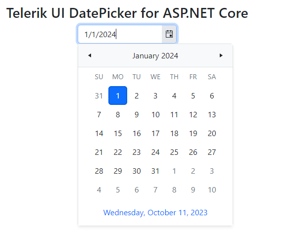

# Using a {{ site.product }} Project Template in VS for Windows

This tutorial shows how to create an ASP.NET Core web app that uses [Telerik UI for ASP.NET Core](https://www.telerik.com/aspnet-core-ui) components. 

You will create a project from a template and configure it for Telerik UI by using the [Visual Studio extensions](). This method allows you to download the components and then create a pre-configured application that has all necessary scripts, styles, and editor templates so that you can immediately start adding the Telerik UI components.

If you need to add Telerik UI controls to an existing project, see the [First Steps with VS for Windows]() tutorial.

You'll learn how to:

<style>
    .toc-ul{
        list-style: none;
    }
    
    .toc-ul li span {
      color: green;
	  margin-right: 0.5em;
    }

    .toc-ul li::before {
      display: none;
    }
</style>

<ul class="toc-ul">
    <li><span class="k-icon k-i-check"></span>Download and install the Telerik UI extensions.</li>
    <li><span class="k-icon k-i-check"></span>Create an ASP.NET Core MVC (Model-View-Controller) project.</li>
    <li><span class="k-icon k-i-check"></span>Bind data to Telerik UI components like the Grid.</li>
    <li><span class="k-icon k-i-check"></span>Enhance the project with additional components like the DatePicker.</li>
    <li><span class="k-icon k-i-check"></span>Use the Telerik UI Themes.</li>
	<li><span class="k-icon k-i-check"></span>Add your license file.</li>
</ul>

## Prerequisites

* [.NET Core SDK](https://dotnet.microsoft.com/download/dotnet)

* [Visual Studio 2017 or later](https://visualstudio.microsoft.com/downloads)

   >For newer .NET Core versions, a recent matching Visual Studio might be required.

* Windows 10 or higher

* [Telerik account](https://www.telerik.com/account)&mdash;if you don't have an account yet, you can [create one for free](https://www.telerik.com/account).

## Installing the Telerik UI Extensions

1. Close any running Visual Studio instances.

1. Go to the [{{ site.product_long }} Extension](https://marketplace.visualstudio.com/items?itemName=TelerikInc.ProgressTelerikASPNETCoreVSExtensions) page and click **Download**.

	* For [Visual Studio 2017 and 2019](https://marketplace.visualstudio.com/items?itemName=TelerikInc.TelerikASPNETCoreVSExtensions)
    * For [Visual Studio 2022](https://marketplace.visualstudio.com/items?itemName=TelerikInc.ProgressTelerikASPNETCoreVSExtensions)

1. Locate and double-click the `TelerikUI.ASP.NET.Core.VSPackage.vsix` file to install the extensions.

Once you install the Telerik UI Extensions, you can open Visual Studio and start using the automated **Create New Telerik Project** wizard.

## Creating the Project

1. In Visual Studio, select **Create a new project**.

1. Filter by project type and select **Telerik** from the drop-down.

	

1. Select **Telerik ASP.NET Core MVC Application**, and then select **Next**.

1. Name the project `TelerikAspNetCoreApp` and select **Create**.

   Using this name guarantees that the `namespace` from the code snippets in this tutorial will match your project.

	

1. From the drop-down box, select the latest **ASP.NET Core** version for .NET target framework.

   Telerik UI supports all newer ASP.NET Core versions.

   	

1. Select HTML or Tag Helpers.

   Telerik UI for ASP.NET Core is a set of server-side wrappers (HTML and Tag Helpers) that allow you to use the [Kendo UI widgets](https://www.telerik.com/kendo-ui-b) 
   in .NET Core. When you select the helper type in the **Create New Project Wizard**, the wizard will configure the project for the selected helpers.

   >tip In Razor files, Tag Helpers come with predefined strongly-typed attributes that enable server-side code to participate in the creation and rendering of HTML elements. The resulting markup is cleaner and easier to read than with traditional HTML Helpers, which are invoked as methods that are mixed with HTML inside your Razor views.

1. From the **Select Version** list, select the latest Telerik UI version, and then select **Next**.

   * If you use the Telerik UI extensions for the first time, you will see a login window. Enter the credentials for your [Telerik account](https://www.telerik.com/account) to download the controls.
   * If you haven't purchased a license, download the trial version of the Telerik UI controls.


1. From the available options Select **Grid and Menu**, and then select **Next**.

   The wizard offers [various templates](#available-templates) for projects with pre-configured Grid and Menu controls and for projects using Razor Pages. This tutorial uses the **Grid and Menu** MVC version.

   

1. Select the default theme and then select **Finish**.

   The selected theme defines the appearance of the Telerik UI components. You can [change the theme](#changing-the-app-theme) at any time.

   
 
Congratulations! The created project:

* Is a working app.

* Has all resources required by Telerik UI, and you can start adding components immediately.

## The Grid and Data Binding

The next step is to examine the Telerik UI Grid which the template wizard added to your project. The Grid is the richest component in the entire toolset, but this sample will only demonstrate a basic implementation.

Binding the Grid  requires adding a model and controller. The Wizard has done the following automatically: 

1. Added a `Models` folder to the project. Created an `OrderViewModel` class and added it to the `Models` folder.

   The model represents the shape of the data that the Grid will display.

	```C#
		public class OrderViewModel
		{
			public int OrderID
			{
				get;
				set;
			}

			public decimal? Freight
			{
				get;
				set;
			}

			public DateTime? OrderDate
			{
				get;
				set;
			}

			public string ShipCity
			{
				get;
				set;
			}

			public string ShipName
			{
				get;
				set;
			}
		}
	```

	>When the Grid is bound to a strongly-typed model such as the OrderViewModel, it automatically detects the data types of the fields.

1. Created a new Controller and named the file `GridController`.

   The controller handles the incoming requests, retrieves the model data, and then returns the requested data.

1. In `GridController.cs`, added the following declarations at the top. They enable the data processing by the Telerik UI extensions:
	
	```C#
		using Kendo.Mvc.Extensions;
		using Kendo.Mvc.UI;
		using Microsoft.AspNetCore.Mvc;
		using System;
		using System.Linq;
		using TelerikAspNetCoreApp.Models;
	```

1. In `GridController.cs`, added an ActionMethod that will return the data for the Grid.

	```C#
		public class GridController : Controller
		{
			public ActionResult Orders_Read([DataSourceRequest] DataSourceRequest request)
			{
				var result = Enumerable.Range(0, 50).Select(i => new OrderViewModel
				{
					OrderID = i,
					Freight = i * 10,
					OrderDate = new DateTime(2016, 9, 15).AddDays(i % 7),
					ShipName = "ShipName " + i,
					ShipCity = "ShipCity " + i
				});

				var dsResult = result.ToDataSourceResult(request);
				return Json(dsResult);
			}
		}
	```

1. In the `~/Views/Home/Index.cshtml` file, added the Grid:

	```HtmlHelper
		@(Html.Kendo().Grid <TelerikAspNetCoreApp.Models.OrderViewModel>()
			.Name("grid")
			.Columns(columns =>
			{
				columns.Bound(p => p.OrderID).Filterable(false);
				columns.Bound(p => p.Freight);
				columns.Bound(p => p.OrderDate).Format("{0:MM/dd/yyyy}");
				columns.Bound(p => p.ShipName);
				columns.Bound(p => p.ShipCity);
			})
			.Pageable()
			.Sortable()
			.Scrollable()
			.Filterable()
			.HtmlAttributes(new { style = "height:550px;" })
			.DataSource(dataSource => dataSource
				.Ajax()
				.PageSize(20)
				.Read(read => read.Action("Orders_Read", "Grid"))
				)
		)
	```
	```TagHelper
		<kendo-grid name="grid" height="550">
			<columns>
				<column field="OrderID" title="Order ID">
					<filterable enabled="false"></filterable>
				</column>
				<column field="Freight" title="Freight" />
				<column field="OrderDate" title="Order Date" format="{0:MM/dd/yyyy}" />
				<column field="ShipName" title="Ship Name" />
				<column field="ShipCity" title="Ship City" />
			</columns>
			<scrollable enabled="true" />
			<sortable enabled="true" />
			<pageable enabled="true" />
			<filterable enabled="true" />
			<datasource type="DataSourceTagHelperType.Ajax" page-size="20">
				<transport>
					<read url="@Url.Action("Orders_Read", "Grid")" />
				</transport>
			</datasource>
		</kendo-grid>
	```

1. Now you can run the project and enjoy the neat result:

   

>tip For more information on data processing and data binding, see the following articles:
>* [Binding the Grid to a database]()
>* [CRUD operations](https://demos.telerik.com/aspnet-core/grid/editing)

## Adding a DatePicker

Next, you will add another Telerik UI component to the project&mdash;the [Telerik UI DatePicker](). You can add the DatePicker as an HTML or Tag Helper. Whether you select the HTML or Tag Helper syntax depends on what you have configured when you have [created the project](#creating-the-project).

Utilize the [Telerik UI DatePicker]() component by adding the snippet from the following example to `~/Views/Home/Index.cshtml`.

```HtmlHelper
	<div class="text-center">
		<h2>Telerik UI DatePicker for ASP.NET Core</h2>
		@(Html.Kendo().DatePicker()
			.Name("my-picker")
		)
	</div>
```
```TagHelper
	<div class="text-center">
		<h2>Telerik UI DatePicker for ASP.NET Core</h2>
		<kendo-datepicker name="my-picker"/>
	</div>
```

Run the project. The following result is visualized in the browser:



Next, you can [change the look and feel](#changing-the-app-theme) of your application by selecting another visual theme.

## Changing the App Theme

The UI for ASP.NET Core suite comes with a set of 20+ built-in [LESS-based]() and [Sass-based themes]() that allow you to alter the visual appearance of the Telerik components. The most prominent themes are Default (our own styling), Material (based on the Material Design guidelines), and Bootstrap (a theme that matches Bootstrap guidelines).

The themes are usually referenced in the `_Layout` file of the application. To change the theme, substitute the existing CSS reference in the `_Layout` with the new theme.

If during the creation the project you've chosen the Bootstrap theme, the `_Layout.cshtml` file must contain the following CSS link:

```HTML
	<link href="https://kendo.cdn.telerik.com/themes/{{ site.themesCdnVersion }}/bootstrap/bootstrap-main.css" rel="stylesheet" type="text/css" />
```

To change the theme to the Default theme, substitute the link above with the following:

```HTML
	<link href="https://kendo.cdn.telerik.com/themes/{{ site.themesCdnVersion }}/default/default-main.css" rel="stylesheet" type="text/css" />
```

Since both the Bootstrap and Default themes are Sass-based themes, no additional CSS files are required. LESS theme files are no longer support after the R1 2023 SP1 release. If you need to reference LESS CSS files in an older version of the {{ site.product }}, you must add a common and a theme CSS files. The following example shows how to reference the Default LESS theme (applicable to versions of {{ site.product }} before R1 2023 SP1):

```HTML
    <link rel="stylesheet" href="https://kendo.cdn.telerik.com/2022.3.1109/styles/kendo.common.min.css" />
    <link rel="stylesheet" href="https://kendo.cdn.telerik.com/2022.3.1109/styles/kendo.default.min.css" />
```

@[template](/_contentTemplates/core/json-serialization-note.md#json-serialization-note)

## Adding Your License File

Using any client-side assets from the [Kendo UI CDN]() or the [@progress/kendo-ui NPM package](https://www.npmjs.com/package/@progress/kendo-ui) requires you to add a Telerik license file to your application. A missing license file triggers [a banner, a watermark, and causes a warning message]() in the browser's console.

To generate your license file and add it to your application, follow the instructions in the [Installing a License File]().

## Next Steps

* [Check out the free Telerik UI onboarding course]()
* [Getting Started with Telerik UI Video Tutorial](https://www.youtube.com/embed/AIFNeWrZCdM?list=PLvmaC-XMqeBaHWzU1zyFgaNi2pcuix6Ps)
* [Using Telerik UI in Razor Pages projects]() 
* [Create your own custom bundles]()
* [Switch from Trial to Commercial License](#switching-to-a-developer-license)

## See Also

* [Installing UI for ASP.NET Core with NuGet]()
* [Installing UI for ASP.NET Core by Using the CDN Services]()
