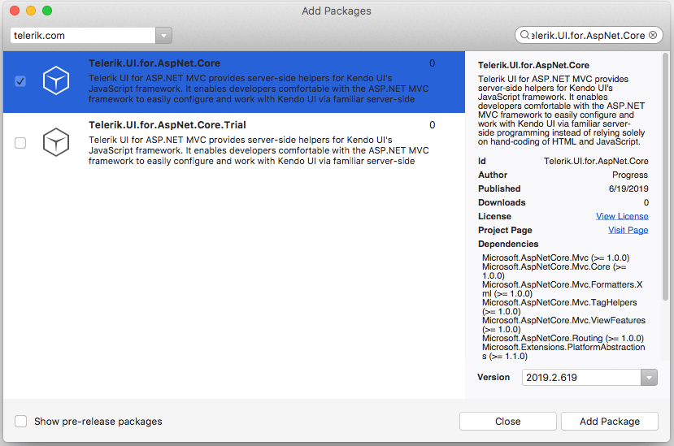

# First Steps on VS for Mac

<iframe width="700" height="400" src="https://www.youtube.com/embed/901yBM2WYb4?list=PLvmaC-XMqeBaHWzU1zyFgaNi2pcuix6Ps" frameborder="0" allow="accelerometer; autoplay; encrypted-media; gyroscope; picture-in-picture" allowfullscreen></iframe>

Welcome to the First Steps on Mac guide on getting started with Progress<sup>®</sup> Telerik<sup>®</sup> UI for ASP.NET Core with Visual Studio for Mac!

The guide creates a use-case scenario which demonstrates how to start working with the suite and implements the Kendo UI DatePicker for ASP.NET Core in your project by using the Telerik UI DatePicker HtmlHelper or TagHelper. For its purposes, the guide uses Visual Studio for Mac 2019.

To get up and running with the project:

1. [Download the controls](https://www.telerik.com/download-trial-file/v2/aspnet-core-ui)
1. [Meet the requirements](#meeting-the-requirements)
1. [Create the ASP.NET Core application](#creating-the-application)
1. [Add the UI for ASP.NET Core NuGet package](#adding-the-nuget-package)

## Meeting the Requirements

* Follow the instructions from the [official .NET Core documentation site](https://docs.microsoft.com/en-us/dotnet/core/macos-prerequisites?tabs=netcore2x).
* Make sure that you have an active trial or commercial license for the product by downloading the installer from the [Telerik UI for ASP.NET Core product page](https://www.telerik.com/aspnet-core-ui). You will need the active trial or commercial license for [making downloads from YourAccount](https://www.telerik.com/account/my-downloads) and for working with your NuGet Feed.

## Creating the Application

1. Open Visual Studio for Mac 2019 and select **New**.
1. Select **Web Application(Model-View-Controller) .NET Core** > **App** and click **Next**.
1. Select the target framework of the project and click **Next**.
1. Set a name and location for the project and click **Create**.    

## Adding the NuGet Package

1. Open the NuGet Package Manager.

	

2. Add a new [package source](https://docs.microsoft.com/en-us/visualstudio/mac/nuget-walkthrough?toc=%2Fnuget%2Ftoc.json&view=vsmac-2019#adding-package-sources).

	

3.  In the **Add Package Source** popup, add a **Telerik Source** with the `https://nuget.telerik.com/nuget` **Location** URL, enter your credentials (telerik.com email and password), and click **OK**.

	

4. From the drop-down list with sources, select the **Telerik Source**. Search for and select `Telerik.UI.for.AspNet.Core`. Click **Add Package** to install it. As a result, a line similar to `<PackageReference Include="Telerik.UI.for.AspNet.Core" Version="{{ site.mvcCoreVersion }}" />` is added to your `.csproj` file.

	> If the package for Telerik UI for ASP.NET Core is not visible in your NuGet feed, then either you do not have an active trial or commercial license for the product, or your current trial or commercial license has expired. Download it from the [Telerik UI for ASP.NET Core product page](https://www.telerik.com/aspnet-core-ui).

	

5. Open the `Startup.cs` file and register the Kendo UI services in the `ConfigureServices` method.

		public void ConfigureServices(IServiceCollection services)
		{
			// Add Kendo UI services to the services container.
			services.AddKendo();
		}

6. Import the `Kendo.Mvc.UI` namespace in `~/Views/_ViewImports.cshtml` through `@using Kendo.Mvc.UI`. If you intend to use the Telerik UI ASP.NET Core Tag Helpers, add them with `@addTagHelper *, Kendo.Mvc`.

        @using MyASPNETCoreProject
	    @using MyASPNETCoreProject.Models
        @addTagHelper *, Microsoft.AspNetCore.Mvc.TagHelpers
        @addTagHelper *, Kendo.Mvc
        @using Kendo.Mvc.UI


7. Include the client-side resources in `~\Views\Shared\_Layout.cshtml`.

	> * The CDN links and/or package versions have to point to the same UI for ASP.NET Core version which your project references.
	> * The Kendo UI scripts have to be placed after `jQuery`.

  7.1 Since the Microsoft template project uses Bootstrap, you can use the Kendo UI SASS Bootstrap v4 theme to match it.

	7.2 The Microsoft template comes with a jQuery script reference in the body. Find it and move it to the head.

	7.3 After `jQuery`, copy and paste the scripts from this snippet. Make sure that the versions match the installed `Kendo.Mvc.dll`.

		<link rel="stylesheet" href="https://kendo.cdn.telerik.com/{{ site.mvcCoreVersion }}/styles/kendo.bootstrap-v4.min.css" />
		<script src="https://kendo.cdn.telerik.com/{{ site.mvcCoreVersion }}/js/kendo.all.min.js"></script>   
		<script src="https://kendo.cdn.telerik.com/{{ site.mvcCoreVersion }}/js/kendo.aspnetmvc.min.js"></script>   			

8. Use a Kendo UI widget by adding the snippet from the following example to `~/Views/Home/Index.cshtml`.

	```tab-HtmlHelper
		<div class="text-center">
    		<h2>Kendo UI DatePicker</h2>
    		@(Html.Kendo().DatePicker()
       			.Name("datepicker")
    		)
		</div>
	```
	```tab-TagHelper
		<div class="text-center">
    		<h2>Kendo UI DatePicker</h2>
			<kendo-datepicker name="my-picker"/>
		</div>
	```

	As a result, the following sample page is created.

    

## Next Steps

* [Use data-bound widgets]()
* [Ways to download and install UI for ASP.NET Core (overview)]()
* [Create your own custom bundles]()
* [Explore the helper script dependencies]()

## See Also

* [Installing UI for ASP.NET Core with Bower]()
* [Installing UI for ASP.NET Core by Using the CDN Services]()
* [Installing UI for ASP.NET Core with NPM]()
* [Installing UI for ASP.NET Core with NuGet]()
