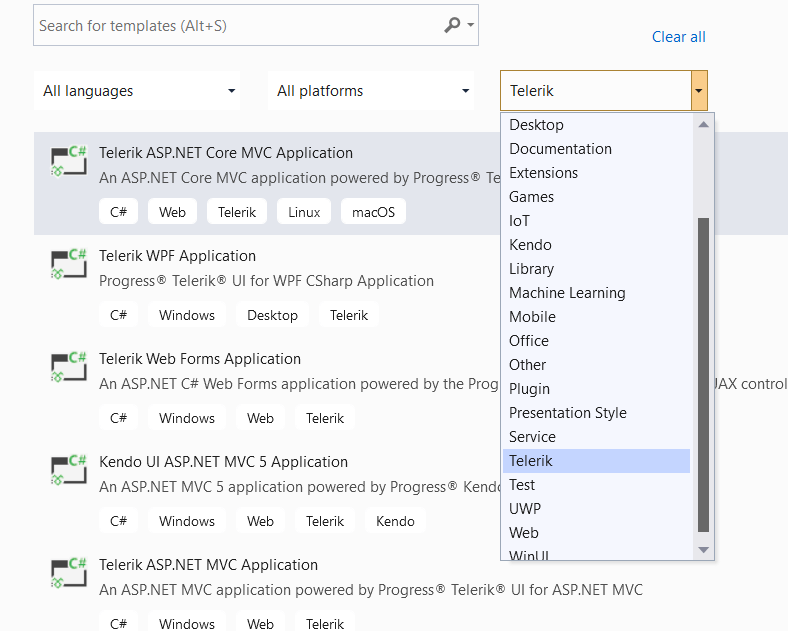
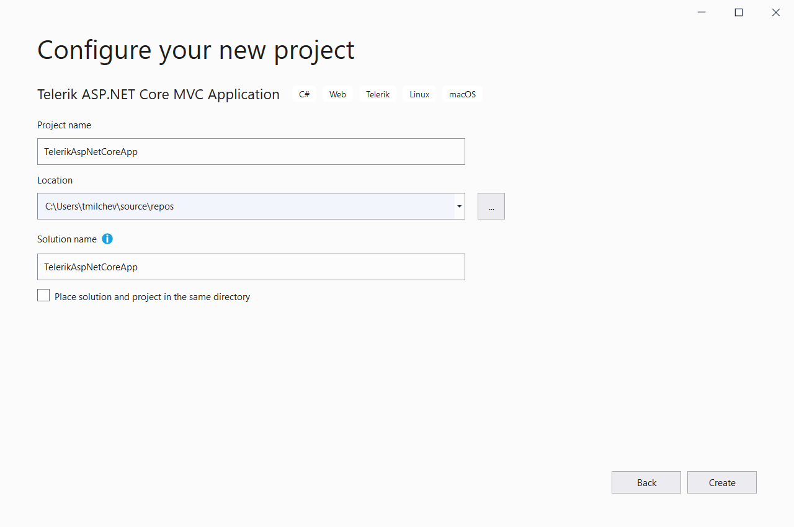
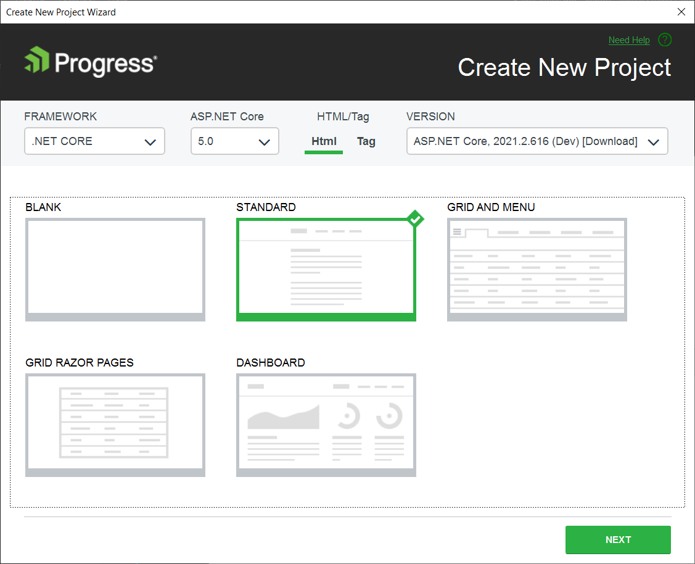

# First Steps on VS for Windows

This tutorial shows how to create and run an ASP.NET Core web app that uses [Telerik UI for ASP.NET Core](https://www.telerik.com/aspnet-core-ui) components. 

To create the application and configure it for Telerik UI, you will use the [Visual Studio extensions](). These extensions allow you to download the components and then create a pre-configured application that has all necessary scripts, styles, and editor templates so that you can immediately start adding the Telerik UI components.

You'll learn how to:

<style>
    .toc-ul{
        list-style: none;
    }
    
    .toc-ul li span {
      color: green;
	  margin-right: 0.5em;
    }

    .toc-ul li::before {
      display: none;
    }
</style>

<ul class="toc-ul">
    <li><span class="k-icon k-i-check"></span>Download and install the Telerik UI extensions.</li>
    <li><span class="k-icon k-i-check"></span>Create an ASP.NET Core MVC (Model-View-Controller) project.</li>
    <li><span class="k-icon k-i-check"></span>Initialize a DatePicker and a Grid.</li>
    <li><span class="k-icon k-i-check"></span>Bind data to Telerik UI widgets.</li>
    <li><span class="k-icon k-i-check"></span>Use the Telerik UI Themes.</li>
</ul>

>tip How about a free Telerik UI onboarding course? Check out the [Video Onboarding]() article and learn how to take advantage of the <a href="https://learn.telerik.com/learn" target="_blank">Telerik Virtual Classroom</a>.

Using the Visual Studio extensions is the fastest approach to create and configure a project for Telerik UI, but it isn't the only one. The following tutorials describe the alternative approaches:

* If you prefer videos, the [Getting Started with Telerik UI Video Tutorial](https://www.youtube.com/embed/AIFNeWrZCdM?list=PLvmaC-XMqeBaHWzU1zyFgaNi2pcuix6Ps) demonstrates how to set up the environment [via NuGet]() and [via the .NET CLI]().

* If you need more control and want to start from scratch by configuring the project manually (adding NuGet packages, Kendo references, client-side resources), see the [Configuring a Project Manually]() tutorial.

* To learn more about using Telerik UI with the ASP.NET Razor Pages framework, see the [Telerik UI in Razor Pages projects]() article. 

## Prerequisites

* [.NET Core SDK](https://dotnet.microsoft.com/download/dotnet)

* [Visual Studio 2017 or later](https://visualstudio.microsoft.com/downloads)

   >For .NET Core 3.1 version or later, Visual Studio 2019 is required.

* **Windows 10** or higher

* [Telerik account](https://www.telerik.com/account)

   >tip If you don't have a [Telerik account](https://www.telerik.com/account) yet, you can create one for free.

## Installing the Telerik UI Extensions

1. Close any running Visual Studio instances.

1. Go to the [{{ site.product_long }} Extension](https://marketplace.visualstudio.com/items?itemName=TelerikInc.TelerikASPNETCoreVSExtensions) page and click **Download**.

1. Locate and double-click the `TelerikUI.ASP.NET.Core.VSPackage.vsix` file to install the extensions.

Once you install the Telerik UI Extensions, you can open Visual Studio and start using the automated **Create New Telerik Project** wizard.

## Creating the Project

1. In Visual Studio, select **Create a new project**.

1. Filter by project type and select **Telerik** from the drop-down.

	

1. Select **Telerik ASP.NET Core MVC Application**, and then select **Next**.
1. Name the project `TelerikAspNetCoreApp` and select **Create**.

   Using this name guarantees that the `namespace` from the code snippets in this tutorial will match your project.

	

1. From the drop-down boxes, select the **.NET CORE** framework and **ASP.NET Core** version **5.0**.

   Telerik UI supports all ASP.NET Core versions, including 3.x, 5.0, and newer. The default is .NET 5.0.

1. Select HTML or Tag Helpers.

   Telerik UI for ASP.NET Core is a set of server-side wrappers (HTML and Tag Helpers) that allow you to use the [Kendo UI widgets](https://www.telerik.com/kendo-ui-b) 
   in .NET Core. When you select the helper type in the **Create New Project Wizard**, the wizard will configure the project for the selected helpers.

   >tip In Razor files, Tag Helpers come with predefined strongly-typed attributes that enable server-side code to participate in the creation and rendering of HTML elements. The resulting markup is cleaner and easier to read than with traditional HTML Helpers, which are invoked as methods that are mixed with HTML inside your Razor views.

	

1. From the **VERSION** drop-down, select the latest Telerik UI version.

   * If you use the Telerik UI extensions for the first time, you will see a login window. Enter the credentials for your [Telerik account](https://www.telerik.com/account) to download the controls.
   * If you haven't purchased a license, download the trial version of the Telerik UI controls.


1. Select **STANDARD**, and then select **Next**.

   The wizard offers [various templates](#available-templates) for projects with pre-configured Grid and Menu controls and for projects using Razor Pages. This tutorial uses the **STANDARD** MVC version.

1. Select the default Boostrap-v4 theme, and then select **Finish**.

   The selected theme defines the appearance of the Telerik UI components. You can [change the theme](#changing-the-app-theme) at any time.
 
Congratulations! The created project:

* Is a working app.

* Has all resources required by Telerik UI, and you can start adding components immediately.

## Initializing a DatePicker

Next, you will add the first Telerik UI component to the project&mdash;the [Telerik UI DatePicker](). The Telerik UI extensions have already configured the project with all required Telerik UI resources, and all you need now is to add the DatePicker HTML or Tag Helper. Whether you select the HTML or Tag Helper syntax depends on what you have configured when you have [created the project](#creating-the-project).

Utilize the [Telerik UI DatePicker]() component by adding the snippet from the following example to `~/Views/Home/Index.cshtml`.

```HtmlHelper
	<div class="text-center">
		<h2>Telerik UI DatePicker for ASP.NET Core</h2>
		@(Html.Kendo().DatePicker()
			.Name("my-picker")
		)
	</div>
```
```TagHelper
	<div class="text-center">
		<h2>Telerik UI DatePicker for ASP.NET Core</h2>
		<kendo-datepicker name="my-picker"/>
	</div>
```

Run the project. The following page is visualized in the browser:


## Initializing a Grid and Binding Data

The next step is to add the more complex Telerik UI Grid to your project. You will bind the Grid to data, and this requires adding a model and controller.

1. Add a `Models` folder to the project. Create an `OrderViewModel` class and add it to the `Models` folder.

   The model represents the shape of the data that the Grid will display.

	```
		public class OrderViewModel
		{
			public int OrderID
			{
				get;
				set;
			}

			public decimal? Freight
			{
				get;
				set;
			}

			public DateTime? OrderDate
			{
				get;
				set;
			}

			public string ShipCity
			{
				get;
				set;
			}

			public string ShipName
			{
				get;
				set;
			}
		}
	```

	>When the Grid is bound to a strongly-typed model such as the OrderViewModel, it automatically detects the data types of the fields.

1. Right-click the `Controllers` folder. Select **Add** > **Controller...**, and then select **Add**.

   The controller handles the incoming requests, retrieves the model data, and then returns the requested data.

1. Name the file `GridController`.

1. In `GridController.cs`, add the following declarations at the top. They enable the data processing by the Telerik UI extensions:
	
	```
		using Kendo.Mvc.Extensions;
		using Kendo.Mvc.UI;
		using Microsoft.AspNetCore.Mvc;
		using System;
		using System.Linq;
		using TelerikAspNetCoreApp.Models;
	```

1. In `GridController.cs`, add an ActionMethod that will return the data for the Grid.

	```
		public class GridController : Controller
		{
			public ActionResult Orders_Read([DataSourceRequest] DataSourceRequest request)
			{
				var result = Enumerable.Range(0, 50).Select(i => new OrderViewModel
				{
					OrderID = i,
					Freight = i * 10,
					OrderDate = new DateTime(2016, 9, 15).AddDays(i % 7),
					ShipName = "ShipName " + i,
					ShipCity = "ShipCity " + i
				});

				var dsResult = result.ToDataSourceResult(request);
				return Json(dsResult);
			}
		}
	```

1. In the `~/Views/Home/Index.cshtml` file, add the Grid:

	```HtmlHelper
		@(Html.Kendo().Grid <TelerikAspNetCoreApp.Models.OrderViewModel>()
			.Name("grid")
			.Columns(columns =>
			{
				columns.Bound(p => p.OrderID).Filterable(false);
				columns.Bound(p => p.Freight);
				columns.Bound(p => p.OrderDate).Format("{0:MM/dd/yyyy}");
				columns.Bound(p => p.ShipName);
				columns.Bound(p => p.ShipCity);
			})
			.Pageable()
			.Sortable()
			.Scrollable()
			.Filterable()
			.HtmlAttributes(new { style = "height:550px;" })
			.DataSource(dataSource => dataSource
				.Ajax()
				.PageSize(20)
				.Read(read => read.Action("Orders_Read", "Grid"))
				)
		)
	```
	```TagHelper
		<kendo-grid name="grid" height="550">
			<columns>
				<column field="OrderID" title="Order ID">
					<filterable enabled="false"></filterable>
				</column>
				<column field="Freight" title="Freight" />
				<column field="OrderDate" title="Order Date" format="{0:MM/dd/yyyy}" />
				<column field="ShipName" title="Ship Name" />
				<column field="ShipCity" title="Ship City" />
			</columns>
			<scrollable enabled="true" />
			<sortable enabled="true" />
			<pageable enabled="true" />
			<filterable enabled="true" />
			<datasource type="DataSourceTagHelperType.Ajax" page-size="20">
				<transport>
					<read url="@Url.Action("Orders_Read", "Grid")" />
				</transport>
			</datasource>
		</kendo-grid>
	```

1. Run the project.

>tip For more information on data processing and data binding, see the following articles:
>* [Binding the Grid to a database]()
>* [CRUD operations](https://demos.telerik.com/aspnet-core/grid/editing)

Next, you can [change the look and feel](#changing-the-app-theme) of your application by selecting another visual theme.

## Changing the App Theme

The UI for ASP.NET Core suite comes with a set of 20+ built-in LESS-based and Sass-based themes that allow you to alter the visual appearance of the Telerik components. The most prominent themes are Default (our own styling), Material (based on the Material Design guidelines), and Bootstrap (a theme that matches Bootstrap guidelines).

The themes are usually referenced in the _Layout file of the application. To change the theme, substitute the existing CSS reference in the _Layout with the new theme.

If during the creation the project you've chosen the Bootstrap-v4 theme, the `_Layout.cshtml` file should contain the following CSS link:

```
	<link href="https://kendo.cdn.telerik.com/{{ site.mvcCoreVersion }}/styles/kendo.bootstrap-v4.min.css" rel="stylesheet" type="text/css" />
```

To change the theme to the Default theme, substitute the link above with the following:

```
	<link href="https://kendo.cdn.telerik.com/{{ site.mvcCoreVersion }}/styles/kendo.default-v2.min.css" rel="stylesheet" type="text/css" />
```

Since both the Bootstrap-v4 and Default-v2 themes are Sass-based themes, no additional CSS files are required. To reference a Less-based theme, you must add an additional common CSS file. To use the Less-based Default theme, substitute the link above with the following two links:

```
    <link rel="stylesheet" href="https://kendo.cdn.telerik.com/{{ site.mvcCoreVersion }}/styles/kendo.common.min.css" />
    <link rel="stylesheet" href="https://kendo.cdn.telerik.com/{{ site.mvcCoreVersion }}/styles/kendo.default.min.css" />
```

## JSON Serialization

When you work with Telerik UI components, always consider the JSON serialization and its effect on the casing of the properties. The default casing for JSON strings in ASP.NET Core is Camel-case. Data-bound Telerik UI components depend on Pascal-case formatted response from the server. To find out how to configure the application to return the data in Pascal-case, refer to the following article:

* [JSON Serialization]()

## Next Steps

* [How to download and install UI for ASP.NET Core]()
* [Create your own custom bundles]()
* [Explore the helper script dependencies]()
* [How to update UI for ASP.NET Core to a new version](#upgrading-to-new-versions)
* [Switch from Trial to Commercial License](#switching-to-a-developer-license)

## See Also

* [Installing UI for ASP.NET Core with NuGet]()
* [Installing UI for ASP.NET Core by Using the CDN Services]()
* [Installing UI for ASP.NET Core with NPM]()
