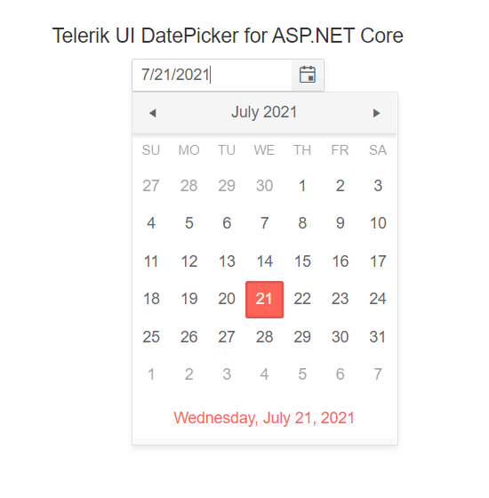

# First Steps with {{ site.product }}

This article explains how to use the Telerik UI for ASP.NET Core components in an ASP.NET Core MVC application. You will set up your Telerik development environment, create a new application from scratch, and finally, add a UI component to a View.





## Prerequisites

To successfully complete the steps in this tutorial, install the [.NET Core SDK](https://dotnet.microsoft.com/download/dotnet).

## Set Up Telerik Development Environment

The fastest way to set up your Telerik development environment is to use the [Telerik CLI]() .NET tool. Run the following commands in your preferred command shell (Visual Studio Terminal, cmd, PowerShell, Bash, macOS Terminal, or other).

>tip If you have already set up your Telerik development environment and it doesn't need updating, skip to [Create New ASP.NET Core App](#create-new-aspnet-core-app).

1. Install Telerik CLI

    ````SH.skip-repl
    dotnet tool install -g Telerik.CLI --source https://api.nuget.org/v3/index.json
    ````

1. Run the Telerik CLI `setup` command:

    ````SH.skip-repl
    telerik setup aspnetcore
    ````

The [`setup` command performs multiple actions](#set-up-telerik-environment) to configure your Telerik development environment:

* Create your Telerik account or log in if you already have one.
* Activate a {{ site.product }} trial if you don't have an active license.
* Download your Telerik license key.
* Configure the Telerik NuGet package source.
* Install the Telerik UI for ASP.NET Core MCP server.

## Create New ASP.NET Core App

This section assumes that you have successfully completed the Telerik-specific setup in the [previous step](#set-up-telerik-development-environment).

To create a new Telerik ASP.NET Core app, use your preferred approach:

<TabStrip>
<TabStripTab title=".NET CLI">

1. Create a new ASP.NET Core MVC project:

    ````SH.skip-repl
    mkdir MyASPNETCoreProject
    cd MyASPNETCoreProject
    dotnet new mvc
    ````

1. Add the {{ site.product }} NuGet package:

    ````SH.skip-repl
    dotnet add package Telerik.UI.for.AspNet.Core
    ````

</TabStripTab>
<TabStripTab title="Visual Studio">

1. Open Visual Studio and select **Create a new project**.

1. Search for **Model-View-Controller**, select the **ASP.NET Core Web App (Model-View-Controller)** C# template, and then select **Next**.

1. Enter **MyASPNETCoreProject** as a project name, and then select **Next**.

1. Select a target framework and select **Create**.

1. Open the **NuGet Package Manager** (**Tools** > **NuGet Package Manager** > **Manage NuGet Packages for Solution**).

1. Select the **TelerikNuGetV3** package source, search for `Telerik.UI.for.AspNet.Core`, and install the package.

</TabStripTab>
<TabStripTab title="Project Template">

1. Install the Telerik UI for ASP.NET Core [Visual Studio extension](https://marketplace.visualstudio.com/items?itemName=TelerikInc.ProgressTelerikASPNETCoreVSExtensions).

1. In Visual Studio, create a new **Telerik ASP.NET Core MVC Application** from the Telerik project templates.

1. Follow [Using a {{ site.product }} Project Template in VS for Windows]() for the complete workflow and screenshots.

When you use the project template approach, the generated application is already configured for Telerik UI and includes Telerik components. Skip the [Configure the Application](#configure-the-application) and [Add Telerik Component](#add-telerik-component) sections.

</TabStripTab>
</TabStrip>

> To manually add Telerik UI for ASP.NET Core to an existing app, follow the [First Steps with CLI]() article.

### Configure the Application

After creating the project and adding the NuGet package, configure the application to use {{ site.product }}:

1. Register the Kendo UI service in the `Program.cs` file. Add `builder.Services.AddKendo()` after `AddControllersWithViews()`:

    ```C#
    var builder = WebApplication.CreateBuilder(args);

    builder.Services.AddControllersWithViews();

    // Add Kendo UI services to the services container.
    builder.Services.AddKendo();
    ```

1. Import the `Kendo.Mvc.UI` namespace in `~/Views/_ViewImports.cshtml`. If you intend to use the Telerik UI ASP.NET Core Tag Helpers, add them with `@addTagHelper *, Kendo.Mvc`.

    ```C#
    @using MyASPNETCoreProject
    @using MyASPNETCoreProject.Models
    @addTagHelper *, Microsoft.AspNetCore.Mvc.TagHelpers
    @addTagHelper *, Kendo.Mvc
    @using Kendo.Mvc.UI
    ```

1. Add the client-side resources in `~/Views/Shared/_Layout.cshtml`. Add the theme CSS in the `<head>` and make sure jQuery is referenced before the Kendo scripts:

    ```HTML
    <head>
        ...
        <link rel="stylesheet" href="https://kendo.cdn.telerik.com/themes/{{ site.themesCdnVersion }}/default/default-main.css" />

        <script src="~/lib/jquery/dist/jquery.js"></script>
        <script src="https://kendo.cdn.telerik.com/{{ site.mvcCoreVersion }}/js/kendo.all.min.js"></script>
        <script src="https://kendo.cdn.telerik.com/{{ site.mvcCoreVersion }}/js/kendo.aspnetmvc.min.js"></script>
    </head>
    ```
>* The `kendo.all.min.js` and `kendo.aspnetmvc.min.js` scripts must be loaded after the `jquery.min.js` script.
>* `jQuery` must be loaded only once. Ensure there are no duplicate references elsewhere in the `_Layout`.

## Add Telerik Component

Add a new Telerik component. For example, add a {{ site.product }} DatePicker to `~/Views/Home/Index.cshtml`:

```HtmlHelper
<div class="text-center">
    <h2>Kendo UI DatePicker</h2>
    @(Html.Kendo().DatePicker()
        .Name("my-picker")
    )
</div>
```
```TagHelper
<div class="text-center">
    <h2>Kendo UI DatePicker</h2>
    <kendo-datepicker name="my-picker">
    </kendo-datepicker>
</div>
```

Run the application:

```sh
dotnet run
```


Upon successful run in a web browser, the new Telerik ASP.NET Core app looks like this:




Well done! Now you have your first {{ site.product }} component running in your ASP.NET Core application.


## Next Steps

<article-card-container>
    <article-card
        href="slug://htmlhelpers_grid_aspnetcore_overview"
        src="../images/aicomponents/AI_Data_Highlight_Light_Large.svg"
        title="Get Started with Data Grid"
        darkSrc="../images/aicomponents/AI_Data_Highlight_Dark_Large.svg"
        description="Bind the {{ site.product }} Grid to data and choose from the large variety of built-in features.">
    </article-card>
    <article-card
        href="slug://htmlhelpers_datasource_aspnetcore"
        src="../images/aicomponents/AI_Column_Assistant_Light_Large.svg"
        title="Learn Telerik Data Binding"
        darkSrc="../images/aicomponents/AI_Column_Assistant_Dark_Large.svg"
        description="Learn the data binding fundamentals for {{ site.product }} components.">
    </article-card>
    <article-card
        href="slug://overview_aspnetmvc6_aspnetmvc#list-of-helpers"
        src="../images/aicomponents/Editor_AI_Integration_Light_Large.svg"
        title="Use Components"
        darkSrc="../images/aicomponents/Editor_AI_Integration_Dark_Large.svg"
        description="Check the list of available {{ site.product }} components.">
    </article-card>
    <article-card
        href="https://demos.telerik.com/aspnet-core"
        src="../images/aicomponents/Grid_AI_Chat_Integration_Light_Large.svg"
        title="Browse Online Demos"
        darkSrc="../images/aicomponents/Grid_AI_Chat_Integration_Dark_Large.svg"
        description="Explore the live {{ site.product }} examples.">
    </article-card>
    <article-card
        href="slug://sassbasedthemes_overview"
        src="../images/aicomponents/AIPrompt_Light_Large.svg"
        title="Create Themes"
        darkSrc="../images/aicomponents/AIPrompt_Dark_Large.svg"
        description="Review the built-in themes, customize them, or create your own.">
    </article-card>
    <article-card
        href="slug://ai-overview-core"
        src="../images/aicomponents/Chat_Light_Large.svg"
        title="Use Telerik AI Tools"
        darkSrc="../images/aicomponents/Chat_Dark_Large.svg"
        description="{{ site.product }} provides AI-powered development assistance through a unified MCP server that delivers intelligent, context-aware help directly in your IDE.">
    </article-card>
</article-card-container>

## See Also

* [First Steps with CLI]()
* [Using a Project Template]()
* [First Steps on Windows]()
* [Using Razor Pages]()
* [Video Onboarding]()
