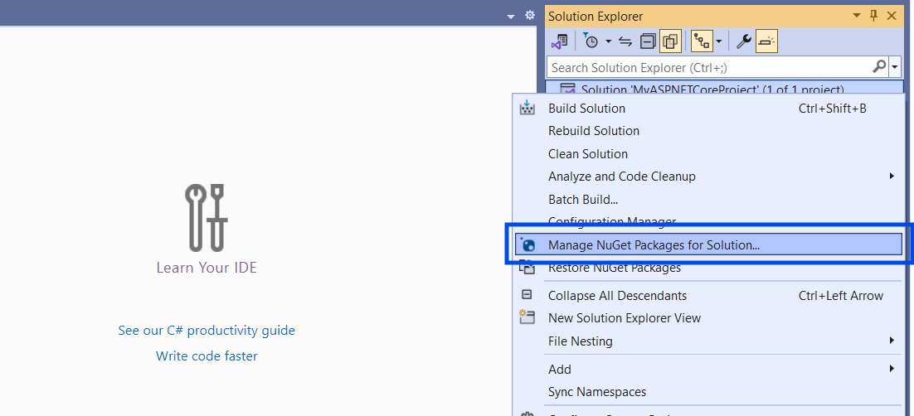
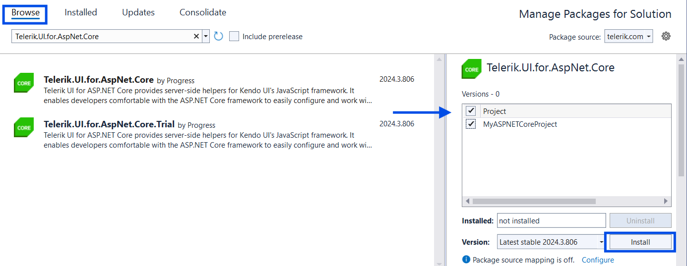

# First Steps in {{ site.product }} with VS for Windows

This tutorial demonstrates how to start working with Telerik UI for ASP.NET Core. You will implement the Telerik UI DatePicker for ASP.NET Core in your project by using its dedicated HtmlHelper or TagHelper. In this guide, you will download and implement the components by using NuGet and Visual Studio 2022 for Windows.

The approach demonstrated in this guide is applicable both for new projects and for existing projects where you want to implement Telerik UI controls.

>tip If you want to start a new project from a template, you can [use the Telerik UI for ASP.NET Core Visual Studio extensions]() and create a new pre-configured application that has all necessary scripts, styles, and editor templates.

In this tutorial, you will:

1. [Check the prerequisites](#prerequisites).

1. [Create an ASP.NET Core application](#creating-the-application).

	If you already have an existing app that you want to use, skip this step.

1. [Install a license key](#installing-a-license-key).

1. [Add the Telerik NuGet Feed to Visual Studio](#adding-the-telerik-nuget-feed-to-visual-studio).

1. [Install the {{ site.product }} NuGet package](#installing-the-nuget-package).

1. [Reference Kendo.Mvc.UI](#adding-a-reference-to-kendomvcui).

1. [Include the client-side resources](#including-the-client-side-resources).

1. [Add a component](#adding-a-telerik-ui-component).

>tip How about a free Telerik UI onboarding course? Check out the [Video Onboarding]() article and learn how to take advantage of the <a href="https://www.telerik.com/support/video-courses" target="_blank">Telerik and Kendo UI Video Courses</a>.

## Prerequisites

* [.NET Core SDK](https://dotnet.microsoft.com/download/dotnet)
* [Visual Studio 2022 or later](https://visualstudio.microsoft.com/downloads)
* Windows 10 or higher
* [Telerik account](https://www.telerik.com/account)&mdash;if you don't have an account yet, you can [create one for free](https://www.telerik.com/account).

## Creating the Application

1. Open Visual Studio 2022 for Windows and select **Create a new project**.

1. In the search box, enter **Model-View-Controller**, select the **ASP.NET Core Web App (Model-View-Controller)** C# template, and then select **Next**.

    

1. Enter **MyTelerikProject** as a project name, and then select **Next**.

	Using this project name guarantees that the namespace from the code snippets in this tutorial will match your project.

1. Select the **.NET** target framework of your choice from the dropdown box, and then select **Create**.

## Installing a License Key

@[template](/_contentTemplates/licensing-templates.md#license-key-version)

@[template](/_contentTemplates/licensing-templates.md#license-key-manual-steps)

@[template](/_contentTemplates/licensing-templates.md#license-key-know-more-link)

## Adding the Telerik NuGet Feed to Visual Studio

>tip If you have already configured the Telerik NuGet feed in Visual Studio, jump to [Installing the NuGet Package](#installing-the-nuget-package).

@[template](/_contentTemplates/get-started.md#add-nuget-feed)

## Installing the NuGet Package

Once you configure Visual Studio to access the Telerik NuGet server, you can add NuGet package with the Telerik UI components to the project:

1. Open the NuGet Package Manager.

    

1. From the **Package source** drop-down, select the Telerik NuGet source.

1. Select the **Browse** tab, and then enter `Telerik.UI.for.AspNet.Core` in the search field.

1. Select the project's checkbox and then select **Install**. As a result, a line similar to `<PackageReference Include="Telerik.UI.for.AspNet.Core" Version="{{ site.mvcCoreVersion }}" />` is added to your `.csproj` file.

    

## Adding a Reference to Kendo.Mvc.UI

1. Register the Kendo UI service in the services container.

	* For applications using .NET 6 and the [minimal hosting model](https://docs.microsoft.com/en-us/aspnet/core/migration/50-to-60?view=aspnetcore-6.0&tabs=visual-studio#new-hosting-model), open the `Program.cs` file and register the Kendo UI service.

	```C#
	var builder = WebApplication.CreateBuilder(args);

	// Add Kendo UI services to the services container.
	builder.Services.AddKendo();
	```

 	* For applications using .NET 5 or earlier, open the `Startup.cs` file and register the Kendo UI services in the `ConfigureServices` method.

	```C#
	public void ConfigureServices(IServiceCollection services)
	{
		// Add the Kendo UI services to the services container.
		services.AddKendo();
	}
	```

1. Import the `Kendo.Mvc.UI` namespace in `~/Views/_ViewImports.cshtml` through `@using Kendo.Mvc.UI`. If you intend to use the Telerik UI ASP.NET Core Tag Helpers, add them with `@addTagHelper *, Kendo.Mvc`.

	```C#
        @using MyTelerikProject
	    @using MyTelerikProject.Models
        @addTagHelper *, Microsoft.AspNetCore.Mvc.TagHelpers
        @addTagHelper *, Kendo.Mvc
        @using Kendo.Mvc.UI
	```

## Including the Client-Side Resources

To enable the Telerik UI for ASP.NET Core components, you must add several [client-side]() dependencies to the application, like scripts and a [theme file]().

@[template](/_contentTemplates/general-info.md#identical-versions-note-core)

Before adding a Telerik UI component, you must include the theme, the jQuery script, and the required Kendo UI scripts:

1. Go to `~\Views\Shared\_Layout.cshtml` and add the theme of your choice to the `<head>` of the document. Since the ASP.NET Core Web App template uses Bootstrap, you can use the [Telerik UI Bootstrap theme](#built-in-themes) to match it:

	```HTML
	<head>
		...
		<link rel="stylesheet" href="~/lib/bootstrap/dist/css/bootstrap.min.css" />
		<link rel="stylesheet" href="~/css/site.css" />

		@* Add the Telerik UI Bootstrap Main theme: *@
		<link rel="stylesheet" href="https://kendo.cdn.telerik.com/themes/{{ site.themesCdnVersion }}/bootstrap/bootstrap-main.css" />
		...
	</head>
	```

1. The ASP.NET Core Web App template comes with a jQuery script reference at the end of `_Layout.cshtml` file. Locate the `jquery.min.js` script line in the `<body>` of the document and move it to the `<head>`. Alterantively, use the jQuery script hosted on the jQuery CDN.

	```HTML
	<head>
		...
		<link rel="stylesheet" href="~/lib/bootstrap/dist/css/bootstrap.min.css" />
		<link rel="stylesheet" href="~/css/site.css" />
		<link rel="stylesheet" href="https://kendo.cdn.telerik.com/themes/{{ site.themesCdnVersion }}/bootstrap/bootstrap-main.css" />

		@* Add the jQuery script from the jQuery CDN: *@
		<script src="https://code.jquery.com/jquery-3.7.1.min.js"></script>
		...
	</head>
	```

1. Add the required Kendo UI script files in the `<head>` tag after the `jQuery` script reference:

	```HTML
	<head>
		...
		<link rel="stylesheet" href="~/lib/bootstrap/dist/css/bootstrap.min.css" />
		<link rel="stylesheet" href="~/css/site.css" />
		<link rel="stylesheet" href="https://kendo.cdn.telerik.com/themes/{{ site.themesCdnVersion }}/bootstrap/bootstrap-main.css" />

		@* Add the jQuery script from the jQuery CDN: *@
		<script src="https://code.jquery.com/jquery-3.7.1.min.js"></script>

		@* Add the Kendo UI scripts: *@
		<script src="https://kendo.cdn.telerik.com/{{ site.mvcCoreVersion }}/js/kendo.all.min.js"></script>
		<script src="https://kendo.cdn.telerik.com/{{ site.mvcCoreVersion }}/js/kendo.aspnetmvc.min.js"></script>
	</head>
	```

@[template](/_contentTemplates/general-info.md#scripts-references-notes)

If you prefer to include the client-side resources from a local source instead of CDNs, refer to the [Local Client-Side Resources]() article.

## Adding a Telerik UI Component

@[template](/_contentTemplates/core/json-serialization-note.md#json-serialization-note)

Define the Telerik UI DatePicker component by adding the snippet from the following example to `~/Views/Home/Index.cshtml`.

```HtmlHelper
	<div class="text-center">
		<h2>Telerik UI DatePicker for ASP.NET Core</h2>
		@(Html.Kendo().DatePicker()
			.Name("my-picker")
		)
	</div>
```
```TagHelper
	@addTagHelper *, Kendo.Mvc

	<div class="text-center">
		<h2>Telerik UI DatePicker for ASP.NET Core</h2>
		<kendo-datepicker name="my-picker"/>
	</div>
```

Build and run the application.

Congratulations! You created a page that uses the [DatePicker]() component.


## Next Steps

* [Overview of the UI for ASP.NET Core installation methods]()
* [How to update UI for ASP.NET Core to a new version](#upgrading-to-new-versions)
* [Create a New Telerik UI for ASP.NET Core Application through Visual Studio Extension]()

## See Also

* [Using the UI for ASP.NET Core CDN Services]()
* [Switch from Trial to Commercial License](#switching-to-a-developer-license)
* [Migrating from MVC to Core MVC](https://docs.telerik.com/aspnet-core/installation/migrating)
* [MS - Upgrade from ASP.NET Framework to ASP.NET Core](https://learn.microsoft.com/en-us/aspnet/core/migration/proper-to-2x/?view=aspnetcore-7.0)

