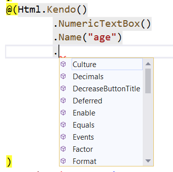

# Fundamentals

Telerik UI for ASP.NET Core is a set of server-side wrappers (HTML and tag helpers) that allow you to use the Kendo UI widgets in .NET Core.

For more information on the difference between helpers and widgets, refer to the [Telerik UI for ASP.NET Core introduction article](#widgets-vs-helpers).

As of the jQuery 3.0 release, the [document-ready handlers are called asynchronously](https://api.jquery.com/ready/). As a result, regardless of whether the document is ready at the point of execution or not, the code placed outside a document-ready handler is executed before the code within the handler. This change affects the usage of the Telerik UI for ASP.NET Core components because the widgets for the MVC helpers are initialized in a document-ready handler. This means that after the jQuery 3.0 release you need to get the reference of a widget and its API calls within a document-ready handler.

## Basic Configuration

The helper options are exposed through a [fluent interface](https://en.wikipedia.org/wiki/Fluent_interface).

To set an option for a helper, call the corresponding method and pass the required option value.

    @(Html.Kendo().NumericTextBox()
          .Name("name") // Set the name of the NumericTextBox.
          .Value(10) // Set the value.
          .Spinners(false) // Disable the spinners.
    )

You have to set the `Name` option of the helper. The value will be used as the `id` and `name` HTML attributes&mdash;the `name` attribute is set only for input helpers such as the DatePicker, NumericTextBox, and DropDownList. The `id` attribute is used to initialize the helper. The id (`Name`) of a helper has to meet the requirements for valid HTML `ID` attributes. It must not contain spaces and special characters and has to start with a letter.

> The `Name` options of the helpers have to be always unique in the context of the whole web page. If a partial view is loaded multiple times, each instance of this partial view has to render all helpers with unique `Name` (id) options. If this requirement is not met, the page will render duplicate element IDs and only the helper instance which occurs first in the markup will be initialized and will work properly.

Alternatively, you can use the `NumericTextBoxFor` setting. All Telerik UI helpers which accept a value can be initialized with the `[WidgetName]For` method. For example, to initialize the DatePicker, use `DatePickerFor`. These methods automatically set the `Name` of the helper. In this way, `@Html.Kendo().NumericTextBoxFor(model => model.Age)` is the same as `@Html.Kendo().NumericTextBox().Name("Age").Value(Model.Age)`.

## Deferred Initialization

By default, the helpers output the widget initialization script immediately after the HTML markup of the widget. This scenario may not always be desired&mdash;for example, if the script files are registered at the bottom of the page or when you nest widgets.

To defer the initialization:

1. Call the `Deferred` method of the helper. This approach suppresses the immediate rendering of the script statement.

          @(Html.Kendo().NumericTextBox()
                .Name("age")
                .Deferred()
          )

1. Call the `DeferredScripts` method. As a result, all previously deferred initialization statements are output.

          @Html.Kendo().DeferredScripts()

  The `DeferredScripts` method accepts a Boolean parameter which determines whether script elements will be automatically rendered. This behavior is useful for rendering the deferred initialization scripts inside existing script element.

          

1. Render the deferred initialization script of a particular helper by using the `DeferredScriptsFor` method.

          @(Html.Kendo().NumericTextBox()
                .Name("age")
                .Deferred()
          )
          <!-- other code -->
          @Html.Kendo().DeferredScriptsFor("age")

  You can also use the `DeferredScriptsFor` method to suppress the output of `script` elements around the initialization script.

        

## Referencing Client-Side Objects

You can get a reference to the client-side object that is initialized by the helper through the [`data`](http://api.jquery.com/data/) jQuery method. Use the `Name` of the widget in an `ID` jQuery selector, and obtain the reference in a `document.ready` handler which is placed or called after the widget is declared. This ensures that the widget is already initialized and the client-side object exists. After you get the object reference, use the client-side API of the widget.

    @(Html.Kendo().NumericTextBox()
        .Name("age")
    )

    

If you have deferred the initialization of the widget, make sure you get its instance after calling `DeferredScripts` or `DeferredScriptsFor`.

    @(Html.Kendo().NumericTextBox()
        .Name("age")
        .Deferred()
    )

    .....

    @Html.Kendo().DeferredScripts()

    

## Using Client Templates

By default, every Telerik UI helper renders a script element with an initialization statement. If the helper declaration is placed inside a Kendo UI template, the nested script elements will be invalid. The `ToClientTemplate` method instructs the helper to escape its own script element so that it can be nested.

    
    

    

## Employing jQuery Validation

1. Add the latest version of the [`jquery.validate`](http://www.nuget.org/packages/jQuery.Validation/) and [`jquery.validate.unobtrusive`](http://www.nuget.org/packages/Microsoft.jQuery.Unobtrusive.Validation/) scripts to the project.
1. Include them in the view in which you want to validate the user input or in the layout.
1. After including the scripts, override the default `ignore` setting to enable the validation of the hidden elements&mdash;for example, helpers like the DropDownList and NumericTextBox have a hidden input to keep the value.

            
            
            

1. Define the model and create the editors. For more information, refer to the [section on using the Validator with `DataAnnotation` attributes](#using-the-dataAnnotation-attributes).

## See Also

* [Telerik UI for ASP.NET Core Download and Installation]()
* [First Steps]()
