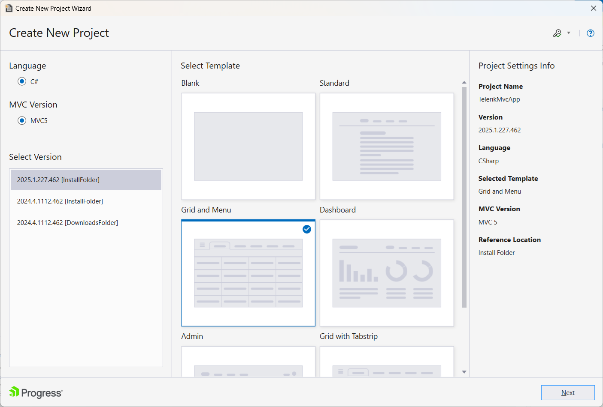
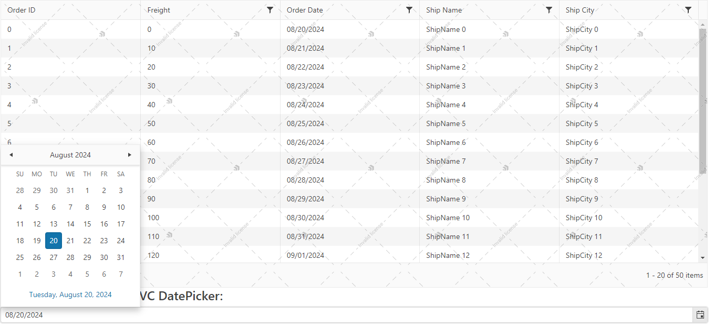

# First Steps

Welcome to the First Steps with Progress<sup>®</sup> Telerik<sup>®</sup> UI for ASP.NET MVC in Visual Studio tutorial!

The tutorial guides you through implementing the Telerik UI for ASP.NET MVC Grid and Datepicker in a new Telerik UI for ASP.NET application. To create the application, you will use Visual Studio 2019 for Windows and the [Visual Studio Extensions]() that come with the Telerik UI for ASP.NET installation.

The Telerik Extensions streamline the Telerik UI for ASP.NET MVC setup by automatically adding the necessary references and configuration. The Extensions can also [convert an existing ASP.NET MVC application]() to a Telerik UI for ASP.NET MVC application.

If you want to manually set up Telerik UI for ASP.NET MVC in an existing application, there are alternative approaches that do not involve the Telerik Visual Studio Extensions:
* [Setup with Telerik NuGet](). 
* [Manual setup]().

>tip How about a free Telerik UI onboarding course? Check out the [Video Onboarding]() article and learn how to take advantage of the <a href="https://learn.telerik.com/learn" target="_blank">Telerik Virtual Classroom</a>.

## Prerequisites

* Telerik UI for ASP.NET MVC requires <a href="https://dotnet.microsoft.com/download/dotnet-framework" target="_blank">.NET Framework</a>.

* [Visual Studio](https://www.visualstudio.com/downloads/) 2012 or later.
   
* [Telerik account](https://www.telerik.com/account).

## Downloading and Installing

Follow these steps to download and install Telerik UI for ASP.NET MVC:

1. Log in to your [Telerik account](https://www.telerik.com/login/v2/telerik).

   >tip If you don't have a Telerik account yet, you can create one for free.

1. Download the installation file:

    * To get the free trial version, follow [this link](https://www.telerik.com/try/ui-for-asp.net-mvc) to download UI for ASP.NET MVC and activate your trial.

    * If you have already purchased a license:

        1. Click **Downloads** in the top navigation bar of your [Telerik account](https://www.telerik.com/login/v2/telerik).

        1. Click **UI for ASP.NET MVC**.

        1. Download the `.msi` installer file from the **Installation** section.

1. Close any running Visual Studio instances and run the Telerik UI for ASP.NET MVC installer. The automatic setup will guide you through the rest of the installation. The Telerik Visual Studio Extensions are installed by default.

The default installation folder is `C:\Program Files (x86)\Progress\Telerik UI for ASP.NET MVC<version>`. 

## Creating a Telerik ASP.NET MVC Application

After the Visual Studio Extensions are installed, you can create a Telerik ASP.NET MVC application by using the **Create New Project** wizard in Visual Studio.

1. In the Visual Studio toolbar, click **File** > **New** > **Project**.     

1. Search for and select the **Telerik ASP.NET MVC C#** project template. Click **Next**.

	

1. Select the **GRID AND MENU** template.

   For more information on the additional predefined Telerik template options, refer to the [Creating New Projects]() article. 

	

1. Select the **Default-v2** visual theme for your Telerik ASP.NET MVC Application, and click **Finish** to complete the creation of the application.

The newly created application already has a reference to the required `Kendo.Mvc.dll` assembly. The wizard also references the client-side resources (the Kendo UI script and theme-related CSS files) in the `_Layout.cshtml`. 

You can now start adding components.

## Adding Components to the Application

As a result of selecting the **GRID AND MENU** template, a Grid component has been added to the `Index.cshtml` view, and a Menu to the `_Layout.cshtml`. The Grid is configured and bound remotely to sample data returned by the `GridController`.

Add a DatePicker to the `Index.cshtml` view:

```
    <h4>Telerik UI for ASP.NET MVC DatePicker:</h4>

    @(Html.Kendo().DatePicker()
        .Name("datepicker") // The Name of the DatePicker is mandatory. It specifies the "id" attribute of the component.
        .Value(DateTime.Today) // Sets the value of the DatePicker.
    )
```

## Building and Running the Application 

Press `CTRL+F5` to build and run the application. You have a Grid and a DatePicker on your page.



## Next Steps

* [Explore the Telerik UI for ASP.NET MVC fundamentals]()
* [Telerik UI for ASP.NET MVC HTML Helpers]()
* [Grid Data Binding Overview]()

## See Also

* [Exploring the Helper Script Dependencies]()
* [Integrate Telerik UI for ASP.NET MVC in Visual Studio]()
* [Upgrade Telerik UI for ASP.NET MVC]()
* [Collected Examples on ASP.NET MVC](https://github.com/telerik/kendo-examples-asp-net-mvc)
* [Collected Examples on Telerik UI for ASP.NET MVC](https://github.com/telerik/ui-for-aspnet-mvc-examples)
