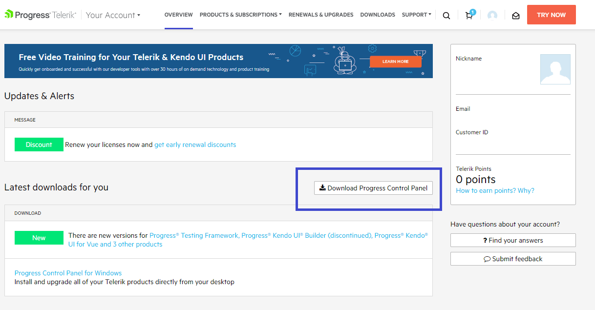
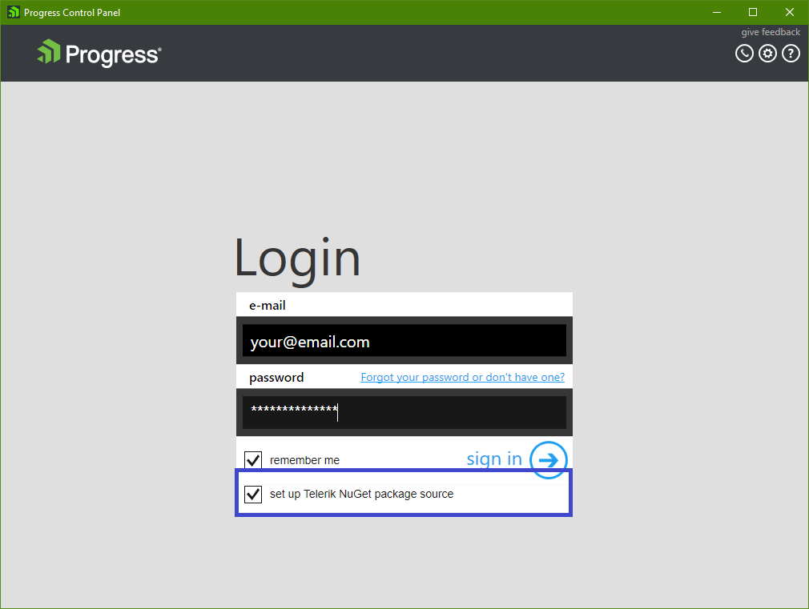
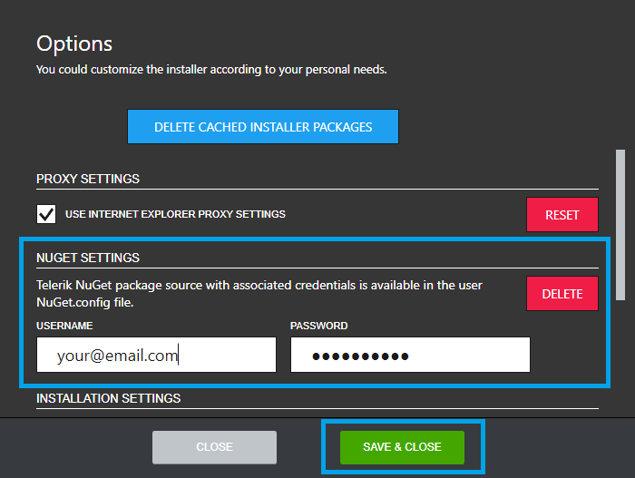
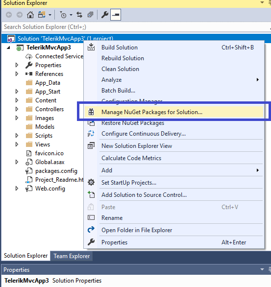
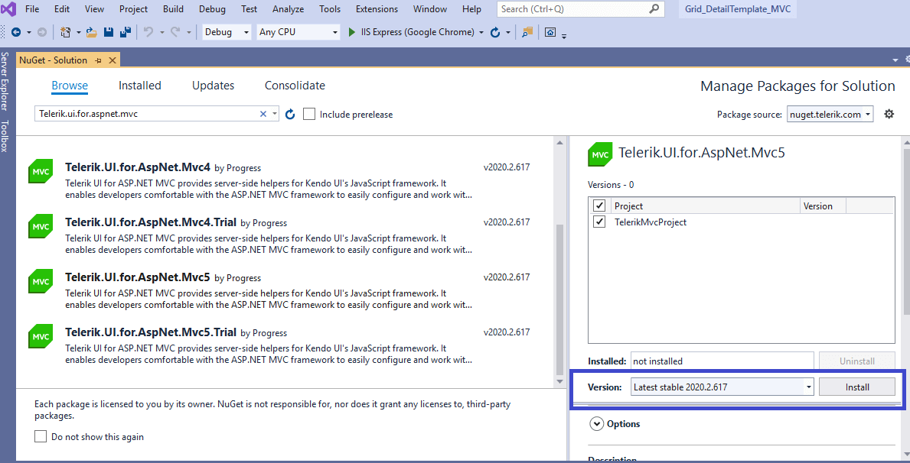

# First Steps

Welcome to the First Steps with Progress<sup>®</sup> Telerik<sup>®</sup> UI for ASP.NET MVC in Visual Studio tutorial!

This article presents a use-case scenario that demonstrates how to start working with Telerik UI for ASP.NET MVC. You will implement the Kendo UI Grid in your project by using the Telerik UI Grid HtmlHelper. In this tutorial, we use Visual Studio for Windows 2019.

To configure an ASP.NET MVC web application to use UI for ASP.NET MVC, you can use either of the following approaches:
* Create the application from scratch and manually add the necessary setup (demonstrated in this guide). 
* [Use the Telerik UI for ASP.NET MVC Visual Studio extensions]() and create an application that has all necessary scripts, styles, and editor templates.

To get up and running with the project:

1. [Meet the requirements](#meet-the-requirements)
1. [Create the ASP.NET MVC Web Application](#create-the-application)
1. [Add the Telerik NuGet Feed to Visual Studio](#add-the-telerik-nuget-feed-to-visual-studio)
1. [Add the UI for ASP.NET MVC NuGet package](#add-the-nuget-package)
1. [Include the Telerik UI for ASP.NET MVC client-side resources](#include-the-client-side-resources)
1. [Initialize the HtmlHelper](#initialize-the-htmlhelper)
1. [Build and run the application](#build-and-run-the-application)

## Meet the requirements

Telerik UI for ASP.NET MVC requires the .NET Framework. [Download a current version of the .NET Framework from Microsoft's website.](https://dotnet.microsoft.com/download/dotnet-framework) 

## Create the Application

1. Open Visual Studio 2019 for Windows and select **Create a new project**.
1. Select **ASP.NET Web Application (.NET Framework)** and click **Next**.
1. Set a name and location for the project and click **Create**.
1. Select **MVC** and click **Create**.

## Add the Telerik NuGet Feed to Visual Studio

Telerik maintains a NuGet feed with official UI ASP.NET MVC releases and service packs. These packages are available for registered users.

* If you use a free trial license, follow [these steps](#add-the-telerik-nuget-feed-for-trial-license-users) to add the NuGet feed to Visual Studio.
* If you purchased a commercial license, follow [these steps](#add-the-telerik-nuget-feed-for-users-with-commercial-license) to add the NuGet feed to Visual Studio. 

>**Tip**
>
>If you have already configured the Telerik NuGet feed in Visual Studio, jump to [Add the NuGet Package](#add-the-nuget-package).
	
### Add the Telerik NuGet Feed for Trial License Users

The easiest way to add the Telerik NuGet feed to Visual Studio if you are a trial user is to install the UI for ASP.NET MVC free trial:

1. Download the [UI for ASP.NET MVC free trial](https://www.telerik.com/aspnet-mvc) installer. You need to create a free account if don't have one.

1. Run the installer.

1. Select the option **Set up Telerik NuGet package source** to automatically add the [Telerik NuGet feed]().

	
	
### Add the Telerik NuGet Feed for Users with Commercial License

The easiest way to add the Telerik NuGet feed to Visual Studio if you purchased a commercial license is to use the Progress Control Panel:

1. Download the Progress Control Panel from the **Overview** page of your [Telerik account](https://www.telerik.com/account/). 

	
	
1. Run the Progress Control Panel exe.

1. On the Login screen, check the **set up Telerik NuGet package source** option.

	
	
1. If you miss to set up the Nuget Feed on login, go to the Progress Control Panel options and scroll to **Nuget Settings**. Enter your Telerik credentials and click the **Save and Close** button.

	

## Add the NuGet Package

1. Righ-click on the Solution and select **Manage NuGet Packages for Solution...**

	
	
1. From the **Package source** drop-down, select the Telerik NuGet source.

1. Click on the **Browse** tab, search for `Telerik.UI.for.AspNet.Mvc5` (or `Telerik.UI.for.AspNet.Mvc5.Trial`), and install it.

	
	
>**Note**
>
>When you use the NuGet package manager to install Telerik.UI.for.AspNet.Mvc5, you save time. It performs the following steps in the background:
>* Adds a reference to the `Kendo.Mvc.dll` assembly that contains the Telerik UI for ASP.NET MVC helpers.
>* Updates the `web.config` file to indicate the `Kendo.Mvc.UI` namespace where the helpers are located.

## Include the Client-Side Resources

>**Note**
>
> * The CDN links and/or package versions have to point to the same UI for ASP.NET MVC version that your project references.
> * The Kendo UI scripts have to be placed after `jQuery`.

Before you can use a Telerik UI component, you must include the theme, the jQuery script, and the Kendo UI scripts:

1. Go to `~\Views\Shared\_Layout.cshtml` and add the Kendo UI theme of your choice to the `<head>` of the document. Since Microsoft's project template uses Bootstrap, you can use the Kendo UI SASS Bootstrap v4 theme to match it:

		<head>
		<meta charset="utf-8" />
		<meta name="viewport" content="width=device-width, initial-scale=1.0">
		<title>@ViewBag.Title - My ASP.NET Application</title>
		@Styles.Render("~/Content/css")
		@Scripts.Render("~/bundles/modernizr")

		@* Add the Kendo Bootstrap v4 theme: *@
		<link href="https://kendo.cdn.telerik.com/{{ site.mvcCoreVersion }}/styles/kendo.bootstrap-v4.min.css" rel="stylesheet" type="text/css" />
		</head>

1. The Microsoft ASP.NET Web Application template comes with a `jQuery` script reference at the end of _Layout.cshtml file. Find the `@Scripts.Render("~/bundles/jquery")` script line in the `<body>` of the document and remove it.  

1. Add the `jQuery` script hosted on the Telerik CDN to the `<head>`:

		<head>
		...
		<link href="https://kendo.cdn.telerik.com/{{ site.mvcCoreVersion }}/styles/kendo.bootstrap-v4.min.css" rel="stylesheet" type="text/css" />
		
		@* Add the jQuery script from the Telerik CDN: *@
		<script src="https://kendo.cdn.telerik.com/{{ site.mvcCoreVersion }}/js/jquery.min.js"></script>
		</head>

1. Add the Kendo UI scripts. The Kendo UI script files required by UI for ASP.NET MVC must be loaded in the `<head>` tag *after* the `jQuery` script:

		<head>
		...
		<link href="https://kendo.cdn.telerik.com/{{ site.mvcCoreVersion }}/styles/kendo.bootstrap-v4.min.css" rel="stylesheet" type="text/css" />
		<script src="https://kendo.cdn.telerik.com/{{ site.mvcCoreVersion }}/js/jquery.min.js"></script>

		@* Add the Kendo UI scripts: *@
		<script src="https://kendo.cdn.telerik.com/{{ site.mvcCoreVersion }}/js/jszip.min.js"></script>
		<script src="https://kendo.cdn.telerik.com/{{ site.mvcCoreVersion }}/js/kendo.all.min.js"></script>
		<script src="https://kendo.cdn.telerik.com/{{ site.mvcCoreVersion }}/js/kendo.aspnetmvc.min.js"></script>
		</head>

1. Finally, add the `bootstrap.min.js` script available in Microsoft's ASP.NET Web Application template, and the `<head>` will look like this:

		<head>
		<meta charset="utf-8" />
		<meta name="viewport" content="width=device-width, initial-scale=1.0">
		<title>@ViewBag.Title - My Telerik MVC Application</title>
		@Styles.Render("~/Content/css")
		@Scripts.Render("~/bundles/modernizr")
		<link href="https://kendo.cdn.telerik.com/{{ site.mvcCoreVersion }}/styles/kendo.bootstrap-v4.min.css" rel="stylesheet" type="text/css" />
		<script src="https://kendo.cdn.telerik.com/{{ site.mvcCoreVersion }}/js/jquery.min.js"></script>
		<script src="https://kendo.cdn.telerik.com/{{ site.mvcCoreVersion }}/js/jszip.min.js"></script>
		<script src="https://kendo.cdn.telerik.com/{{ site.mvcCoreVersion }}/js/kendo.all.min.js"></script>
		<script src="https://kendo.cdn.telerik.com/{{ site.mvcCoreVersion }}/js/kendo.aspnetmvc.min.js"></script>
		
		@* Add the bootstrap.min.js script: *@
		<script src="@Url.Content("~/Scripts/bootstrap.min.js")"></script>
		</head>


>**Note**
>
>* Always put the `kendo.all.min.js` and `kendo.aspnetmvc.min.js` script files after the `jquery.min.js` script. 
>* `jQuery` must be loaded only once. It must be placed only in the `<head>` tag, make sure there are no duplicate references elsewhere in the _Layout.

## Initialize the HtmlHelper 

Perform the steps below to initialize the HtmlHelper:

1. Create a model in the `Models` folder of the application.

        public class Product
        {
            public int ProductID { get; set; }
            public string ProductName { get; set; }
            public Nullable<decimal> UnitPrice { get; set; }
            public bool Discontinued { get; set; }
        }

1. Open the `~/Views/Home/Index.cshtml` view or, if using ASPX, the `Index.aspx` file.
1. Add a Kendo UI Grid HtmlHelper.

    ```Razor
        <div class="text-center">
			<h2>Kendo UI Grid</h2>
			@(Html.Kendo().Grid<TelerikMvcApp1.Models.Product>()
				.Name("grid")
				.Columns(columns =>
				{
					columns.Bound(c => c.ProductID).Width(100);
					columns.Bound(c => c.ProductName).Width(300);
					columns.Bound(c => c.UnitPrice).Width(100);
					columns.Bound(c => c.Discontinued).Width(200);
				})
				.DataSource(dataSource => dataSource
					.Ajax()
					.Read(read => read.Action("Select", "Home"))
				)
			)
		</div>
    ```
1. Open the `HomeController.cs` and import the `Kendo.Mvc.UI` and the `Kendo.Mvc.Extensions` namespaces so that you can use `Kendo.Mvc.UI.DataSourceRequest` and the `ToDataSourceResult` extension method in the next step:

    	using Kendo.Mvc.Extensions;
    	using Kendo.Mvc.UI;

Additionally, import the namespace for the model that you created in step 1.

1. In the `HomeController.cs`, add a new action method which will return the data as JSON. The Grid makes Ajax requests to this action:

        public ActionResult Select([DataSourceRequest]DataSourceRequest request)
        {
            var data = Enumerable.Range(1, 10)
                .Select(index => new Product
                {
                    ProductID = index,
                    ProductName = "Product #" + index,
                    UnitPrice = index * 10,
                    Discontinued = false
                });

            return Json(data.ToDataSourceResult(request), JsonRequestBehavior.AllowGet);
        }

## Build and Run the Application 

Press `CTRL+F5` to build and run the application. As a result, the following sample page is created.


## Next Steps

* [Explore the Telerik UI for ASP.NET MVC fundamentals]()
* [Scaffold the Telerik UI for ASP.NET MVC project]()
* [Integrate Telerik UI for ASP.NET MVC in Visual Studio]()
* [Upgrade Telerik UI for ASP.NET MVC]()

## See Also

* [Exploring the Helper Script Dependencies]()
* [Collected Examples on ASP.NET MVC](https://github.com/telerik/kendo-examples-asp-net-mvc)
* [Collected Examples on ASP.NET Web Technologies](https://github.com/telerik/kendo-examples-asp-net)
* [Collected Examples on Telerik UI for ASP.NET MVC](https://github.com/telerik/ui-for-aspnet-mvc-examples)
