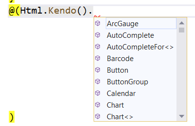

# Fundamentals

Telerik UI for ASP.NET MVC is a set of server-side wrappers (HTML helpers) that allow you to use the Kendo UI widgets in .NET MVC.

For more information on the difference between helpers and widgets, refer to the [Telerik UI for ASP.NET MVC introduction article](#widgets-vs-helpers).

As of the jQuery 3.0 release, the [document-ready handlers are called asynchronously](https://demos.telerik.com/kendo-ui/). As a result, regardless of whether the document is ready at the point of execution or not, the code placed outside a document-ready handler is executed before the code within the handler. This change affects the usage of the Telerik UI for ASP.NET MVC components because the widgets for the MVC helpers are initialized in a document-ready handler. This means that after the jQuery 3.0 release you need to get the reference of a widget and its API calls within a document-ready handler.

## Basic Configuration

The [`HtmlHelper`](http://www.asp.net/mvc/overview/older-versions-1/views/creating-custom-html-helpers-cs) extension method exposes all Telerik UI HTML helpers.

The helper options are exposed through a [fluent interface](https://en.wikipedia.org/wiki/Fluent_interface).

To set an option for a helper, call the corresponding method and pass the required option value.

    @(Html.Kendo().NumericTextBox()
          .Name("name") // Set the name of the NumericTextBox.
          .Value(10) // Set the value.
          .Spinners(false) // Disable the spinners.
    )

You have to set the `Name` option of the helper. The value will be used as the `id` and `name` HTML attributes&mdash;the `name` attribute is set only for input helpers such as the DatePicker, NumericTextBox, and DropDownList. The `id` attribute is used to initialize the helper. The id (`Name`) of a helper has to meet the requirements for valid HTML `ID` attributes. It must not contain spaces and special characters and has to start with a letter.

> The `Name` options of the helpers have to be always unique in the context of the whole web page. If a partial view is loaded multiple times, each instance of this partial view has to render all helpers with unique `Name` (id) options. If this requirement is not met, the page will render duplicate element IDs and only the helper instance which occurs first in the markup will be initialized and will work properly.

Alternatively, you can use the `NumericTextBoxFor` setting. All Telerik UI helpers which accept a value can be initialized with the `[WidgetName]For` method. For example, to initialize the DatePicker, use `DatePickerFor`. These methods automatically set the `Name` of the helper. In this way, `@Html.Kendo().NumericTextBoxFor(model => model.Age)` is the same as `@Html.Kendo().NumericTextBox().Name("Age").Value(Model.Age)`.

## Deferred Initialization

By default, the helpers output the widget initialization script immediately after the HTML markup of the widget. This scenario may not always be desired&mdash;for example, if the script files are registered at the bottom of the page or when you nest widgets.

To defer the initialization:

1. Call the `Deferred` method of the helper. This approach suppresses the immediate rendering of the script statement.

          @(Html.Kendo().NumericTextBox()
                .Name("age")
                .Deferred()
          )

1. Call the `DeferredScripts` method. As a result, all previously deferred initialization statements are output.

          @Html.Kendo().DeferredScripts()

  The `DeferredScripts` method accepts a Boolean parameter which determines whether script elements will be automatically rendered. This behavior is useful for rendering the deferred initialization scripts inside existing script element.

          

1. Render the deferred initialization script of a particular helper by using the `DeferredScriptsFor` method.

          @(Html.Kendo().NumericTextBox()
                .Name("age")
                .Deferred()
          )
          <!-- other code -->
          @Html.Kendo().DeferredScriptsFor("age")

  You can also use the `DeferredScriptsFor` method to suppress the output of `script` elements around the initialization script.

        

## Event Handling

To subscribe to the client-side events that are exposed by a helper, use the `Events` method.

1. Specify the name of the JavaScript function which will handle the event.

          @(Html.Kendo().NumericTextBox()
                .Name("age")
                .Events(events =>
                    events.Change("age_change") // Handle the "change" event.
                          .Spin("age_spin")     // Handle the "spin" event.
                )
          )

1. Declare the event handlers.

            

## Referencing Client-Side Objects

You can get a reference to the client-side object that is initialized by the helper through the [`data`](http://api.jquery.com/data/) jQuery method. Use the `Name` of the widget in an `ID` jQuery selector, and obtain the reference in a `document.ready` handler which is placed or called after the widget is declared. This ensures that the widget is already initialized and the client-side object exists. After you get the object reference, use the client-side API of the widget.

    @(Html.Kendo().NumericTextBox()
        .Name("age")
    )

    

If you have deferred the initialization of the widget, make sure you get its instance after calling `DeferredScripts` or `DeferredScriptsFor`.

    @(Html.Kendo().NumericTextBox()
        .Name("age")
        .Deferred()
    )

    .....

    @Html.Kendo().DeferredScripts()

    

## Using Client Templates

By default, every Telerik UI helper renders a script element with an initialization statement. If the helper declaration is placed inside a Kendo UI template, the nested script elements will be invalid. The `ToClientTemplate` method instructs the helper to escape its own script element so that it can be nested.

    
    

    

## Rendering of Forms

If you have to include `Html.BeginForm()` or `Ajax.BeginForm()` inside the `.Content()`, use the `.Render();` helper method and wrap the widget declaration in a non-rendering code block. For example, `@{}` instead of `@()`. Otherwise, the form will be rendered outside the widget and the form fields inside the widget will not be submitted as expected.

This approach is required with widgets such as the Window, TabStrip, Splitter, and PanelBar, and is not required if the form is placed inside a partial view which is loaded with Ajax through `.LoadContentFrom()`, or if a plain HTML `<form>` tag is used.

    @{Html.Kendo().TabStrip()
        .Name("TabStrip1")
        .Items(tabstrip =>
        {
            tabstrip.Add().Text("Tab 1")
                .Content(@<text>
                    @using (Ajax.BeginForm("...", "..."))
                    {
                        ...
                    }
                </text>);
        }).Render();
    }

## Bundling Resources

Bundling combines resources and improves the loading time by reducing the number of requests to the server. By default, bundling is disabled in development (debug configuration).

To enable bundling in development, use either of the following approaches:

* Disable debugging by setting `debug="false"` within the compilation element in `web.config`.
* Set `BundleTable.EnableOptimizations=true` within the `RegisterBundles` static method. This will override the `"debug"` value in `web.config`.

Bundling can cause issues with relative paths in stylesheets. For example, the DejaVu font that is included in the common stylesheet uses such a path. The work around such issues, rewrite the URLs to absolute ones by using the `CssRewriteUrlTransform`. For more information, refer to the article on [bundling and minification](http://www.asp.net/mvc/overview/performance/bundling-and-minification).

    bundles.Add(new StyleBundle("~/Content/kendo/css")
        .Include("~/Content/web/kendo.common.min.css", new CssRewriteUrlTransform())
        .Include("~/Content/web/kendo.rtl.min.css", new CssRewriteUrlTransform())
        .Include("~/Content/web/kendo.default.min.css", new CssRewriteUrlTransform())
    );

## Using CSS Bundling

The ASP.NET bundling allows the combination of multiple stylesheets on the web server so that the browser loads them as a single file.

> Internet Explorer versions 6-9 have a set of limitations with regard to the amount of CSS code. The most important ones are the following:
> * A stylesheet may contain up to 4095 CSS selectors.
> * A stylesheet may be up to 250KB in size.

When you use CSS bundling with the Telerik UI helper stylesheets, the virtual location of the bundle must match the physical location of the Telerik UI CSS files because the image URLs in the Kendo UI themes are relative and the browser searches for the theme images depending on the virtual URL.

To demonstrate the CSS bundling, use the following sample scenario:

* The Kendo UI theme CSS file is located in `~/Content/kendo/...VERSION.../kendo.default.min.css`.
* The images for the Kendo UI Default theme are located in `~/Content/kendo/...VERSION.../Default/`.
* The images in the Kendo UI Default theme CSS code are referenced like this: `"Default/sprite.png"`.
* The preferred StyleBundle virtual URL is `~/Content/kendo/css`.

The specified virtual bundle URL will cheat the browser that it is registering a CSS file which is named `css` and is located in the `~/Content/kendo/` folder. As a result, when the browser sees a `"Default/sprite.png"` image in the CSS code, it will make a request to `~/Content/kendo/Default/sprite.png`, but the image will not be there and the sample use case will result in the following incorrect implementation.

    bundles.Add(new StyleBundle("~/Content/kendo/css").Include(
        "~/Content/kendo/...VERSION.../kendo.common.min.css",
        "~/Content/kendo/...VERSION.../kendo.default.min.css"));

To properly load the images, use the following correct implementation.

    bundles.Add(new StyleBundle("~/Content/kendo/...VERSION.../css").Include(
        "~/Content/kendo/...VERSION.../kendo.common.min.css",
        "~/Content/kendo/...VERSION.../kendo.default.min.css"));

The following implementation is also correct and assumes that the Kendo UI Default theme images are located in the `~/Content/kendo/Default/` folder.

    bundles.Add(new StyleBundle("~/Content/kendo/css").Include(
        "~/Content/kendo/kendo.common.min.css",
        "~/Content/kendo/kendo.default.min.css"));

The explanations and requirements in this section are applicable to all stylesheets that use relative image URLs which is not a limitation of the product. Theoretically, CSS files can use absolute image URLs, and then the virtual bundle URL can be random but such an implementation is suitable only for custom tailor-made stylesheets which are intended to work in a specific application.

## See Also

* [Telerik UI for ASP.NET MVC Download and Installation]()
* [Installing Telerik UI for ASP.NET MVC with NuGet]()
