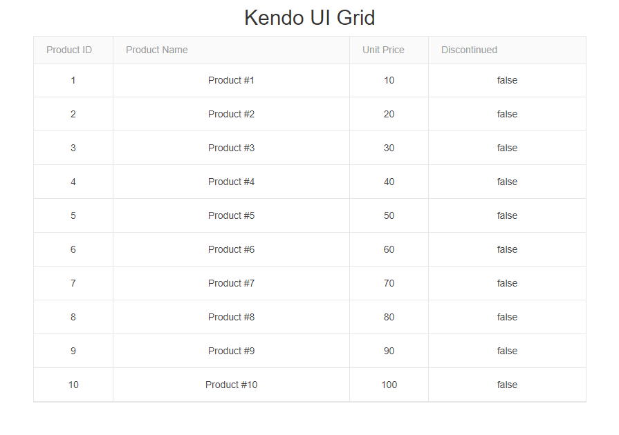

# Adding Telerik UI for ASP.NET MVC through Local Files

This article explains how to manually configure an ASP.NET MVC application to use the Telerik UI controls. You will learn how to add the required `Kendo.Mvc.dll` assembly, which provides the UI helpers for ASP.NET MVC, by using local files. The process also includes specifying the required namespaces and adding necessary client-side resources, such as a theme file and Kendo UI scripts, which are essential for proper control functionality and appearance.

The approach described in this tutorial is applicable to either new or existing projects. An alternative approach that automatically adds the namespaces and the `Kendo.Mvc.dll` assembly to the project is the [Setup with Telerik NuGet](). 

## Prerequisites

* Telerik UI for ASP.NET MVC requires the <a href="https://dotnet.microsoft.com/download/dotnet-framework" target="_blank">.NET Framework</a>.

* [Visual Studio](https://www.visualstudio.com/downloads/) 2012 or later.

   For Visual Studio 2017 or later, you must install the **ASP.NET & web development** workload. See Microsoft's <a href="https://learn.microsoft.com/en-us/visualstudio/install/install-visual-studio?view=vs-2019#step-4---choose-workloads" target="_blank">Install Visual Studio workloads</a> documentation for guidance.
   
* [Telerik account](https://www.telerik.com/account).

## Creating the Application

If you already have an existing project and you want to add Telerik UI for ASP.NET MVC to the application, skip this section and continue with [installing a license key](#installing-a-license-key).

To create the application:

1. Open Visual Studio 2019 for Windows. In the toolbar, select **File** > **New** > **Project**.  
1. Search for and select **ASP.NET Web Application C#** and click **Next**.
1. Set a name and location for the project and click **Create**.
1. Select the **MVC** template and click **Create**.

## Installing a License Key

@[template](/_contentTemplates/licensing-templates.md#license-key-version)

@[template](/_contentTemplates/licensing-templates.md#license-key-manual-steps)

@[template](/_contentTemplates/licensing-templates.md#license-key-know-more-link)

## Downloading and Referencing the Kendo.Mvc.dll Assembly

The `Kendo.Mvc.dll` assembly contains the UI for ASP.NET MVC HtmlHelpers. Follow the steps below to download and reference it in the project:

1. Log in to your [Telerik account](https://www.telerik.com/login/v2/telerik).

1. Download the installation file:

    * If you are new to UI for ASP.NET MVC and have not purchased a license yet, you can [Start a Free Trial](https://www.telerik.com/try/ui-for-asp.net-mvc) by downloading and installing the UI for ASP.NET MVC components.  Once the installation completes, your free trial will be activated and you can continue with the next step.

    * If you have already purchased a license, continue with the next step.

1. Go to the [Telerik UI for ASP.NET MVC download page](https://www.telerik.com/account/product-download?product=KENDOUIMVC) and download the `telerik.ui.for.aspnetmvc.{{ site.mvcCoreVersion }}.zip` file.

1. Open the downloaded bundle and extract the `Kendo.Mvc.dll` from the `\wrappers\aspnetmvc\Binaries\Mvc5\` folder to the `bin` folder of your project. 

1. Right-click `References` in the Visual Studio Solution Explorer, browse to the `bin` folder, select the `Kendo.Mvc.dll`, and add it as reference to the project.

## Adding the Kendo.Mvc.UI Namespace

Add the `Kendo.Mvc.UI` namespace to the `~/Views/Home/Index.cshtml` view. 

```Razor
@using Kendo.Mvc.UI
```

@[template](/_contentTemplates/mvc/add-client-side-resources.md#including-client-side-resources)

## Adding a Telerik UI Component

To define a [Grid component](), follow the next steps:

1. Create a model in the `Models` folder of the application.

    ```C#
    public class Product
    {
        public int ProductID { get; set; }
        public string ProductName { get; set; }
        public Nullable<decimal> UnitPrice { get; set; }
        public bool Discontinued { get; set; }
    }
    ```

1. Open the `~/Views/Home/Index.cshtml` view and define a Telerik UI Grid HtmlHelper.

    ```Razor
        <div class="text-center">
			<h2>Kendo UI Grid</h2>
			@(Html.Kendo().Grid<TelerikMvcApp1.Models.Product>()
				.Name("grid")
				.Columns(columns =>
				{
					columns.Bound(c => c.ProductID).Width(100);
					columns.Bound(c => c.ProductName).Width(300);
					columns.Bound(c => c.UnitPrice).Width(100);
					columns.Bound(c => c.Discontinued).Width(200);
				})
				.DataSource(dataSource => dataSource
					.Ajax()
					.Read(read => read.Action("Select", "Home"))
				)
			)
		</div>
    ```
1. Open the `HomeController.cs` and import the `Kendo.Mvc.UI` and the `Kendo.Mvc.Extensions` namespaces so that you can use `Kendo.Mvc.UI.DataSourceRequest` and the `ToDataSourceResult()` extension method in the next step.

    ```C#
    using Kendo.Mvc.Extensions;
    using Kendo.Mvc.UI;
    using TelerikMvcApp1.Models;
    ```

1. In the `HomeController.cs`, add a new Action method that returns the Grid data as JSON. The Grid makes Ajax requests to this Action method.

    ```C#
    public ActionResult Select([DataSourceRequest]DataSourceRequest request)
    {
        var data = Enumerable.Range(1, 10)
            .Select(index => new Product
            {
                ProductID = index,
                ProductName = "Product #" + index,
                UnitPrice = index * 10,
                Discontinued = false
            });

        return Json(data.ToDataSourceResult(request), JsonRequestBehavior.AllowGet);
    }
    ```

## Building and Running the Application 

Press `CTRL+F5` to build and run the application. As a result, the following sample page is created.



## Next Steps

* [Explore the Telerik UI for ASP.NET MVC fundamentals]()
* [Grid Overview]()
* [Integrate Telerik UI for ASP.NET MVC in Visual Studio]()

## See Also

* [Collected Examples on ASP.NET MVC](https://github.com/telerik/kendo-examples-asp-net-mvc)
* [Collected Examples on ASP.NET Web Technologies](https://github.com/telerik/kendo-examples-asp-net)
* [Collected Examples on Telerik UI for ASP.NET MVC](https://github.com/telerik/ui-for-aspnet-mvc-examples)
