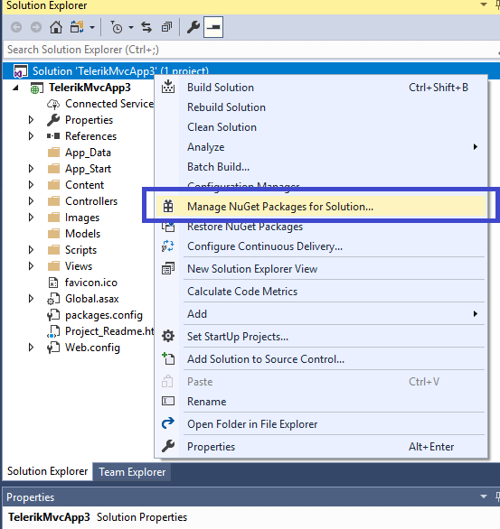
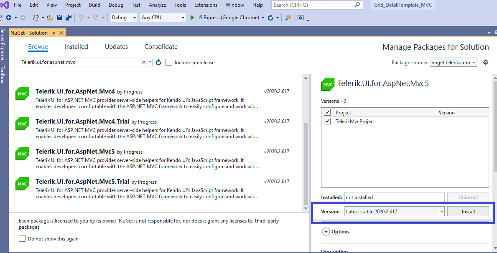
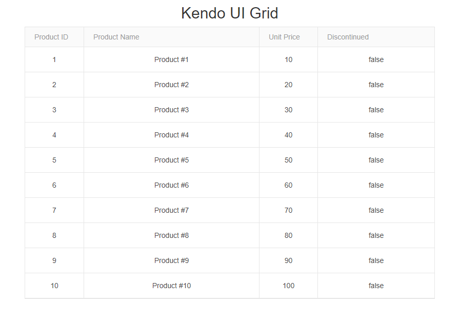

# Adding Telerik UI with NuGet

This article demonstrates how to add Telerik UI components to an ASP.NET MVC Web Application by using the Telerik NuGet server. You will add the Telerik UI NuGet package and the required client-side resources manually, and then implement the Kendo UI Grid in your project by using the Telerik UI Grid HTML Helper.

To get up and running with the project:

1. [Check the prerequisites](#prerequisites)
1. [Create an ASP.NET MVC Web Application](#creating-the-application)
1. [Install a license key](#installing-a-license-key).
1. [Add the Telerik NuGet Feed to Visual Studio](#adding-the-telerik-nuget-feed-to-visual-studio)
1. [Install the {{ site.product }} NuGet package](#installing-the-nuget-package)
1. [Include the client-side resources](#including-the-client-side-resources)
1. [Add a component](#adding-a-telerik-ui-component).
1. [Build and run the application](#building-and-running-the-application)

## Prerequisites

* Telerik UI for ASP.NET MVC requires the <a href="https://dotnet.microsoft.com/download/dotnet-framework" target="_blank">.NET Framework</a>.

* [Visual Studio](https://www.visualstudio.com/downloads/) 2012 or later.

   For Visual Studio 2017 or later, you must install the **ASP.NET & web development** workload. See Microsoft's <a href="https://learn.microsoft.com/en-us/visualstudio/install/install-visual-studio?view=vs-2019#step-4---choose-workloads" target="_blank">Install Visual Studio workloads</a> documentation for guidance.

* To download the Telerik UI NuGet packages, you need a [Telerik account](https://www.telerik.com/account).

## Creating the Application

If you already have an existing project and you want to add Telerik UI for ASP.NET MVC to the application, skip this section and continue with [installing a license key](#installing-a-license-key).

1. Open Visual Studio 2019 for Windows and select **Create a new project**.
1. Select **ASP.NET Web Application (.NET Framework)** and click **Next**.
1. Set a name and location for the project and click **Create**.
1. Select **MVC** and click **Create**.

## Installing a License Key

@[template](/_contentTemplates/licensing-templates.md#license-key-version)

@[template](/_contentTemplates/licensing-templates.md#license-key-manual-steps)

@[template](/_contentTemplates/licensing-templates.md#license-key-know-more-link)

## Adding the Telerik NuGet Feed to Visual Studio

>tip If you have already configured the Telerik NuGet feed in Visual Studio, jump to [install the NuGet package](#installing-the-nuget-package).

@[template](/_contentTemplates/get-started.md#add-nuget-feed)
	
## Installing the NuGet Package

Once you configure Visual Studio to access the Telerik NuGet server, you can add NuGet package with the Telerik UI components to the project:

1. Right-click the solution and select **Manage NuGet Packages for Solution...**.

	
	
1. From the **Package source** drop-down, select the Telerik NuGet source.

1. Click the **Browse** tab, search for `Telerik.UI.for.AspNet.Mvc5` and install it.

	
	
>When you use the NuGet package manager to install `Telerik.UI.for.AspNet.Mvc5`, you save time. It performs the following steps in the background:
>* Adds a reference to the `Kendo.Mvc.dll` assembly that contains the Telerik UI for ASP.NET MVC helpers.
>* Updates the `web.config` file to indicate the `Kendo.Mvc.UI` namespace where the helpers are located.

@[template](/_contentTemplates/mvc/add-client-side-resources.md#including-client-side-resources)

## Adding a Telerik UI Component

To define a [Grid component](), follow the next steps:

1. Create a model in the `Models` folder of the application.

	```C#
	public class Product
	{
		public int ProductID { get; set; }
		public string ProductName { get; set; }
		public Nullable<decimal> UnitPrice { get; set; }
		public bool Discontinued { get; set; }
	}
	```

1. Open the `~/Views/Home/Index.cshtml` view (if using ASPX, the `Index.aspx` file).
1. Define a Telerik UI Grid HtmlHelper.

    ```Razor
        <div class="text-center">
			<h2>Kendo UI Grid</h2>
			@(Html.Kendo().Grid<TelerikMvcApp1.Models.Product>()
				.Name("grid")
				.Columns(columns =>
				{
					columns.Bound(c => c.ProductID).Width(100);
					columns.Bound(c => c.ProductName).Width(300);
					columns.Bound(c => c.UnitPrice).Width(100);
					columns.Bound(c => c.Discontinued).Width(200);
				})
				.DataSource(dataSource => dataSource
					.Ajax()
					.Read(read => read.Action("Select", "Home"))
				)
			)
		</div>
    ```
1. Open the `HomeController.cs` and import the `Kendo.Mvc.UI` and the `Kendo.Mvc.Extensions` namespaces so that you can use `Kendo.Mvc.UI.DataSourceRequest` and the `ToDataSourceResult()` extension method in the next step.

	```C#
	using Kendo.Mvc.Extensions;
	using Kendo.Mvc.UI;
	using TelerikMvcApp1.Models;
	```

1. In the `HomeController.cs`, add a new Action method that returns the Grid data as JSON. The Grid makes Ajax requests to this Action method.

	```C#
	public ActionResult Select([DataSourceRequest]DataSourceRequest request)
	{
		var data = Enumerable.Range(1, 10)
			.Select(index => new Product
			{
				ProductID = index,
				ProductName = "Product #" + index,
				UnitPrice = index * 10,
				Discontinued = false
			});

		return Json(data.ToDataSourceResult(request), JsonRequestBehavior.AllowGet);
	}
	```

## Building and Running the Application 

Press `CTRL+F5` to build and run the application. As a result, the following sample page is created.



## Next Steps

* [Explore the Telerik UI for ASP.NET MVC fundamentals]()
* [Grid Overview]()
* [Integrate Telerik UI for ASP.NET MVC in Visual Studio]()

## See Also

* [Collected Examples on ASP.NET MVC](https://github.com/telerik/kendo-examples-asp-net-mvc)
* [Collected Examples on ASP.NET Web Technologies](https://github.com/telerik/kendo-examples-asp-net)
* [Collected Examples on Telerik UI for ASP.NET MVC](https://github.com/telerik/ui-for-aspnet-mvc-examples)
