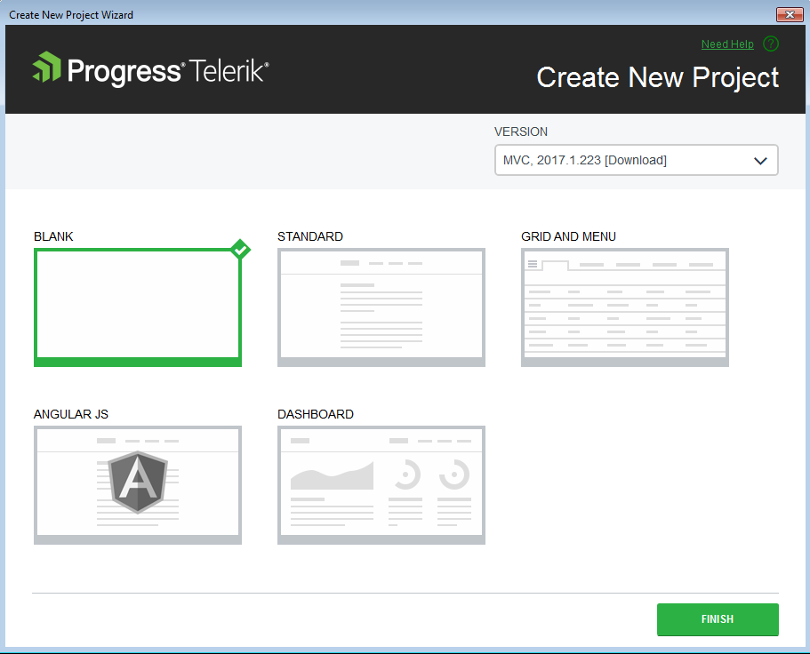

# Creating Kendo UI Projects

This article demonstrates how to create a new Progress&reg; Kendo UI&reg; for jQuery application.

## The Basics

New Kendo UI for jQuery applications are created by using the **Create New Project Wizard**.

To start the **Create New Project Wizard**, follow either of the approaches below.

**Approach 1**

1. Go to the Telerik menu.
2. Click **Telerik** > **Kendo UI** > **Create New Kendo UI Project** .

**Approach 2**

1. Click **File** > **New** > **Project**.
2. Navigate to the Kendo UI ASP.NET MVC 5 project templates under **Telerik** > **Web**.

The wizard detects all the installed versions of Telerik UI for ASP.NET MVC and lists them in the **Version** combobox. This enables you to select a version you want to apply to your project.

## Project Settings

The **Create New Project** page enables you to modify the project settings by configuring the following options:

* **Project type**&mdash;Choose the desired project type: **Empty**, **Standard**, **Grid and Menu**, **Angular JS**, or **Dashboard**.
* **Version**&mdash;Choose the version of Kendo UI you want to use.

## New Web Application Creation

After configuring the project settings, click **Finish** to start the creation of the new Kendo UI Professional application.

As a result, the wizard:
* Creates a new ASP.NET MVC application.
* Copies all Kendo UI scripts.
* Copies all Kendo UI content files.
* Adds references to required scripts in the master page.

## See Also

* [Integrating Visual Studio in Your .Net Project]()
* [Downloading the Latest Telerik UI for ASP.NET Core Versions]()
