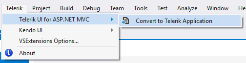
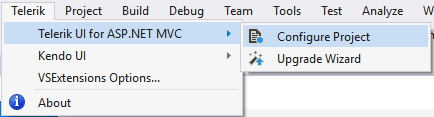

# Visual Studio Integration Overview

The Progress&reg; Telerik&reg; UI for ASP.NET MVC Visual Studio (VS) Extensions enhance the experience in developing MVC web applications with Telerik UI for ASP.NET MVC.

The extensions handle the following major points:

* Project [Creation]() and [Configuration]() Wizards&mdash;Web asset management, adding the required settings to `web.config`, changing the theme.
* Project [Upgrade]()&mdash;Upgrading Telerik UI for ASP.NET MVC to a new version.

The Telerik UI for ASP.NET MVC VS Extensions are distributed with the Telerik UI for ASP.NET MVC installer. They support VS 2010, 2012, 2013, 2015, 2017, and 2019, which handle ASP.NET MVC 4 and 5 applications.

> VS Express editions are not supported.

The VS Extensions can be accessed through the **Telerik | Telerik UI for ASP.NET MVC** menu which has different menu items depending on the selected project in VS. Additionally, the extensions can be accessed through the Solution Explorer context menu of any supported ASP.NET MVC Web Application projects.

When installed, the extensions add the project templates to the New Project dialog of VS.

* C# Telerik UI for ASP.NET MVC web application
* VB Telerik UI for ASP.NET MVC web application

These are available in the language-specific nodes of the dialog as well. The **Add New Project** dialog contains the Telerik UI for ASP.NET MVC web application under both the `CSharp\Web` and `Visual Basic\Web` nodes.

The following additional project templates are also available:
* [C# Telerik ASP.NET Core MVC application](https://docs.telerik.com/aspnet-core/introduction)
* [Kendo UI ASP.NET MVC 5 application]()

The new ASP.NET MVC 4 project wizard also contains the Telerik UI for ASP.NET MVC web application.

## See Also

* [Creating New Projects with Visual Studio]()
* [Downloading the Latest Telerik UI for ASP.NET Core Versions]()
