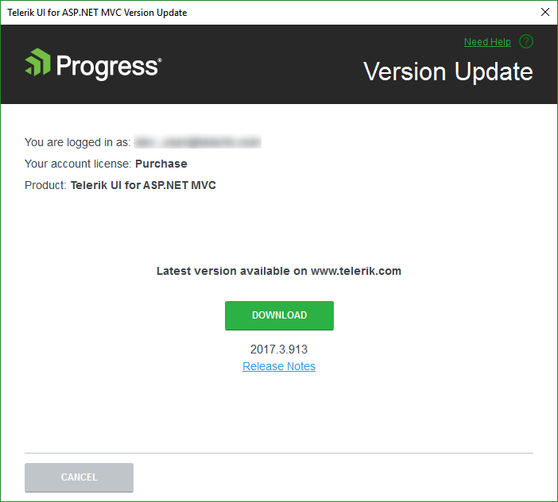
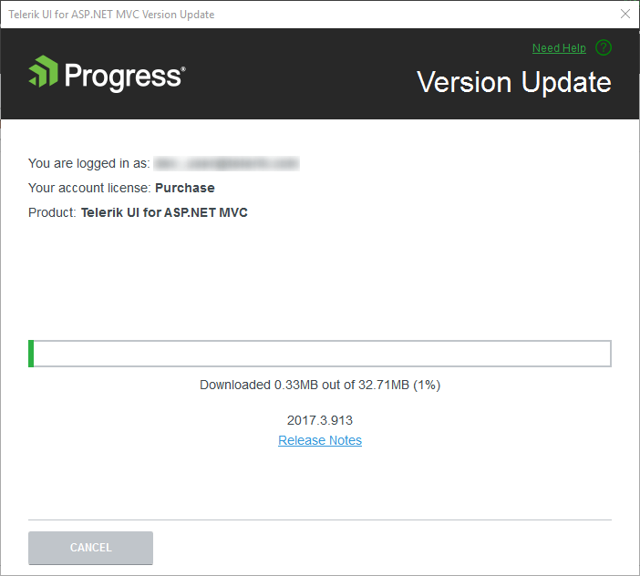
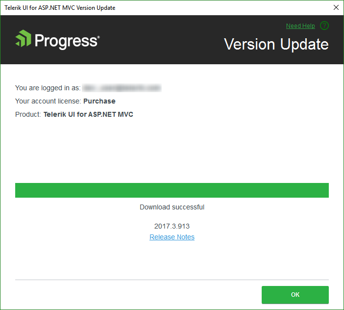

# Downloading New Versions

With the Progress&reg; Telerik&reg; UI for ASP.NET MVC Visual Studio (VS) Extensions you keep your projects in an up-to-date state. The Latest Version Acquirer tool automatically retrieves the latest Telerik UI for ASP.NET MVC distribution available on the Telerik website.

Once a day, upon loading a project with Telerik UI for ASP.NET MVC controls, the extensions query the Telerik website for a new version of Telerik UI for ASP.NET MVC. A notification gets displayed when a new version is discovered.

> If you disable the notifications, you can use the **Options** Dialog to activate them again.

Clicking **Update Now** starts the Latest Version Acquirer tool, prompting for your Telerik credentials in its first page. If you do not have a `www.telerik.com` account, you can create one through the **Create an account for free** link.

> You cannot use the tool if you have a trial license. Attempting to download a distribution results in an error message.

Check for any additional information about the release by clicking the **Release Notes** link. This starts a browser, navigating to a page with the release notes related to the specific version.

Use the **Save my password** checkbox to avoid having to enter your Telerik credentials multiple times. The persistence is done in a secure manner and credentials are saved in a per-user context. Other users on the machine do not have access to your stored credentials.

The download starts automatically after a confirmation window.

Once the download succeeds, the latest version of Telerik UI for ASP.NET MVC is available to use in the **Upgrade Wizard** and the **New Project Wizard**.

> * The **Download** buttons of the **Upgrade Wizard** and the **New Project Wizard** launch the **Latest Version Acquirer** tool too.
> * The **Latest Version Acquirer** tool downloads the `.zip` files, containing the latest Telerik UI for ASP.NET MVC binaries and any resources vital for a Telerik UI for ASP.NET MVC application. These get unpacked to the `%APPDATA%\Telerik\Updates` folder by default. If you find the list of packages offered too long and you do not need the older versions, close the VS and use the Windows Explorer to delete these distributions.

## See Also

* [Integrating Visual Studio in Your .Net Project]()
