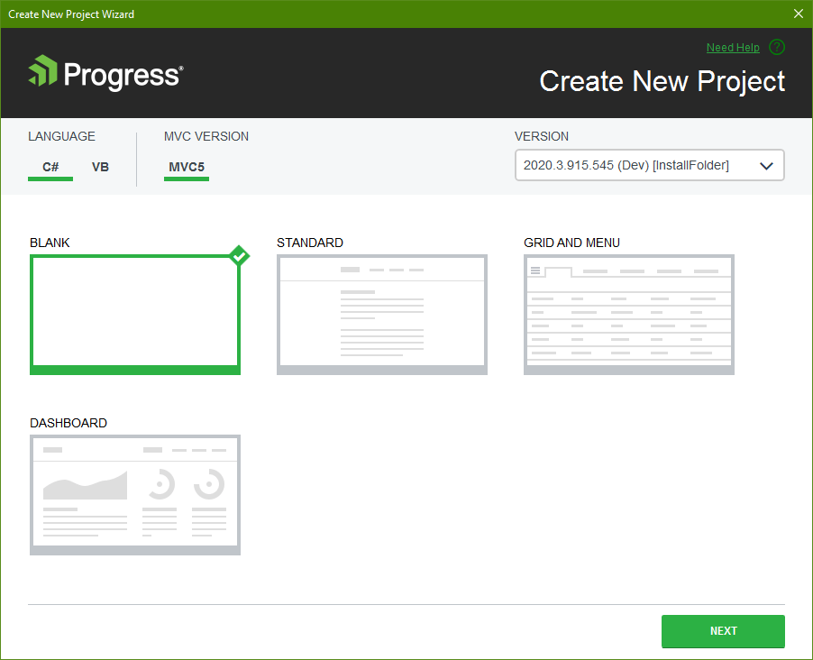
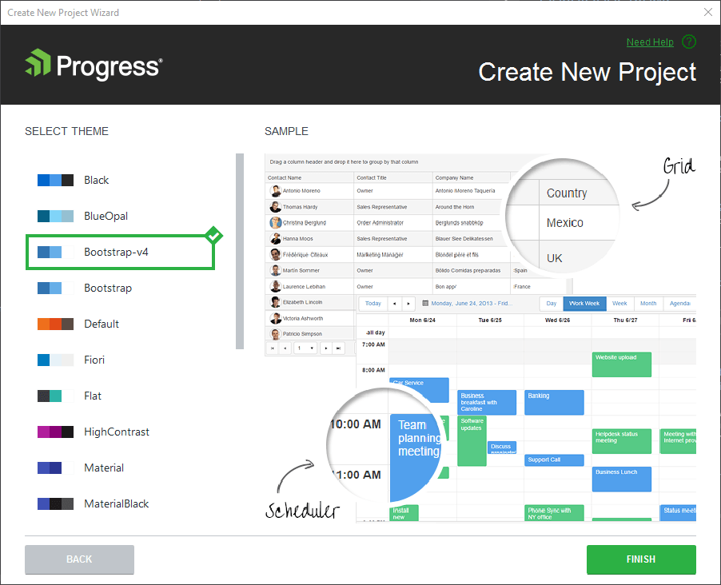

# Creating New Projects

This article demonstrates how to create a new Progress&reg; Telerik&reg; UI for ASP.NET MVC application.

## Getting Started

New Telerik UI for ASP.NET MVC applications are created by using the **Create New Project Wizard**.

To start the **Create New Project Wizard**, follow either of the approaches below.

**Approach 1**   

1. Go to the Telerik menu.   
2. Click **Telerik** > **Telerik UI for ASP.NET MVC** > **Create New Telerik Project**.

**Approach 2**

1. Click **File** > **New** > **Project**.     
2. Navigate to the Telerik ASP.NET MVC project templates under **Telerik** > **Web**.

For convenience, the same project templates are located under the **Visual C#** > **Web** and **Visual Basic** > **Web** nodes.

You will receive a list of predefined Telerik templates and the Telerik ASP.NET MVC versions list to choose from:
* **Blank Template** - It lets you develop your application from scratch with the Telerik UI components enabled.
* **Standard Template** - You can start off with three example pages which have Panel Bar, Card and TabStrip components integrated.
* **Grid and Menu Template** - A small application that contains Grid, Menu and Buttons as a base for your application.
* **Dashboard Template** - It allows you to quickly develop dashboards and dashboard-like applications using the built-in TileLayout component.

The wizard detects all the installed versions of Telerik UI for ASP.NET MVC and lists them in the **Version** combobox. This enables you to select a version you want to apply to your project.

## Project Settings

The first page of the **Create New Project Wizard** enables you to modify the project settings by configuring the following options:

* **Project type**&mdash;Choose the desired project type: **Blank**, **Standard**, **Grid**, and **Menu**.
* **Version**&mdash;Choose the version of Telerik UI for ASP.NET MVC you want to use.
* **MVC Version**&mdash;Choose the targeted ASP.NET MVC version.

To move to the second page of the **Create New Project Wizard** where you can select the visual theme of your Telerik UI for ASP.NET MVC application, click **Next**.

## New Web Application Creation

After configuring the project settings, click **Finish** to start the creation of the new Kendo UI web application.

As a result, the wizard:  
* Creates a new ASP.NET MVC application.
* Adds CDN references in the Layout file of the project for all Kendo UI styles and scripts. This includes the `vsdoc` script that enables the Visual Studio IntelliSense feature. If you prefer to have the scripts locally, disable the CDN Support through the [configure project]() workflow.  
* Copies all Kendo UI editor templates.
* (Optional) Copies the Kendo UI assembly to your solution folder&mdash;it is possible to change this setting in the [Visual Studio Extensions Options]().
* Adds a reference to the `Kendo.Mvc` assembly.

## Custom Modernizr

The Kendo UI ASP.NET MVC application includes a custom stripped-down Modernizr in a file called `kendo.modernizr.custom.js`. It provides an HTML5 element support for old browsers, specifically Internet Explorer.

If you need the Modernizr in your application, remove the existing Modernizr and register another version which includes more components and features. In such cases, if HTML5 element support is required, include the `html5shiv` component to make sure that the newly registered Modernizr [provides such support](http://modernizr.com/docs/#html5inie).

## See Also

* [Integrating Visual Studio in Your .Net Project]()
* [Downloading the Latest Telerik UI for ASP.NET Core Versions]()
