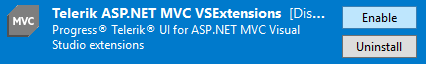

# Troubleshooting

This article provides solutions to common issues you may encounter while integrating Progress&reg; Telerik&reg; UI for ASP.NET MVC in Visual Studio.

## The Telerik menu is missing in Visual Studio**

**Cause** Telerik Visual Studio Extensions are disabled or not installed correctly.

**Solution 1: the extension is disabled**

1. Open Visual Studio.
1. Navigate to the **Menu** > **Tools** > **Extensions and Updates...**. For Visual Studio 2019 Extensions, navigate to **Manage Extensions**.
1. Open the **Installed** tab on the left​.
1. Search for **Telerik ASP.NET MVC VSExtensions**. Make sure they are **Enabled**.

**Solution 2: the extension is not installed**

1. Open Visual Studio.
1. Navigate to the **Menu** > **Tools** > **Extensions and Updates...**. For Visual Studio 2019 Extensions, navigate to **Manage Extensions**.
1. Open the **Online** tab on the left.​
1. Search for **Telerik ASP.NET MVC VSExtensions**.
1. Download and install the extensions.

If the suggested solutions do not solve your issue and before you contact the Support Team, generate the Visual Studio [**ActivityLog**](https://docs.microsoft.com/en-us/visualstudio/ide/reference/log-devenv-exe?view=vs-2019) files:

1. Under **Administrative rights**, open the [Developer Command prompt](https://docs.microsoft.com/en-us/dotnet/framework/tools/developer-command-prompt-for-vs) for Visual Studio 20xx.
1. Execute the `devenv /log %userprofile%\desktop\ActivityLog.xml` command to start Visual Studio and to create logs on your Desktop.
1. Reproduce the problem.
1. Attach the **Activitylog** files when you contact the Support Team.

## See Also

* [Integrating Visual Studio in Your .Net Project]()
* [Downloading the Latest Telerik UI for ASP.NET Core Versions]()
