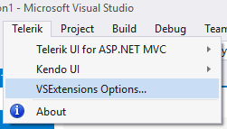
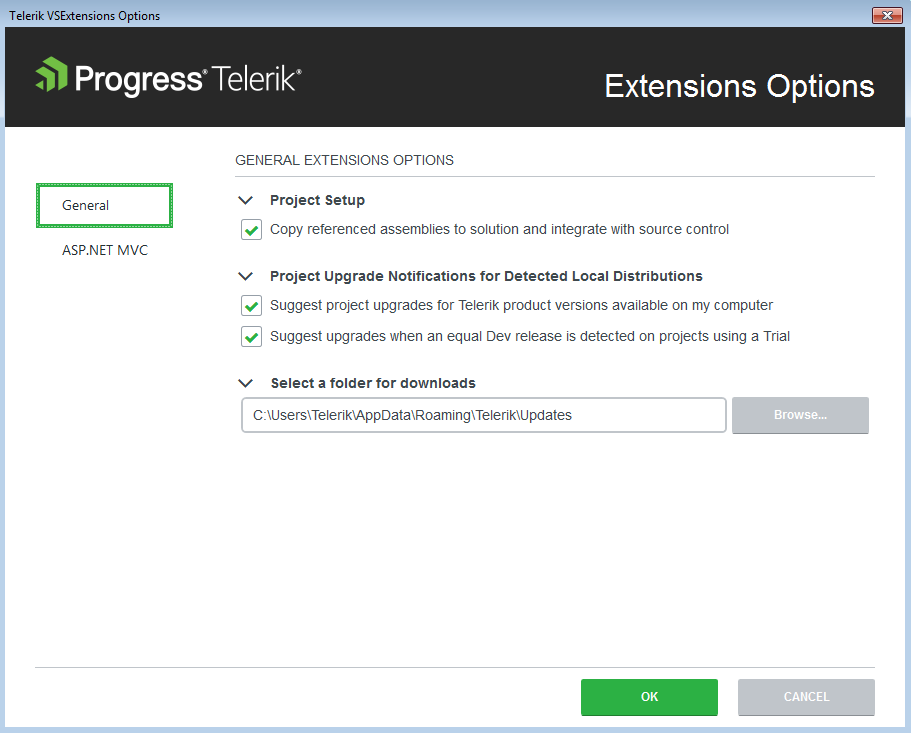
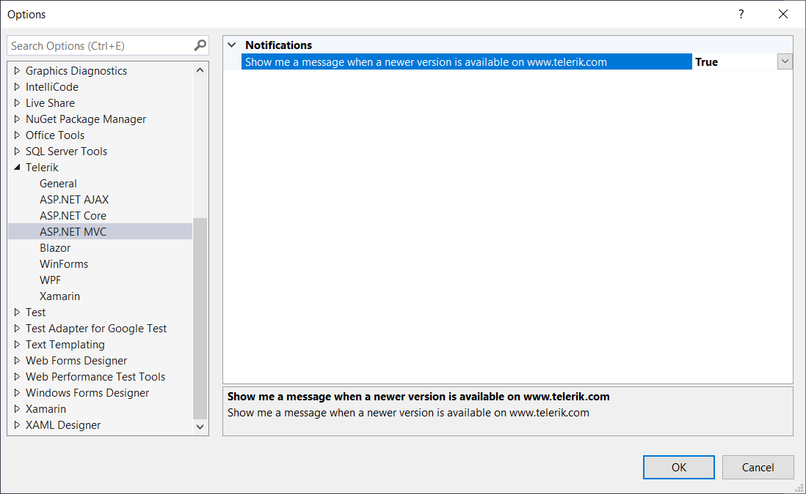

# Visual Studio Extension Options

The Visual Studio (VS) **Extensions Options** dialog provides settings, allowing you to configure the Progress&reg; Telerik&reg; UI for ASP.NET MVC VS Extensions to best suit the  needs of your projects.

It can be accessed by clicking on **Telerik** > **VSExtensions Options**.

The **Extensions Options** dialog contains two sets of options that affect the Telerik UI for ASP.NET MVC VS Extensions.

## General Settings

The settings under the General category affect all of the installed Telerik UI for ASP.NET MVC VS Extensions.

### Project Setup

Set the default value for the **Copy referenced assemblies to solution** option in the Project Configuration Wizard through **Copy referenced assemblies to solution and integrate with source control**.

### Project Upgrade Notifications

Set the project upgrade notifications for detected local distributions by using the options under the **Project Upgrade Notifications for Detected Local Distributions**:

- **Suggest project upgrades for Telerik product versions available on my computer**&mdash;When enabled, you are prompted to upgrade upon opening a project, which is not using the latest version of Telerik products installed on your system.
- **Suggest upgrades when an equal Dev release is detected on projects using a Trial**&mdash;When enabled, you are prompted to upgrade if a licensed version is available on your system, but the current project uses a trial version.

### Download Folder Selection

- **Select a folder for downloads**&mdash;Configures the path where the extensions look for and store distributions.

> Changing the folder path does not move existing folder contents from your previous path. Move your previous folder contents manually if you still want to use them.

## Telerik UI for ASP.NET MVC Settings

The Telerik UI for ASP.NET MVC VS Extensions settings can be found in the standard options dialog in Visual Studio under the Telerik node.

### Latest Version Retrieval

- **Include internal builds in Latest Version update and retrieval**&mdash;When enabled, the Latest Version Acquirer tool retrieves internal builds as well as official releases when checking for a new version.

### Notifications

- **Show me message when a newer version is available on www.telerik.com**&mdash;When enabled, you receive notifications if a new version of Telerik UI for ASP.NET MVC is available on the Telerik website.

## See Also

* [Integrating Visual Studio in Your .Net Project]()
* [Downloading the Latest Telerik UI for ASP.NET Core Versions]()
